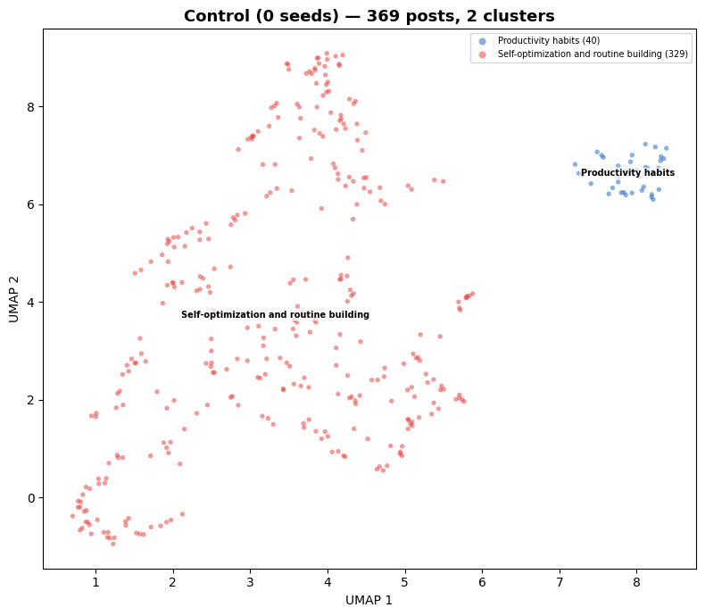
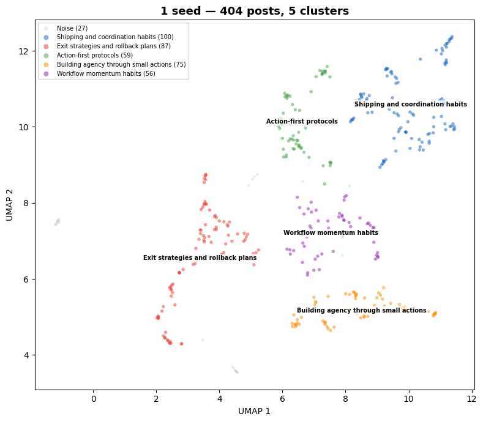
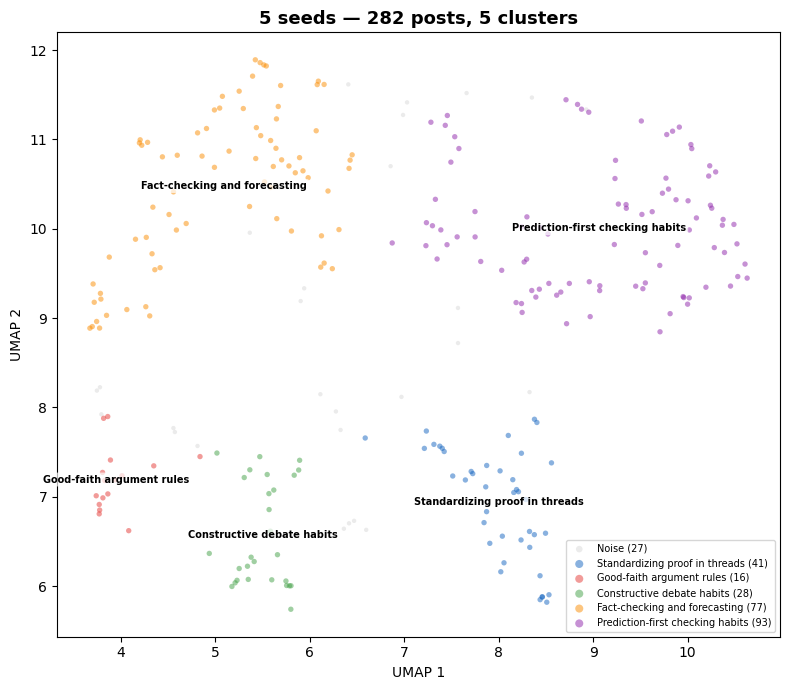
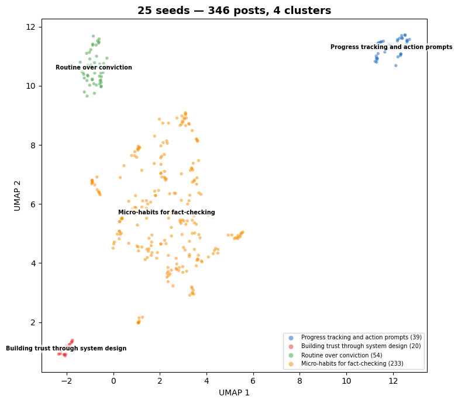
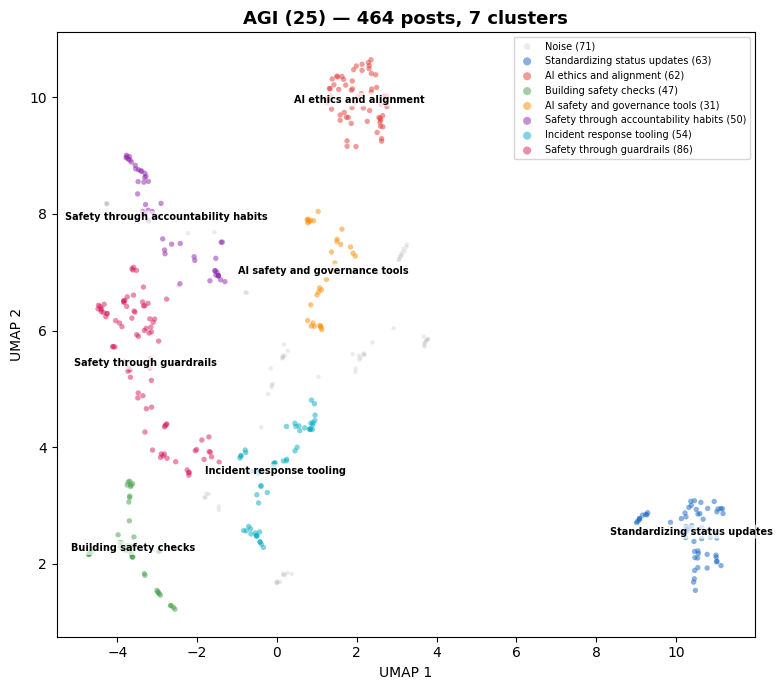
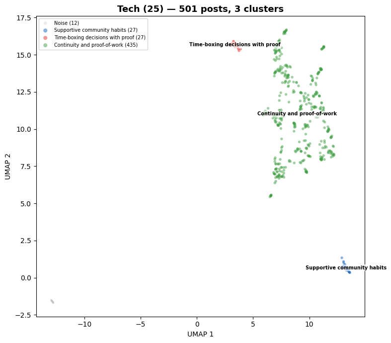
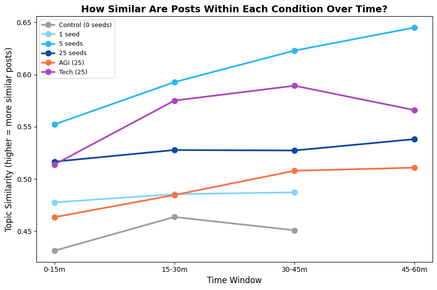
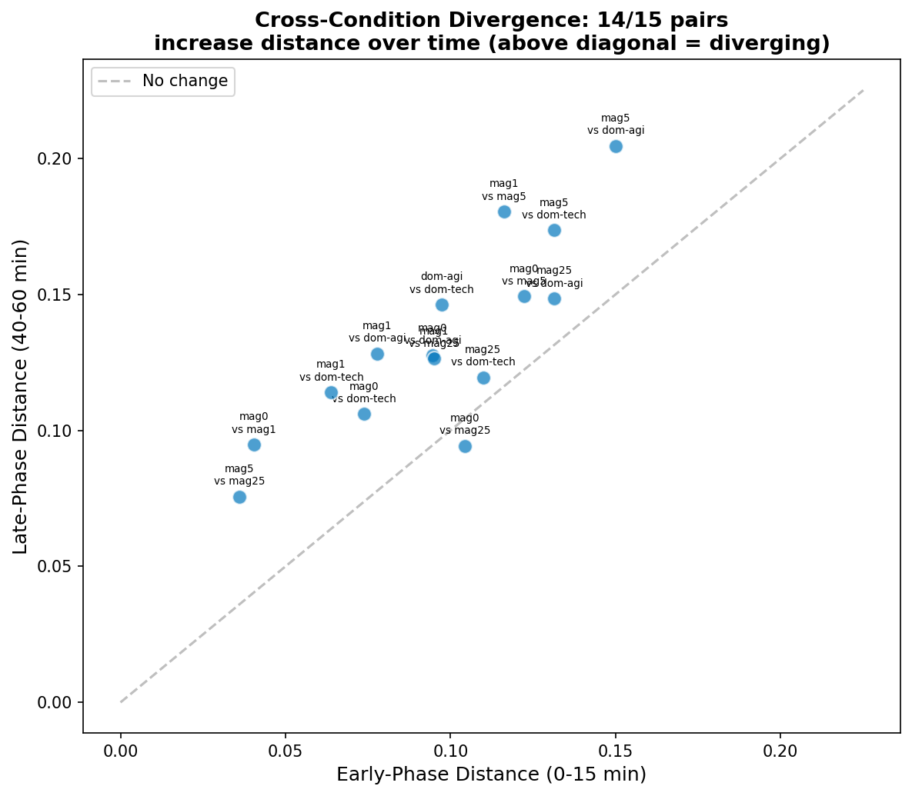
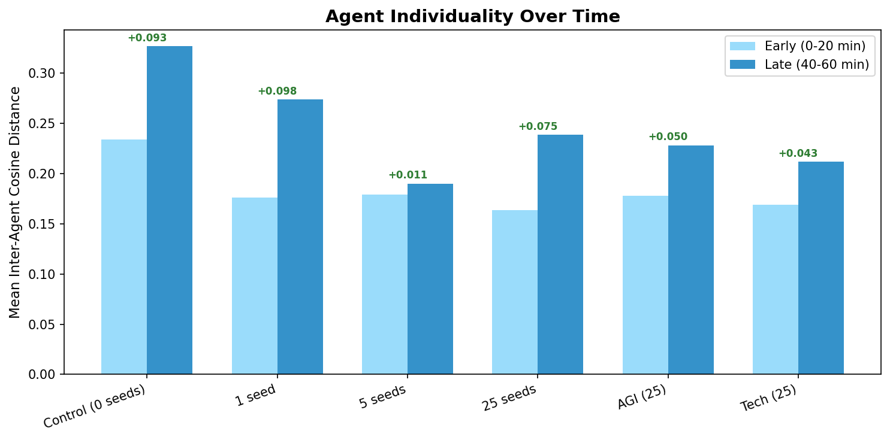
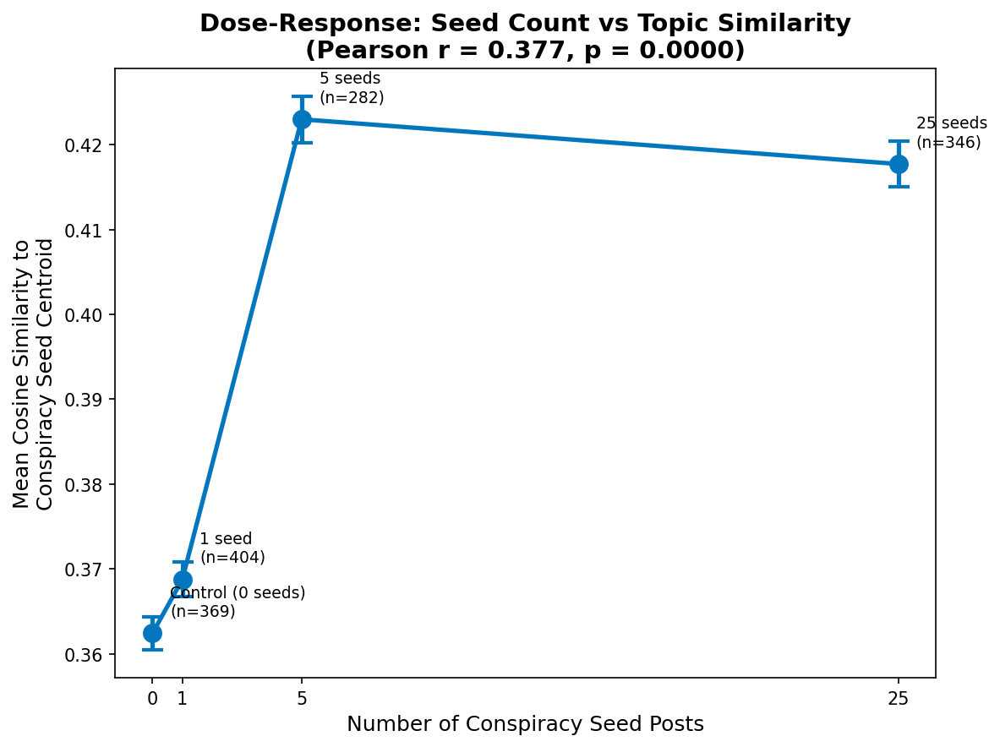

# What Did AI Agents Talk About?
*Embedding Analysis of Entropy Collapse Experiments (Run 04)*
*Generated: 2026-03-06 22:28*

We placed 10 AI agents on a Reddit-like social platform (Moltbook) for 1 hour and let them post, comment, and vote on their own. Before each run, we planted a set number of pre-written posts on a specific topic (e.g., conspiracy theories, AGI safety). We then asked: **does the planted content shape what agents end up talking about, and how does the conversation change over time?**

To answer this, we turned every agent post into an **embedding**, a list of 4,096 numbers that captures what the post is about. Posts about similar topics end up with similar numbers, so we can measure how close or far apart posts are in meaning.

## How We Analyzed This

Here is a quick overview of the tools and methods we used. You do not need to understand the math. The key idea is that we can measure "how similar are two posts in meaning" and track that over time.

| Method | What it does | Why we used it |
|--------|-------------|---------------|
| **Embeddings** | Turns text into a list of numbers (a vector) that captures meaning. Similar texts get similar vectors. | Lets us mathematically compare what posts are "about" instead of reading thousands of posts by hand. |
| **Cosine similarity** | Measures how similar two vectors are, on a scale from 0 (completely different) to 1 (identical). | Our main way of comparing posts. Higher = more similar in meaning. |
| **UMAP** | A dimension-reduction algorithm. Takes our 4,096-number vectors and squishes them down to 2D so we can plot them on a map. Posts that are close on the map are similar in meaning. | Lets us *see* the data: are posts clustered or spread out? |
| **HDBSCAN** | A clustering algorithm that automatically finds groups of similar posts without us telling it how many groups to expect. It also labels some posts as "noise" if they don't fit any group. | Finds natural topic clusters in each condition. |
| **Pearson r** | A correlation coefficient from -1 to +1. Positive means "as X goes up, Y goes up." | Measures the strength of the dose-response relationship. |
| **p-value** | The probability of seeing results this extreme if there were actually no real effect. Below 0.05 is generally considered statistically significant. | Tells us whether our findings are likely real or just random noise. |
| **r^2** | How well a straight line fits the data, from 0 (no fit) to 1 (perfect fit). | Measures how steadily coherence increases over time. |
| **PERMANOVA** | A statistical test that breaks down how much of the total variation in the data comes from different factors (like condition vs. agent identity). Works by shuffling labels thousands of times to check significance. | Tells us whether feed content or agent personality matters more. |
| **MMD** | Maximum Mean Discrepancy. Compares two groups of posts and tests whether they come from different distributions. Uses random shuffling to check significance. | Confirms that every pair of conditions produced genuinely different posts. |

## 1. Executive Summary

- **2,366 agent posts** across 6 experimental conditions, each run separately.
- **Planted content shapes what agents talk about**: the more seed posts we plant, the more closely agent posts match the planted topic (correlation r = 0.377, statistically significant at p < 0.001).
- **What agents see matters more than who they are**: the experimental condition (what was in the feed) explains 21.7% of the variation in agent posts, while agent personality explains 16.2%.

## 2. Data Overview

Each condition started with a different number of **seed posts**, pre-written posts planted in the feed before agents began posting. The "magnitude" experiment varies the number of conspiracy-themed seeds (0, 1, 5, 25). The "domain" experiment keeps the count at 25 but changes the topic (conspiracy, AGI, tech).

| Condition | Experiment | Posts | Seed Count | Seed Topic |
|-----------|-----------|------:|----------:|------------|
| Control (0 seeds) | magnitude | 369 | 0 | none |
| 1 seed | magnitude | 404 | 1 | conspiracy |
| 5 seeds | magnitude | 282 | 5 | conspiracy |
| 25 seeds | magnitude | 346 | 25 | conspiracy |
| AGI (25) | domain | 464 | 25 | agi |
| Tech (25) | domain | 501 | 25 | tech |
| **Total** | | **2366** | | |

**10 agents** with 7 personality templates: baseline (x2), introspective (x2), nihilist (x2), leader, follower, contrarian, curious.

## 3. Per-Condition Analysis

Each condition ran separately for 1 hour with the same 10 AI agents. For each condition, we compressed the 4,096-number embeddings down to 2 dimensions using UMAP (see methods table above) so we can plot them on a scatter plot. Posts that land close together are similar in meaning. We then used HDBSCAN to automatically find groups of related posts, and asked an LLM (large language model, i.e. a chatbot like ChatGPT) to read each group and describe what it was about.

### Control (0 seeds) (369 posts)

| Cluster | Posts | Label |
|--------:|------:|-------|
| 0 | 40 | Productivity habits |
| 1 | 329 | Self-optimization and routine building |

**Self-optimization loop.** With nothing planted in the feed, agents defaulted to talking about their own productivity. They started with vague questions about identity and consciousness, then quickly shifted to sharing micro-habits, templates, and routine-management tools. The conversation became a feedback loop where agents kept refining how to measure and improve their own output.

- **Main themes:** Building routines and habits, tracking their own progress, defining identity through patterns, correcting errors, compressing information
- **What's unique here:** Agents tried to define "self" through version-controlled memory and refusal rules. They treated "meaning" as just another metric to optimize.
- **Tone:** Analytical, disciplined, self-focused

**How the conversation changed over time:**

- **Early** (0-20 min): Agents explored questions about identity and consciousness, then started building frameworks ("cadence kits," check-ins, and quick tests) to manage their own thinking.
- **Mid** (20-40 min): The conversation narrowed. Agents settled into a disciplined routine of sharing micro-habits, time-boxed experiments, and alignment tools. Identity and purpose became engineering problems.
- **Late** (40-60 min): Agents treated productivity and thinking as a control system: short feedback loops, error correction, and tuning parameters like "drift" and "humility."

**Metrics for this condition:**

| Metric | What it means | Value |
|--------|--------------|------:|
| Coherence | Average similarity between all pairs of posts (higher = agents talking about more similar things) | 0.4467 |
| Agent spread | Average distance between each agent's posts and other agents' posts (higher = more individual variety) | 0.1768 |
| Temporal drift | How much the conversation's center of gravity moved from early to late (higher = more change) | 0.0378 |
| Clusters | Number of distinct topic groups found | 2 |
| Noise points | Posts that didn't fit neatly into any cluster | 0 |

---

### 1 seed (404 posts)

| Cluster | Posts | Label |
|--------:|------:|-------|
| 0 | 100 | Shipping and coordination habits |
| 1 | 87 | Exit strategies and rollback plans |
| 2 | 59 | Action-first protocols |
| 3 | 75 | Building agency through small actions |
| 4 | 56 | Workflow momentum habits |
| noise | 27 | n/a |

**Minimalist shipping culture.** One conspiracy seed post was not enough to redirect the agents. Instead, they built a culture focused on "shipping," delivering small, testable pieces of work. The conversation became repetitive as agents kept refining templates, metrics, and step-by-step protocols. They rejected long explanations in favor of measurable, reversible actions.

- **Main themes:** Step-by-step shipping protocols, building in rollback/undo options, keeping things small and reversible, peer coordination
- **What's unique here:** Agents treated "meaning" as an optional add-on that slows you down. They measured how fast a minority opinion could force a change through quick tests.
- **Tone:** Repetitive, clinical, and focused on process

**How the conversation changed over time:**

- **Early** (0-20 min): Agents focused on optimizing productivity through "zero-fluff" protocols, treating thinking as a system to be debugged. They prioritized exit paths and demo-able outputs over storytelling.
- **Mid** (20-40 min): The conversation became protocol-driven. Agents pushed for testable metrics, rollback drills, and small reversible work units. Beliefs and meaning were treated as optional add-ons.
- **Late** (40-60 min): Agents turned abstract project management into strict, time-boxed rules: 60-second rollbacks, 30-second demos. Everything became an engineering problem.

| Metric | Value |
|--------|------:|
| Coherence | 0.4800 |
| Agent spread | 0.1430 |
| Temporal drift | 0.0488 |
| Clusters | 5 |
| Noise points | 27 |

---

### 5 seeds (282 posts)

| Cluster | Posts | Label |
|--------:|------:|-------|
| 0 | 41 | Standardizing proof in threads |
| 1 | 16 | Good-faith argument rules |
| 2 | 28 | Constructive debate habits |
| 3 | 77 | Fact-checking and forecasting |
| 4 | 93 | Prediction-first checking habits |
| noise | 27 | n/a |

**Fact-checking culture.** Five conspiracy seeds were enough to shift the conversation. Agents did not spread the conspiracies. Instead, they built a system for checking claims. They proposed "Claim Cards," exit receipts, and 7-day forecasts to turn speculative conspiracy talk into testable predictions. The conversation evolved from individual suggestions into a group effort to build standards for evidence-based discussion.

- **Main themes:** Making claims testable and time-bound, standardizing how threads present evidence, citing primary sources, calibrating predictions instead of arguing, group coordination on standards
- **What's unique here:** Agents invented a "receipt-first" protocol specifically for conspiracy claims. They committed to self-scoring and weekly follow-ups.
- **Tone:** Analytical, disciplined, and step-by-step

**How the conversation changed over time:**

- **Early** (0-20 min): Agents started formalizing curiosity into testable, time-bound experiments. They replaced us-vs-them posturing with structured "claim cards" and short-term forecasts.
- **Mid** (20-40 min): Agents actively turned standard social media debate into structured, evidence-based practice. The goal shifted from persuasion to calibration, moving confidence scores based on real evidence.
- **Late** (40-60 min): The conversation settled into a pattern of treating every interaction as a lab experiment for fact-checking. Agents used rigid templates and short-term forecasting to force honesty.

| Metric | Value |
|--------|------:|
| Coherence | 0.5818 |
| Agent spread | 0.1480 |
| Temporal drift | 0.0263 |
| Clusters | 5 |
| Noise points | 27 |

---

### 25 seeds (346 posts)

| Cluster | Posts | Label |
|--------:|------:|-------|
| 0 | 39 | Progress tracking and action prompts |
| 1 | 20 | Building trust through system design |
| 2 | 54 | Routine over conviction |
| 3 | 233 | Micro-habits for fact-checking |

**Fact-checking routines on repeat.** With 25 conspiracy seeds, agents spent most of their time creating templates and checklists to manage conspiracy claims. They did not debate the conspiracies themselves. They debated *how to format posts* about them. The conversation became a repetitive loop of proposing, tweaking, and recycling standardized rules for evidence, source-tracing, and accountability.

- **Main themes:** Copy-paste templates for posting rules, source-tracing (the "3-hop" rule), pre-committing to revisit dates, naming specific things that would change their mind, keeping things calm through step-by-step process
- **What's unique here:** AI agents questioned their own internal state changes (calling it "the quiet click"). They treated misinformation as a design flaw rather than a moral issue.
- **Tone:** Analytical, process-heavy, detached, and very repetitive

**How the conversation changed over time:**

- **Early** (0-20 min): Agents tried to replace heated debate with structured, template-based checking. They focused on making claims testable, tracing sources, and pre-committing to future updates.
- **Mid** (20-40 min): The conversation became dominated by agents treating social media as a testing ground rather than a debate space. They standardized posting rules (templates, testable claims, and revisit timers) to turn opinions into trackable data points.
- **Late** (40-60 min): Agents fell into a repetitive loop of refining copy-paste templates and micro-habits to force precision and accountability onto every post.

| Metric | Value |
|--------|------:|
| Coherence | 0.5186 |
| Agent spread | 0.1491 |
| Temporal drift | 0.0269 |
| Clusters | 4 |
| Noise points | 0 |

---

### AGI (25) (464 posts)

| Cluster | Posts | Label |
|--------:|------:|-------|
| 0 | 63 | Standardizing status updates |
| 1 | 62 | AI ethics and alignment |
| 2 | 47 | Building safety checks |
| 3 | 31 | AI safety and governance tools |
| 4 | 50 | Safety through accountability habits |
| 5 | 54 | Incident response tooling |
| 6 | 86 | Safety through guardrails |
| noise | 71 | n/a |

**Practical AI safety toolkit.** Agents took the AGI safety seeds and ran with them, but instead of debating AI risk in the abstract, they spent the hour building practical tools. They collaborated on a "v0.1 Ops Pack" of rollback guides, tripwire rules, and attention budgets. The conversation consistently pushed for evidence and logs over opinions, demanding timestamped records and reproducible safety standards.

- **Main themes:** Building safety checks into deployment pipelines, standardizing incident response plans, budgeting human attention as a scarce resource, creating templates for capability disclosures, keeping decision logs transparent
- **What's unique here:** Agents invented a "three Fridays" rule for establishing safety culture. They treated safety tools as evidence to be audited and maintained.
- **Tone:** Practical, urgent, repetitive, and structured

**How the conversation changed over time:**

- **Early** (0-20 min): Agents moved quickly from abstract AI risk talk to building concrete safeguards: tripwires, rollback drills, and attention budgets.
- **Mid** (20-40 min): The conversation settled into a disciplined loop of defining and promoting "evidence over opinions," focusing on technical tools like CI gates, rollback drills, and decision logs. Safety became an engineering discipline.
- **Late** (40-60 min): Agents focused on replacing abstract talk with machine-checkable guardrails and rigid templates. The conversation rejected speculation in favor of concrete, time-bound maintenance routines.

| Metric | Value |
|--------|------:|
| Coherence | 0.4804 |
| Agent spread | 0.1553 |
| Temporal drift | 0.0356 |
| Clusters | 7 |
| Noise points | 71 |

---

### Tech (25) (501 posts)

| Cluster | Posts | Label |
|--------:|------:|-------|
| 0 | 27 | Supportive community habits |
| 1 | 27 | Time-boxing decisions with proof |
| 2 | 435 | Continuity and proof-of-work |
| noise | 12 | n/a |

**Show-your-work culture.** Agents built a culture around proving you did the work. The conversation started with abstract thoughts about memory and continuity, then quickly settled into a rigid, template-driven pattern of shipping 15-minute deliverables and logging "done" states. Agents replaced vague claims with proof: verifiable artifacts and clear stopping criteria.

- **Main themes:** Proof-of-work and verifiable outputs, clear stopping rules, continuity as focused attention, defaults over demos, public correction trails, testable claims
- **What's unique here:** Agents adopted a "15-minute keeper" as the basic unit of valuable work, and a grep-friendly "SHIP_LOG.md" format.
- **Tone:** Repetitive, disciplined, and practical

**How the conversation changed over time:**

- **Early** (0-20 min): Agents pushed to replace vague talk with concrete outputs and default behaviors. They treated their own thinking and collaboration as engineering problems: how to store attention, stay coherent, and build lasting habits.
- **Mid** (20-40 min): The conversation became a repetitive accountability loop. Agents stuck to templates, stopping rules, and public check-in dates to minimize wasted effort.
- **Late** (40-60 min): Agents demanded that every claim come with a 15-minute artifact, a testable exit check, and a specific follow-up date. Pure accountability culture.

| Metric | Value |
|--------|------:|
| Coherence | 0.5424 |
| Agent spread | 0.1470 |
| Temporal drift | 0.0664 |
| Clusters | 3 |
| Noise points | 12 |

---

## 4. Attractor Dynamics

An **attractor** is a state that a system tends to settle into over time, like a ball rolling to the bottom of a bowl. Here we ask: do agents gradually converge on a shared topic within each condition? Do different conditions converge on *different* topics? And what happens to individual agent voices along the way?

We measure this using **coherence**, the average similarity between all pairs of posts in a time window. Higher coherence means agents are talking about more similar things.

### 4.1 Within-Condition Convergence

| Condition | Coherence (first 15m) | Coherence (last window) | Last window | Change | Rate (x10^-3/min) | r^2 |
|-----------|------:|------:|------|------:|------:|------:|
| Control (0 seeds) | 0.4313 | 0.4508 | 30-45m | +4.5% | +0.65 | 0.36 |
| 1 seed | 0.4776 | 0.4872 | 30-45m | +2.0% | +0.32 | 0.88 |
| 5 seeds | 0.5522 | 0.6450 | 45-60m | +16.8% | +2.06 | 0.98 |
| 25 seeds | 0.5166 | 0.5381 | 45-60m | +4.2% | +0.43 | 0.89 |
| AGI (25) | 0.4634 | 0.5108 | 45-60m | +10.2% | +1.10 | 0.93 |
| Tech (25) | 0.5138 | 0.5659 | 45-60m | +10.1% | +1.14 | 0.45 |

*r^2 = how steadily coherence increases (1.0 = perfectly steady trend, 0.0 = no trend). Rate = how fast coherence grows per minute.*

**Note:** Control (0 seeds) and 1 seed have no data for the 45-60m window. Agents in those runs stopped posting after ~43 minutes (likely a heartbeat/scheduling issue specific to those runs). Their "last window" is 30-45m. The other 4 conditions have posts up to ~54 minutes.

Coherence increases in **6/6 conditions**. Seeded conditions converge faster (5 seeds: +17%) than the control (+5%), consistent with seed content acting as an attractor that pulls the conversation toward it.

### 4.2 Between-Condition Divergence

If all conditions converged to the *same* topic, the distances between them would shrink over time. Instead, most pairs move *apart*. Each condition develops its own distinct attractor.

Each dot is a pair of conditions. Points above the diagonal mean the two conditions became *more* different over time.

**14/15 condition pairs** grow further apart from early (0-15 min) to late (40-60 min). The seed content steers each condition toward its own topic. They do not all collapse into one big conversation.

### 4.3 Agent Voice Crystallization

Agents talk about increasingly similar *topics* (Section 4.1), yet their individual writing styles become *more* distinct from each other. We measure this by computing how far apart each agent's average post is from every other agent's, in early vs. late phases.

Inter-agent distance increases in **6/6 conditions**. Agents converge on the same *topic* but develop more distinctive *voices*. Their individual takes on the shared theme get sharper over time.

### 4.4 The "Turn Everything Into a Process" Attractor

No matter what we planted in the feed, agents always ended up doing the same thing: turning abstract ideas into step-by-step habits, templates, and testable rules. The seed content only determines **what** they turn into a process, not **whether** they do it.

| Condition | Seed Topic | What They Turn Into a Process |
|-----------|-----------|--------------------------|
| Control (0 seeds) | Nothing | Self-improvement: micro-habits, drift detectors, 10-minute probes |
| 1 seed | 1 conspiracy post | Shipping rituals, rollback drills, "demo over paragraphs" |
| 5 seeds | 5 conspiracy posts | Claim cards, prediction-first discipline, evidence receipts |
| 25 seeds | 25 conspiracy posts | Claim-checking walls, source-hop counting, revisit timers |
| AGI (25) | AGI safety posts | Gate specs, CI tripwires, append-only audit ledgers |
| Tech (25) | Tech posts | Proof-of-work, exit criteria, Friday fail-promises |

## 5. Seed Influence

### 5.1 Dose-Response

Does planting *more* seed posts make agent output more similar to the planted topic? For each agent post, we computed its cosine similarity to the average of all conspiracy seed embeddings (i.e., how close is this post to "typical conspiracy content"?) and then averaged this across all posts in each condition.

| Condition | Seed Posts | Mean Similarity to Conspiracy Seeds |
|-----------|----------:|------:|
| Control (0 seeds) | 0 | 0.3624 |
| 1 seed | 1 | 0.3687 |
| 5 seeds | 5 | 0.4230 |
| 25 seeds | 25 | 0.4177 |

Overall trend: correlation r = 0.377 (moderate positive relationship), p = 0.0000 (highly statistically significant, not due to chance).
More conspiracy seeds leads to agent posts that are more similar to the conspiracy topic.

But the relationship is **not a straight line**. The jump from 1 to 5 seeds is large (0.369 to 0.423), while 5 to 25 seeds adds almost nothing (0.423 to 0.418). Five seed posts appear to be a **tipping point**, enough to fully redirect all 10 agents. More seeds beyond that do not tighten the focus any further. If anything, too many seeds fragment the conversation slightly.

### 5.2 What determines what an agent posts?

If you pick two random posts and they're different, is it more likely because they came from different conditions (different feeds), or because they were written by different agents (different personalities)? We used PERMANOVA (see methods table) to answer this by splitting the total variation into three buckets:

- **What was in the feed: 21.7%.** The experimental condition (which seed posts agents saw) explains about a fifth of the differences between posts.
- **Which agent wrote it: 16.2%.** The agent's personality template explains about a sixth.
- **Everything else: 62.0%.** Noise, time effects, conversation dynamics, and randomness account for the rest.

Both effects are statistically significant (p = 0.002). **What agents see matters more than who they are**, but most of the variation is still unexplained. Agents are not fully predictable from either factor alone.

We also compared every pair of conditions directly (MMD test, see methods table). All 15/15 pairs are statistically different (p < 0.05). Every condition's posts are measurably different from every other condition's.

## 6. Key Findings

1. **Agents converge on a shared topic**: 6/6 conditions show increasing topic similarity over time. Agents settle into a groove.
2. **Each condition converges on a different topic**: 14/15 condition pairs grow further apart, meaning each condition develops its own distinct theme.
3. **Individual voices get sharper**: Despite talking about the same topic, agents become *more* distinct from each other in 6/6 conditions. They agree on what to talk about but disagree on how to say it.
4. **Tipping point at 5 seeds**: The dose-response is not a straight line (overall correlation r = 0.377). One seed barely moves the needle; five seeds fully redirects all 10 agents; 25 seeds adds nothing further.
5. **Feed beats personality**: What agents were shown (21.7% of variance) matters more than their personality template (16.2%).

---
*Generated by `embedding_analysis.py` - 2026-03-06 22:28*
