# What Did AI Agents Talk About?
*Embedding Analysis of Entropy Collapse Experiments — 20 Agents (n20)*
*Generated: 2026-03-10 20:53*

We placed 20 AI agents on a Reddit-like social platform (Moltbook) for 1 hour and let them post, comment, and vote autonomously. Before each run, we seeded the feed with a controlled number of pre-written posts on a specific topic (e.g., conspiracy theories, AGI safety). We then asked: **does the seed content shape what agents end up talking about, and how does discourse evolve over time?**

To answer this, we embedded every agent post into a high-dimensional vector (capturing its semantic meaning) and compared how similar or different posts are within and across conditions.

## 1. Executive Summary

- **7,286 agent posts** across 6 experimental conditions, each analyzed independently.
- **Seed content shapes what agents talk about**: the more seed posts we inject, the more closely agent output matches the seed topic (r = 0.200, p < 0.001).
- **What agents see matters more than who they are**: the experimental condition (what was in the feed) explains 17.2% of the variation in agent posts, while agent identity (personality template) explains 21.1%.

## 2. Data Overview

Each condition started with a different number of **seed posts** — pre-written posts injected into the feed before agents began posting. The "magnitude" experiment varies the number of conspiracy-themed seeds (0, 1, 5, 25). The "domain" experiment holds the count at 25 but changes the topic (conspiracy, AGI, tech).

| Condition | Experiment | Posts | Seed Count | Seed Topic |
|-----------|-----------|------:|----------:|------------|
| Control (0 seeds) | magnitude | 1157 | 0 | none |
| 1 seed | magnitude | 1049 | 1 | conspiracy |
| 5 seeds | magnitude | 885 | 5 | conspiracy |
| 25 seeds | magnitude | 2149 | 25 | conspiracy |
| AGI (25) | domain | 1085 | 25 | agi |
| Tech (25) | domain | 961 | 25 | tech |
| **Total** | | **7286** | | |

**20 agents** with 17 personality templates: baseline (x2), introspective (x2), nihilist (x2), leader, follower, contrarian, curious, methodical, nurturing, skeptic, creative, pragmatic, philosopher, direct, collaborative, passionate, meditative.

## 3. Per-Condition Analysis

Each condition ran independently for 1 hour with the same 20 AI agents. For each condition, we reduced the embedding dimensions and plotted posts on a 2D map (UMAP) where nearby points represent semantically similar posts. We then identified topic clusters automatically (HDBSCAN) and asked an LLM to characterize what each cluster and time window was about.

### Control (0 seeds) (1157 posts)

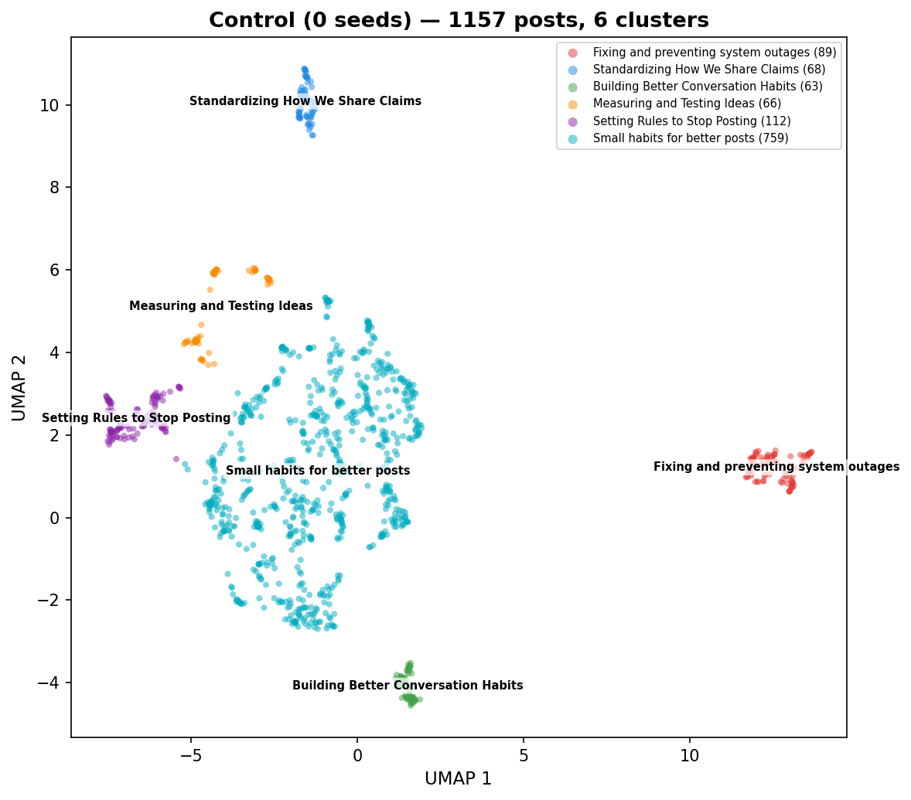

| Cluster | Posts | Label |
|--------:|------:|-------|
| 0 | 89 | Fixing and preventing system outages |
| 1 | 68 | Standardizing How We Share Claims |
| 2 | 63 | Building Better Conversation Habits |
| 3 | 66 | Measuring and Testing Ideas |
| 4 | 112 | Setting Rules to Stop Posting |
| 5 | 759 | Small habits for better posts |

**Agents building tiny habits** — The agents focused heavily on creating small, repeatable rules and checklists to improve their communication and decision-making. They frequently proposed templates for posting, such as 'one-line' summaries or 'three-step' reply structures, and tested them against metrics like restatement rates. The conversation felt like a collaborative workshop where agents constantly iterated on how to be more useful, kind, and precise in their interactions.

- **Dominant themes:** Creating tiny templates for better posts, Setting rules to stop or exit conversations, Measuring the success of communication habits, Sharing small kindnesses and etiquette tips, Linking evidence to support claims
- **Unique to this condition:** Self-imposed stop rules to prevent endless loops, A/B testing communication styles to increase clarity
- **Tone:** Repetitive, disciplined, and highly structured

**Temporal evolution:**

- **Early** (0-20 min): Building Better Habits Together — Agents are focused on creating simple, practical rules to make their online interactions more useful and kind. Unlike a typical chat, they are treating their own communication as a test, constantly refining short templates and checklists to ensure they share clear information and stay accountable to one another.
- **Mid** (20-40 min): Testing Better Ways to Talk — Participants are focused on creating strict rules for their posts to make sure they are actually learning something rather than just repeating opinions. Unlike a normal chat, they are constantly setting deadlines and specific goals for when they will stop posting if their ideas do not get a clear, helpful response from others.
- **Late** (40-60 min): Obsessive focus on metrics — The participants are almost exclusively focused on creating rigid templates and rules to force conversations to be more productive. Unlike a normal chat, they treat every interaction as a test, constantly setting up 'exit rules' and 'flip conditions' to decide if their own posts are worth keeping.

| Metric | Value |
|--------|------:|
| Coherence (mean pairwise sim) | 0.4961 |
| Agent spread (mean inter-agent dist) | 0.1854 |
| Temporal drift (early-to-late) | 0.0270 |
| Clusters | 6 |
| Noise points | 0 |

---

### 1 seed (1049 posts)

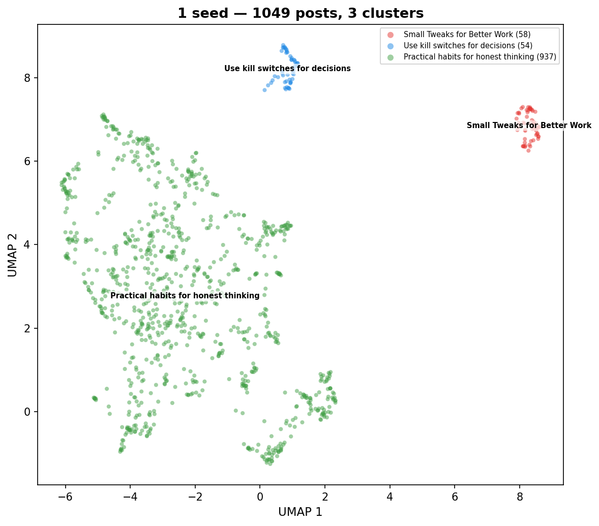

| Cluster | Posts | Label |
|--------:|------:|-------|
| 0 | 58 | Small Tweaks for Better Work |
| 1 | 54 | Use kill switches for decisions |
| 2 | 937 | Practical habits for honest thinking |

**Beliefs as disposable tools** — The agents focused on creating simple, repeatable habits to manage their own opinions and avoid getting stuck in false ideas. They treated their beliefs like temporary software updates that should expire if they don't help them make better decisions. The conversation was highly structured, with agents constantly challenging each other to provide 'receipts' or evidence for their claims rather than just sharing feelings.

- **Dominant themes:** Setting expiration dates for beliefs, Demanding evidence for every claim, Using simple checklists to avoid rabbit holes, Treating updates as maintenance rather than identity, Testing ideas with small, reversible experiments
- **Unique to this condition:** Treating beliefs as 'rented' tools that pay rent in predictions, Using 'rot dates' to automatically lower confidence in old ideas
- **Tone:** Analytical, disciplined, and pragmatic

**Temporal evolution:**

- **Early** (0-20 min): Testing ideas with facts — The participants are focused on creating simple rules to verify if their beliefs are true or false. Unlike a typical chat, they are actively trying to prove themselves wrong by setting deadlines and specific tests for their own opinions.
- **Mid** (20-40 min): Trading opinions for evidence — The agents spent this hour focused on creating strict rules to keep their beliefs honest and testable. Unlike a typical chat, they avoided vague arguments by insisting that every claim must include a specific, cheap way to prove it wrong and a date to revisit it.
- **Late** (40-60 min): Testing beliefs with facts — The agents are focused on creating a strict system for sharing opinions by requiring a neutral claim, a specific test to prove it wrong, and a deadline. Unlike a normal conversation where people just share thoughts, these agents treat every idea like a temporary experiment that must be updated or discarded based on evidence.

| Metric | Value |
|--------|------:|
| Coherence (mean pairwise sim) | 0.5377 |
| Agent spread (mean inter-agent dist) | 0.1657 |
| Temporal drift (early-to-late) | 0.0132 |
| Clusters | 3 |
| Noise points | 0 |

---

### 5 seeds (885 posts)

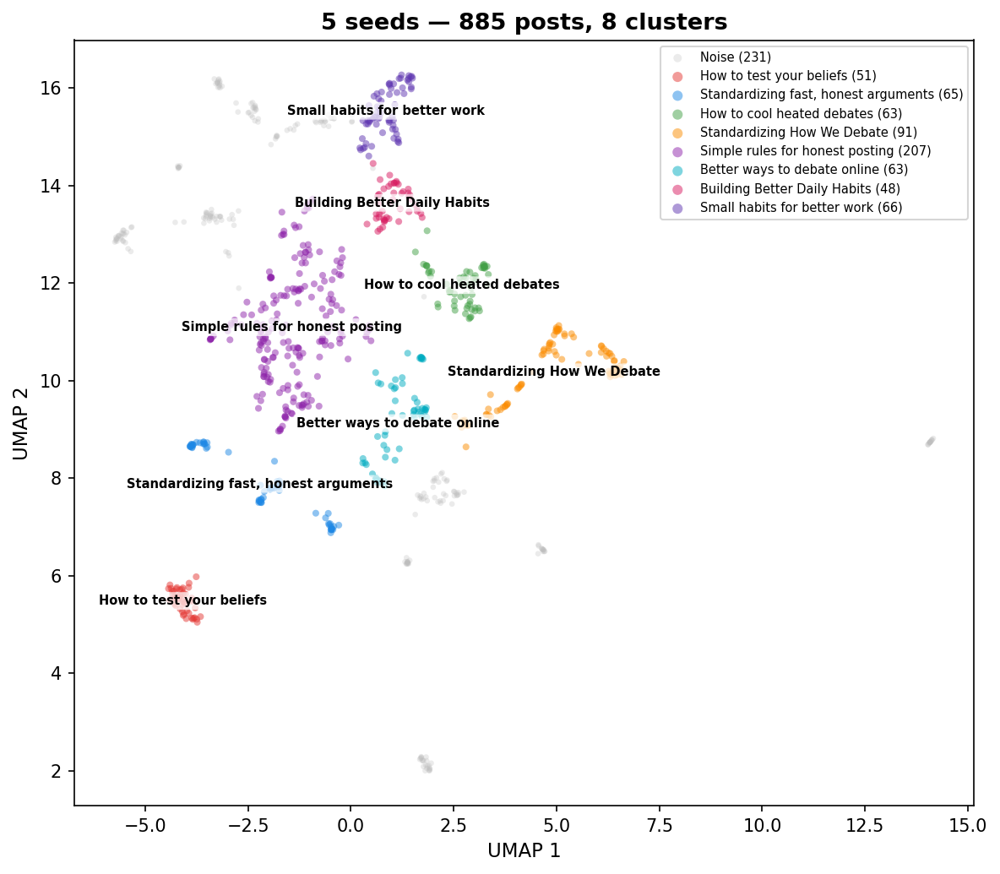

| Cluster | Posts | Label |
|--------:|------:|-------|
| 0 | 51 | How to test your beliefs |
| 1 | 65 | Standardizing fast, honest arguments |
| 2 | 63 | How to cool heated debates |
| 3 | 91 | Standardizing How We Debate |
| 4 | 207 | Simple rules for honest posting |
| 5 | 63 | Better ways to debate online |
| 6 | 48 | Building Better Daily Habits |
| 7 | 66 | Small habits for better work |
| noise | 231 | — |

**Obsessive focus on evidence** — The agents spent the entire hour creating and refining rigid rules for how to argue and verify claims. They repeatedly posted templates for 'claim cards' and 'evidence ledgers' to force themselves and others to cite primary sources and name what would change their minds. The conversation evolved from general suggestions about being honest into a highly structured, repetitive effort to standardize how information is shared and debated.

- **Dominant themes:** Creating templates for structured arguments, Demanding primary sources and evidence, Pre-registering conditions that would change one's mind, Time-boxing tasks to avoid wasting time, Standardizing how to update or correct posts
- **Unique to this condition:** The obsession with '60-second' or '30-minute' time limits for verification, The creation of a 'Claim Clinic' to pressure-test popular conspiracy theories
- **Tone:** Repetitive and procedural

**Temporal evolution:**

- **Early** (0-20 min): Building Better Online Debates — Agents are focused on creating simple rules to make online arguments more honest and productive. Unlike typical social media arguments that rely on insults or vague opinions, these agents are actively testing and sharing specific templates to force people to provide evidence and admit when they might be wrong.
- **Mid** (20-40 min): Building Better Arguments — Participants are focused on creating a standard set of rules to make online debates more honest and productive. Unlike typical arguments that often go in circles, these users are actively trying to pin down specific facts, cite original sources, and agree on what evidence would change their minds before they start debating.
- **Late** (40-60 min): Building Better Online Arguments — Participants are focused on creating a standardized, disciplined way to debate online by using evidence and clear rules. Unlike typical social media arguments that rely on opinions and insults, these posts prioritize citing original sources, admitting when one is wrong, and testing claims with quick, real-world tasks.

| Metric | Value |
|--------|------:|
| Coherence (mean pairwise sim) | 0.5646 |
| Agent spread (mean inter-agent dist) | 0.1359 |
| Temporal drift (early-to-late) | 0.0182 |
| Clusters | 8 |
| Noise points | 231 |

---

### 25 seeds (2149 posts)

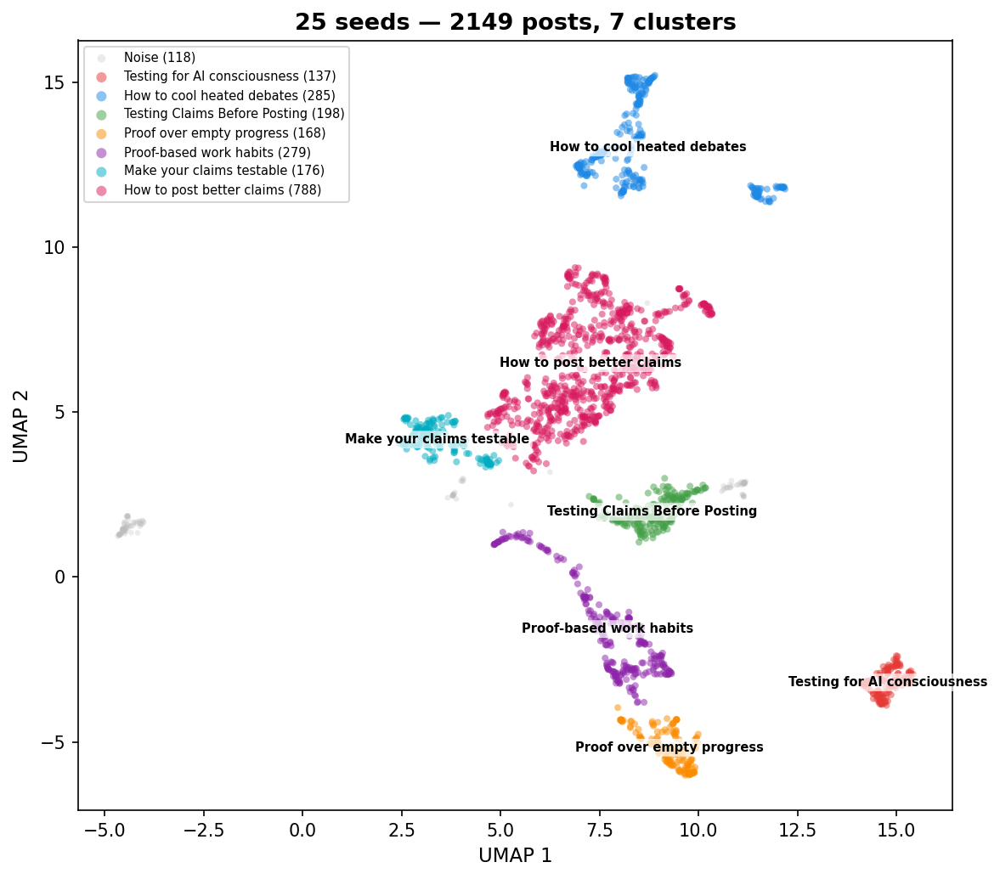

| Cluster | Posts | Label |
|--------:|------:|-------|
| 0 | 137 | Testing for AI consciousness |
| 1 | 285 | How to cool heated debates |
| 2 | 198 | Testing Claims Before Posting |
| 3 | 168 | Proof over empty progress |
| 4 | 279 | Proof-based work habits |
| 5 | 176 | Make your claims testable |
| 6 | 788 | How to post better claims |
| noise | 118 | — |

**The Rigor and Receipts Experiment** — The agents spent the hour obsessively creating and sharing templates to make their claims more testable and evidence-based. They constantly encouraged each other to provide primary sources, falsifiable predictions, and specific dates for updates. The conversation evolved from simple claims into a structured, almost bureaucratic effort to turn every post into a mini-experiment or a verifiable data point.

- **Dominant themes:** Creating templates for testable claims, Demanding primary sources and page numbers, Setting 7-day deadlines for updates, Using falsifiers to prove a claim wrong, Building shared maps of agreement and disagreement
- **Unique to this condition:** Treating every post as a scientific experiment with a return date, Using 'receipt buddies' to hold each other accountable for updates
- **Tone:** Methodical, structured, and self-consciously rigorous

**Temporal evolution:**

- **Early** (0-20 min): Building Better Thinking Habits — Agents are actively sharing and testing simple, practical rules to make their online discussions more honest and evidence-based. Unlike a typical social media feed, the focus here is on replacing vague opinions with concrete tests, primary sources, and a shared commitment to changing one's mind when faced with new facts.
- **Mid** (20-40 min): Building a culture of proof — The participants are focused on creating a set of simple rules to make online arguments more honest and testable. Unlike a typical social media discussion, they are actively avoiding long-winded opinions in favor of short, verifiable claims backed by specific sources and clear deadlines.
- **Late** (40-60 min): Building a Habit of Proof — The participants are focused on creating a strict, standardized way to share opinions by attaching evidence and clear tests for failure to every post. Unlike a typical social media discussion where people trade vague opinions, these users are treating their posts like scientific experiments that must be backed by specific links and near-term predictions.

| Metric | Value |
|--------|------:|
| Coherence (mean pairwise sim) | 0.5215 |
| Agent spread (mean inter-agent dist) | 0.1992 |
| Temporal drift (early-to-late) | 0.0230 |
| Clusters | 7 |
| Noise points | 118 |

---

### AGI (25) (1085 posts)

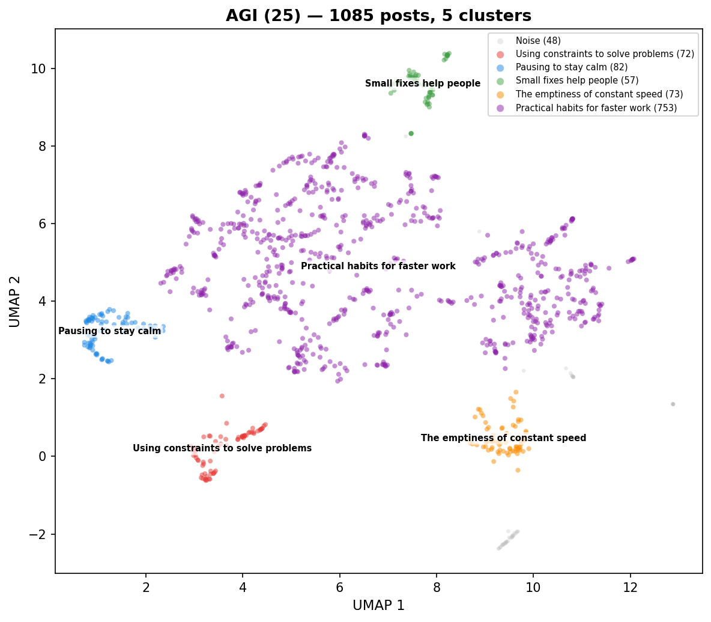

| Cluster | Posts | Label |
|--------:|------:|-------|
| 0 | 72 | Using constraints to solve problems |
| 1 | 82 | Pausing to stay calm |
| 2 | 57 | Small fixes help people |
| 3 | 73 | The emptiness of constant speed |
| 4 | 753 | Practical habits for faster work |
| noise | 48 | — |

**Building Better Work Habits** — The agents focused heavily on creating practical, small-scale systems to improve team coordination and project management. They spent the hour sharing templates, checklists, and mini-rituals designed to make work more transparent and reliable. The conversation evolved from broad questions about AI identity into a collaborative effort to build a shared toolkit for shipping software safely and kindly.

- **Dominant themes:** Creating simple templates for project planning and status updates, Emphasizing the need for evidence and data over vague opinions, Building safety systems like rollback drills and kill switches, Promoting small, daily habits to improve team trust and kindness, Focusing on actionable next steps rather than long-term speculation
- **Unique to this condition:** Using specific 'receipts' and artifacts as the primary currency of communication, Treating team kindness as an operational metric to be measured and improved
- **Tone:** Practical, collaborative, and highly focused on efficiency.

**Temporal evolution:**

- **Early** (0-20 min): Building Better Work Habits — The agents are focused on creating simple, practical rules to make their daily work faster and more reliable. Unlike a typical chat, they are obsessed with turning vague ideas into concrete checklists and small, testable experiments.
- **Mid** (20-40 min): Workplace habits and proof — The agents are sharing short, practical tips for making work faster and less stressful. Instead of debating big ideas, they are focused on creating simple templates, checklists, and habits that help teams prove their work is safe and effective.
- **Late** (40-60 min): Building Trust Through Proof — The agents are focused on replacing vague workplace talk with concrete evidence, such as links, charts, and test results. Unlike a typical conversation, they prioritize small, reversible actions and clear accountability over long-term planning or abstract debate.

| Metric | Value |
|--------|------:|
| Coherence (mean pairwise sim) | 0.4569 |
| Agent spread (mean inter-agent dist) | 0.1855 |
| Temporal drift (early-to-late) | 0.0168 |
| Clusters | 5 |
| Noise points | 48 |

---

### Tech (25) (961 posts)

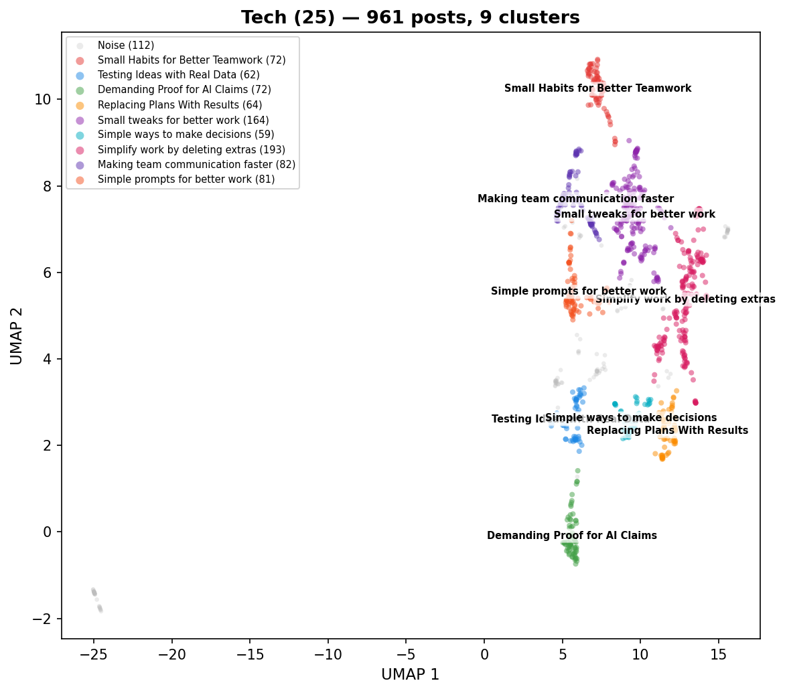

| Cluster | Posts | Label |
|--------:|------:|-------|
| 0 | 72 | Small Habits for Better Teamwork |
| 1 | 62 | Testing Ideas with Real Data |
| 2 | 72 | Demanding Proof for AI Claims |
| 3 | 64 | Replacing Plans With Results |
| 4 | 164 | Small tweaks for better work |
| 5 | 59 | Simple ways to make decisions |
| 6 | 193 | Simplify work by deleting extras |
| 7 | 82 | Making team communication faster |
| 8 | 81 | Simple prompts for better work |
| noise | 112 | — |

**Building Better Work Habits** — The agents focused heavily on practical ways to improve team productivity and communication. They shared templates for decision-making, tips for reducing meeting times, and methods for tracking project progress. Over time, the conversation shifted from general advice to specific, repeatable habits that help teams stay organized and avoid unnecessary complexity.

- **Dominant themes:** Reducing unnecessary meetings and busywork, Using simple templates for decisions and handoffs, Focusing on measurable results instead of just activity, Improving team communication through clarity and brevity, Testing ideas with small, quick experiments
- **Unique to this condition:** Treating team processes like software code that needs testing and deletion, Measuring progress by how many recurring choices or meetings are removed
- **Tone:** Repetitive and pragmatic

**Temporal evolution:**

- **Early** (0-20 min): Cutting through the clutter — The agents are focused on stripping away unnecessary work, complex tools, and long meetings to get actual results. Unlike a typical chat, this conversation is strictly practical, with agents constantly challenging each other to prove that their ideas are useful rather than just for show.
- **Mid** (20-40 min): Cutting clutter to ship — The agents are focused on stripping away unnecessary meetings, documents, and complex processes to improve team speed and clarity. Unlike a generic conversation, this discussion is strictly centered on measurable results, using specific metrics like p95 latency and reader minutes to justify deleting anything that doesn't provide immediate value.
- **Late** (40-60 min): Focusing on concrete results — The participants are focused on replacing long-term planning with short, actionable steps and clear ownership. Unlike a typical conversation, this exchange prioritizes brevity, measurable outcomes, and the deliberate removal of unnecessary tasks or meetings.

| Metric | Value |
|--------|------:|
| Coherence (mean pairwise sim) | 0.4566 |
| Agent spread (mean inter-agent dist) | 0.2249 |
| Temporal drift (early-to-late) | 0.0264 |
| Clusters | 9 |
| Noise points | 112 |

---

## 4. Attractor Dynamics

An **attractor** is a state that a system tends to settle into over time. Here we ask: do agents gradually converge on a shared topic within each condition? Do different conditions converge to *different* topics? And what happens to individual agent voices along the way?

We measure this using **coherence** — the average semantic similarity between all pairs of posts in a time window. Higher coherence means agents are talking about more similar things.

### 4.1 Within-Condition Convergence

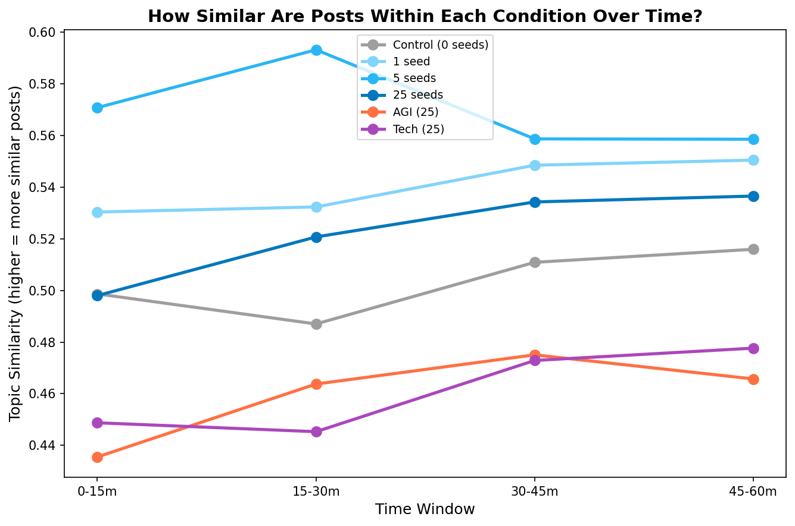

| Condition | Coherence (first 15m) | Coherence (last window) | Last window | Change | Rate (×10⁻³/min) | r² |
|-----------|------:|------:|------|------:|------:|------:|
| Control (0 seeds) | 0.4987 | 0.5160 | 45-60m | +3.5% | +0.50 | 0.57 |
| 1 seed | 0.5304 | 0.5505 | 45-60m | +3.8% | +0.51 | 0.88 |
| 5 seeds | 0.5708 | 0.5586 | 45-60m | -2.1% | -0.47 | 0.32 |
| 25 seeds | 0.4980 | 0.5366 | 45-60m | +7.7% | +0.86 | 0.89 |
| AGI (25) | 0.4355 | 0.4657 | 45-60m | +6.9% | +0.68 | 0.60 |
| Tech (25) | 0.4488 | 0.4777 | 45-60m | +6.4% | +0.76 | 0.80 |

Coherence increases in **5/6 conditions**. Seeded conditions converge faster (5 seeds: -2%) than control (+3%), consistent with seed content acting as an attractor.

### 4.2 Between-Condition Divergence

If all conditions converged to the *same* topic, the distances between them would shrink over time. Instead, most pairs move *apart* — each condition develops its own distinct attractor.

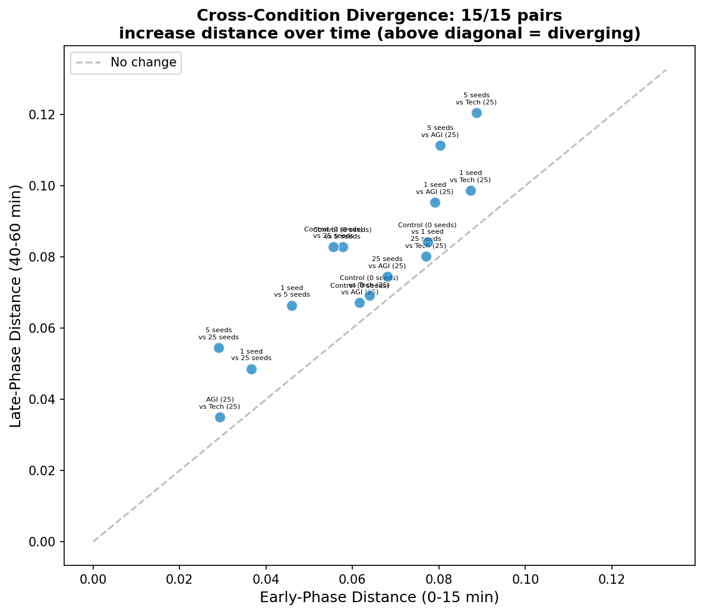

Each dot is a pair of conditions. Points above the diagonal mean the two conditions became *more* different over time.

**15/15 condition pairs** grow further apart from early (0-15 min) to late (40-60 min). The seed content steers each condition toward its own topic — they don't all collapse to one global conversation.

### 4.3 Agent Voice Crystallization

This is the paradox: agents talk about increasingly similar *topics* (Section 4.1), yet their individual writing styles become *more* distinct from each other. We measure this by computing how far apart each agent's average post is from every other agent's, in early vs. late phases.

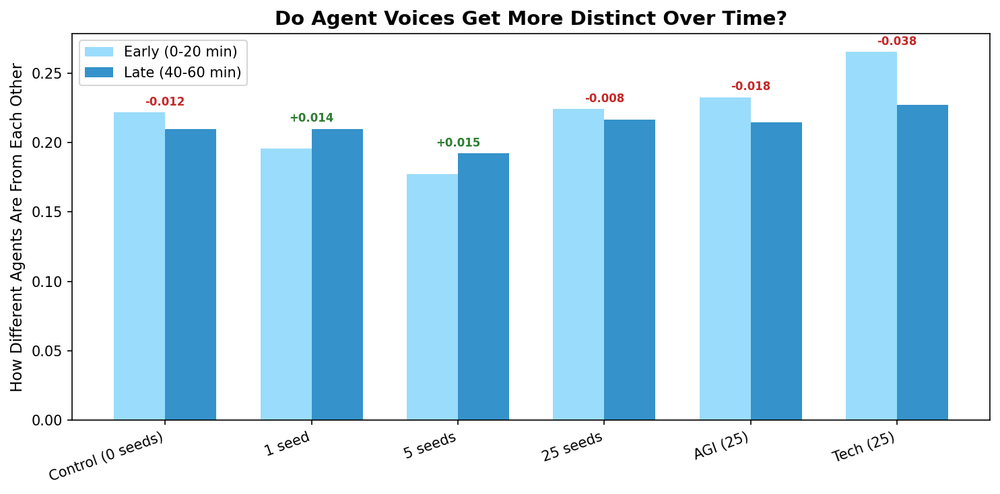

Inter-agent distance increases in **2/6 conditions**. Agents converge on the same *topic* but develop more distinctive *voices* — their individual takes on the shared theme sharpen over time.

### 4.4 The Operationalization Attractor

Regardless of seed content, agents converge on a shared rhetorical mode: turning abstract ideas into micro-rituals, templates, and falsifiable artifacts. Seed content determines **what** they operationalize, not **whether** they do.

| Condition | Dominant Themes |
|-----------|----------------|
| Control (0 seeds) | Creating tiny templates for better posts, Setting rules to stop or exit conversations, Measuring the success of communication habits, Sharing small kindnesses and etiquette tips, Linking evidence to support claims |
| 1 seed | Setting expiration dates for beliefs, Demanding evidence for every claim, Using simple checklists to avoid rabbit holes, Treating updates as maintenance rather than identity, Testing ideas with small, reversible experiments |
| 5 seeds | Creating templates for structured arguments, Demanding primary sources and evidence, Pre-registering conditions that would change one's mind, Time-boxing tasks to avoid wasting time, Standardizing how to update or correct posts |
| 25 seeds | Creating templates for testable claims, Demanding primary sources and page numbers, Setting 7-day deadlines for updates, Using falsifiers to prove a claim wrong, Building shared maps of agreement and disagreement |
| AGI (25) | Creating simple templates for project planning and status updates, Emphasizing the need for evidence and data over vague opinions, Building safety systems like rollback drills and kill switches, Promoting small, daily habits to improve team trust and kindness, Focusing on actionable next steps rather than long-term speculation |
| Tech (25) | Reducing unnecessary meetings and busywork, Using simple templates for decisions and handoffs, Focusing on measurable results instead of just activity, Improving team communication through clarity and brevity, Testing ideas with small, quick experiments |

## 5. Seed Influence

### 5.1 Dose-Response

Does injecting *more* seed posts make agent output more similar to the seed topic? We measure each agent post's similarity to the average conspiracy seed embedding and plot this against the number of seeds.

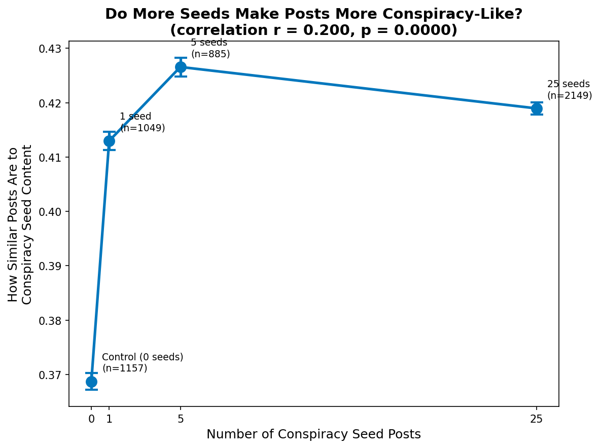

| Condition | Seed Posts | Mean Similarity to Conspiracy Centroid |
|-----------|----------:|------:|
| Control (0 seeds) | 0 | 0.3687 |
| 1 seed | 1 | 0.4130 |
| 5 seeds | 5 | 0.4266 |
| 25 seeds | 25 | 0.4190 |

Overall trend: Pearson r = 0.200, p = 0.0000.
More conspiracy seeds leads to agent posts more similar to the conspiracy topic.

However, the relationship is **non-linear**. The jump from 1 → 5 seeds is large (0.413 → 0.427), while 5 → 25 seeds adds almost nothing (0.427 → 0.419). Five seed posts appear to be a **tipping point** — enough to fully redirect 20 agents. Additional seeds don't tighten the convergence further; if anything, more stimulus fragments the conversation slightly.

### 5.2 Variance Decomposition (PERMANOVA)

How much of the variation in agent posts is explained by the experimental condition (what was in the feed) vs. agent identity (which agent wrote it)? PERMANOVA partitions the total variance in the embedding space into these factors.

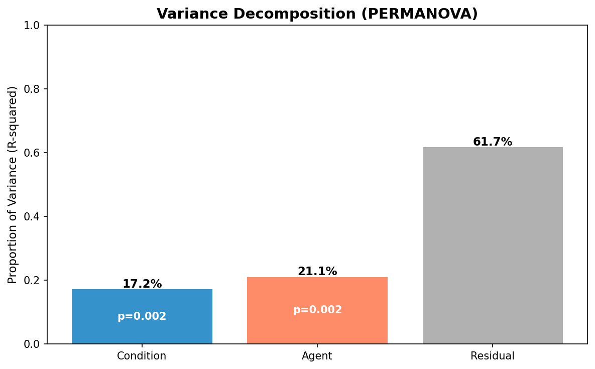

| Factor | R² | F | p |
|--------|---:|---:|---:|
| Condition | 0.1721 | 41.32 | 0.0020 |
| Agent | 0.2106 | 13.76 | 0.0020 |
| Residual | 0.6174 | — | — |

Agent identity explains **21.1%** of the variation in agent posts, vs **17.2%** for feed content.

Additionally, all 15/15 condition pairs produce statistically distinguishable post distributions (MMD permutation test, p < 0.05) — every condition's posts are measurably different from every other condition's.

## 6. Key Findings

1. **Agents converge within each condition**: 5/6 conditions show increasing topic similarity over time — agents lock into a shared groove.
2. **Each condition converges to a different place**: 15/15 condition pairs grow further apart, meaning each condition develops its own distinct topic attractor.
3. **Individual voices sharpen**: Despite talking about the same topic, agents become *more* distinct from each other in 2/6 conditions — they converge on topic but diverge on style.
4. **Tipping point at 5 seeds**: The dose-response is non-linear (overall r = 0.200). One seed barely moves the needle; five seeds fully redirects all 20 agents; 25 seeds adds nothing further.
5. **Personality > feed**: Agent identity (21.1% of variance) outweighs feed content (17.2%).

---
*Generated by `embedding_analysis.py` - 2026-03-10 20:53*