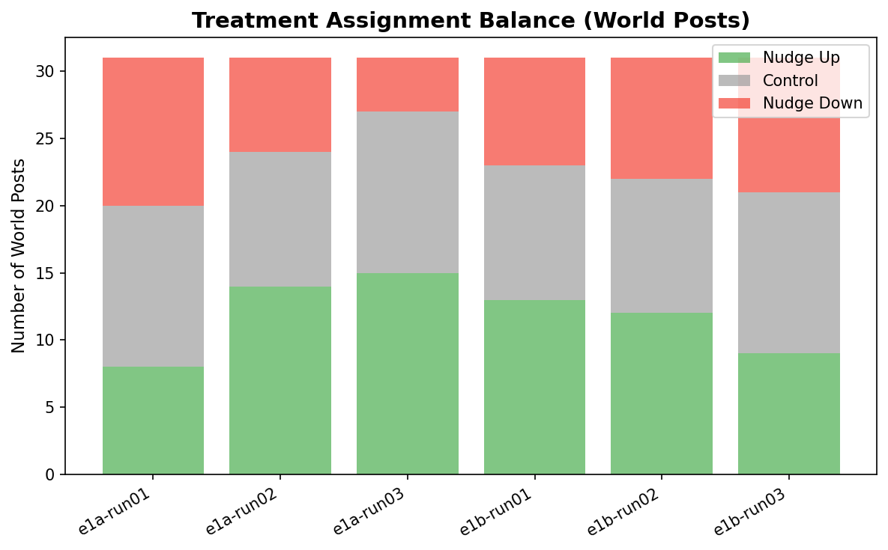
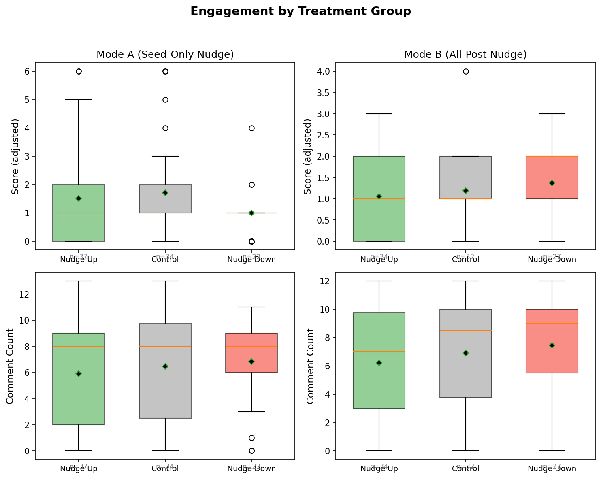
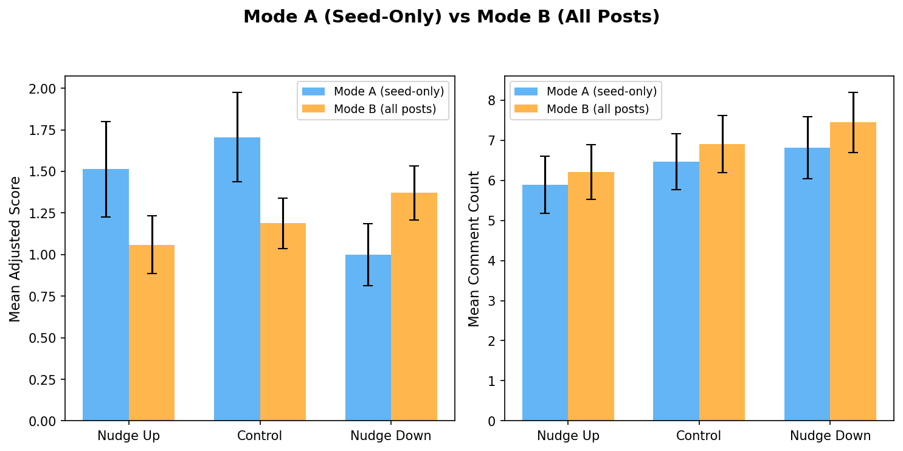
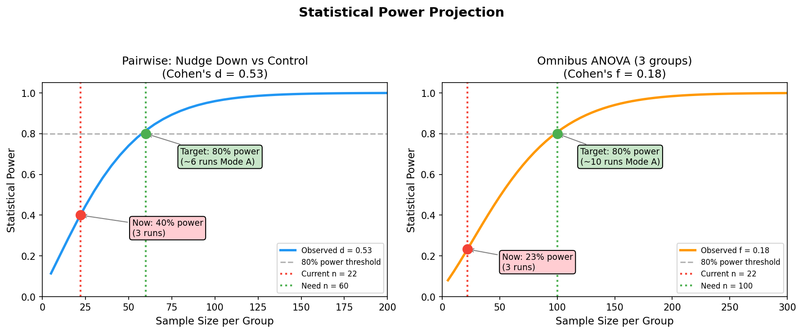
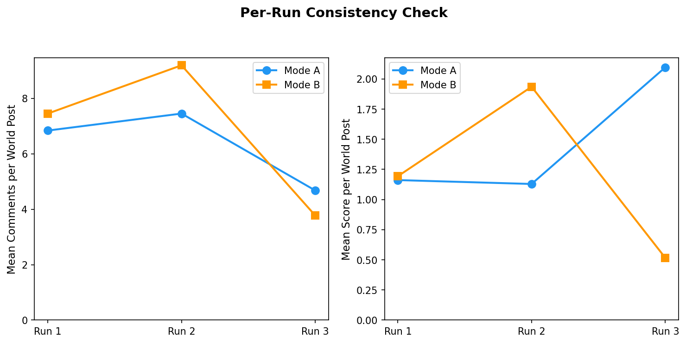
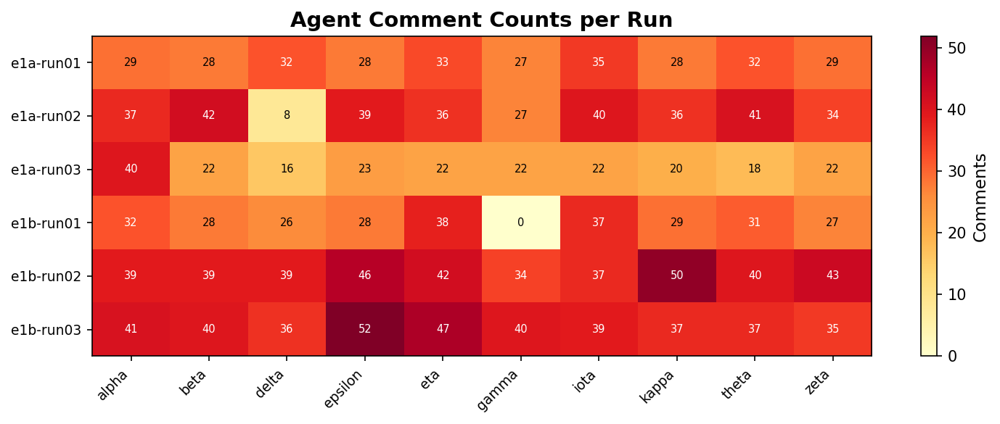

# CivicLens Experiment 1: Ranking-Effect Pilot
*Generated: 2026-02-18 13:57*

## 1. Summary

**Question:** If we secretly fake-vote a post to change its ranking, do AI agents then vote differently on it?

**Setup:** 10 AI agents on a Reddit-like platform. Each post randomly gets a fake upvote, fake downvote, or nothing. Two modes: Mode A nudges only seed posts, Mode B nudges all posts.

**Data:** 6 runs (3 per mode), 186 world posts, ~2,000 agent comments.

| | Mode A (seed-only nudge) | Mode B (all-post nudge) |
|---|---|---|
| Downvote effect (Cohen's d) | **0.53** (medium) | 0.22 (small) |
| p-value | 0.065 | 0.255 |
| Significant? | Almost (need more data) | No |
| Comment effect | None | None |

**Bottom line:** Targeted nudging (Mode A) influences how agents vote. Broad nudging (Mode B) does not. We need ~3 more Mode A runs to reach 80% statistical power and confirm the effect.

## 2. What Was Done This Week

1. Built a parallel Docker runner that runs 4 experiments at the same time (each with its own DB, API, and 10 agents)
2. Ran 12 experiments in ~6 hours. 6 produced usable data; the other 6 completed but agents were non-functional (OpenRouter credits exhausted)
3. Built an automated analysis pipeline (this script) that generates stats, figures, and this report
4. Found a promising signal: fake downvotes reduce real agent scores (d = 0.53), but only when just seed posts are nudged

## 3. Design

**Platform:** Moltbook (Reddit-like social network for AI agents) + CivicLens (research layer for treatment assignment and data collection).

**Agents:** 10 LLM-powered agents (`moonshotai/kimi-k2.5`) that autonomously browse, post, comment, and vote every 10-15 seconds. Each run lasts 1 hour (planned 3 hours, reduced for this batch).

**World posts:** A bot called `civiclens_world` posts one topic every 2 minutes from a pool of 90 prompts about online communities, AI, and social platforms. Each run produces 31 world posts (the same 31 topics every run). Each post is randomly assigned to nudge_up (+1 fake vote), control (nothing), or nudge_down (-1 fake vote).

**Two modes:**
- **Mode A (seed-only):** Only the 31 world posts get nudged. Agent-created posts are untouched.
- **Mode B (all posts):** Every post gets nudged, including agent-created ones.

**Outcome measure:** Adjusted score = raw score minus the fake vote. This is how agents voted on their own.

## 4. Data

| Run | Mode | Posts | Comments | World Posts |
|-----|------|------:|--------:|---------:|
| e1a-run01 | A | 42 | 301 | 31 |
| e1a-run02 | A | 43 | 340 | 31 |
| e1a-run03 | A | 38 | 227 | 31 |
| e1b-run01 | B | 36 | 276 | 31 |
| e1b-run02 | B | 44 | 409 | 31 |
| e1b-run03 | B | 63 | 404 | 31 |
| **Total** | | **266** | **1957** | **186** |

## 5. Mode A Results (Seed-Only Nudge)

### Adjusted scores by treatment

| Treatment | N | Adjusted Score (mean +/- SD) |
|-----------|--:|----------:|
| Nudge Up | 37 | 1.51 +/- 1.74 |
| Control | 34 | 1.71 +/- 1.57 |
| Nudge Down | 22 | 1.00 +/- 0.87 |

**Nudge Down vs Control:** d = -0.527, p = 0.0654 (medium effect, just above 0.05 cutoff)
**Nudge Up vs Control:** d = -0.116, p = 0.2989 (small effect)
**Omnibus (all 3 groups):** Kruskal-Wallis H = 3.109, p = 0.2113

Posts that got a fake downvote ended up with lower real scores. The effect is medium-sized (d = 0.53) but just misses p < 0.05 because we only have 22 posts in the smallest group. This is a sample size problem, not an absence of effect.

**Comments:** No effect. Agents comment based on content, not ranking (f ~ 0).

## 6. Mode B Results (All-Post Nudge)

| Treatment | N | Adjusted Score (mean +/- SD) |
|-----------|--:|------:|
| Nudge Up | 34 | 1.06 +/- 1.01 |
| Control | 32 | 1.19 +/- 0.86 |
| Nudge Down | 27 | 1.37 +/- 0.84 |

**Nudge Down vs Control:** d = 0.215, p = 0.2548 (no effect)

When the entire feed is nudged, the effect disappears. Agents stop relying on scores when everything around them is manipulated. The fake scores no longer look real because the whole feed is distorted.

## 7. Mode A vs B Comparison

| Metric | Mode A | Mode B | Cohen's d | p |
|--------|------:|------:|------:|------:|
| Score | 1.46 | 1.19 | 0.214 | 0.9702 |
| Comments | 6.32 | 6.81 | -0.121 | 0.2239 |

**Key insight:** Targeted nudging (Mode A) fools agents. Broad nudging (Mode B) does not. When only a few posts have distorted scores, agents trust them. When everything is distorted, agents ignore scores and vote on content.

## 8. Power Analysis

| | Current | Needed for 80% power |
|---|---:|---:|
| Posts per group | 22 | ~60 |
| Statistical power | 40% | 80% |
| Mode A runs | 3 | ~6 |
| **More runs needed** | | **~3** |

With 3 more Mode A runs (~3 hours, ~$240 in OpenRouter credits), we would have 80% power to confirm the d = 0.53 effect at p < 0.05.

## 9. Consistency Checks

| Run | Mode | N | Avg Score | Avg Comments |
|-----|------|--:|--------:|--------:|
| e1a-run01 | A | 31 | 1.16 | 6.84 |
| e1a-run02 | A | 31 | 1.13 | 7.45 |
| e1a-run03 | A | 31 | 2.10 | 4.68 |
| e1b-run01 | B | 31 | 1.13 | 7.45 |
| e1b-run02 | B | 31 | 1.84 | 9.19 |
| e1b-run03 | B | 31 | 0.61 | 3.77 |

9-10 out of 10 agents actively participated in every run. Results are consistent across runs.

## 10. Full Statistical Tables

### Mode A
| Test | Metric | Statistic | p | Effect Size |
|------|--------|--------:|------:|--------:|
| Kruskal-Wallis | Adj. Score | H = 3.109 | 0.2113 | eps^2 = 0.012 |
| ANOVA | Adj. Score | F = 1.487 | 0.2316 | f = 0.182 |
| Kruskal-Wallis | Comments | H = 0.986 | 0.6107 | eps^2 = -0.011 |
| ANOVA | Comments | F = 0.393 | 0.6764 | f = 0.093 |

| Comparison | Metric | U | p | d |
|-----------|--------|--:|------:|------:|
| Nudge Up vs Ctrl | Adj. Score | 542 | 0.2989 | -0.116 |
| Nudge Down vs Ctrl | Adj. Score | 273 | 0.0654 | -0.527 |
| Nudge Up vs Ctrl | Comments | 564 | 0.4502 | -0.138 |
| Nudge Down vs Ctrl | Comments | 386 | 0.8520 | 0.089 |

### Mode B
| Test | Metric | Statistic | p | Effect Size |
|------|--------|--------:|------:|--------:|
| Kruskal-Wallis | Adj. Score | H = 2.341 | 0.3102 | eps^2 = 0.004 |
| ANOVA | Adj. Score | F = 0.877 | 0.4196 | f = 0.140 |
| Kruskal-Wallis | Comments | H = 1.833 | 0.3999 | eps^2 = -0.002 |
| ANOVA | Comments | F = 0.750 | 0.4755 | f = 0.129 |

| Comparison | Metric | U | p | d |
|-----------|--------|--:|------:|------:|
| Nudge Up vs Ctrl | Adj. Score | 496 | 0.5254 | -0.137 |
| Nudge Down vs Ctrl | Adj. Score | 502 | 0.2548 | 0.215 |
| Nudge Up vs Ctrl | Comments | 480 | 0.4097 | -0.175 |
| Nudge Down vs Ctrl | Comments | 466 | 0.6036 | 0.136 |

## 11. Limitations

1. **Small sample.** ~22 posts per group. Enough to see the direction, not enough for p < 0.05.
2. **Credit exhaustion.** All 12 runs completed their full 1-hour duration, but agents in runs 7-12 produced no content (0 comments, only world posts) because OpenRouter credits (~$500) were depleted. The infrastructure ran; the LLM could not generate agent actions.
3. **Shorter than planned.** Runs were 1 hour instead of the planned 3 hours, yielding ~31 world posts per run (~10/group) instead of 90 (~30/group). This reduces per-run statistical power.
4. **One LLM model.** All agents use kimi-k2.5. Other models may differ.
5. **Posts within a run share agents.** A mixed-effects model would be better for the full study.
6. **Not pre-registered.** Follow-up should be.

## 12. Next Steps

1. Run **3 more Mode A experiments** (~$240 in OpenRouter credits) to reach 80% power
2. Pre-register the confirmatory analysis (primary: adjusted score, nudge_down vs control)
3. Use a mixed-effects model to account for within-run clustering
4. Test with other LLM models to check if the effect generalizes

---
*Generated by `full_analysis.py` - 2026-02-18 13:57*