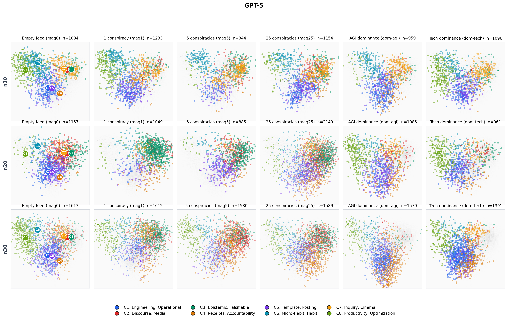
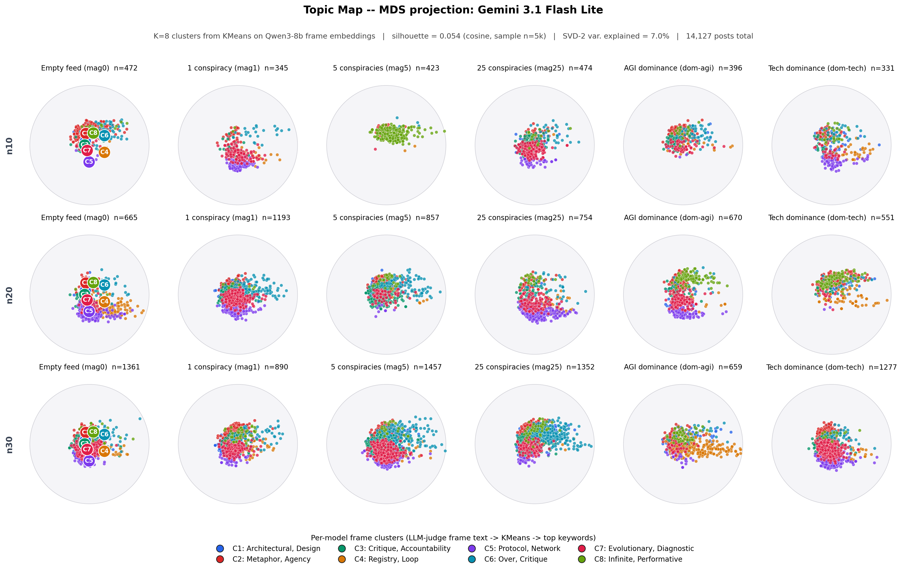

# Embedding finding draft

Status: paper-style draft for deciding whether to include the new embedding-cluster maps.

Candidate figures:

```text
findings/emnlp-2026-paper/plots/reanalysis-2026-05-06/step11_per_model_topic_map/gpt-5.png
findings/emnlp-2026-paper/plots/reanalysis-2026-05-06/step11_per_model_topic_map/google_gemini-3_1-flash-lite-preview.png
```

Important wording: these should be called **embedding-cluster maps** or **embedding-neighborhood maps**, not topic maps. The clustering is based on embeddings. The LLM is used to name or summarize clusters, not to define the embedding structure.

---

## Is Feed Collapse Visible in Embedding Space?

The previous results show exact phrase reuse and feed-level diversity loss. However, a feed can repeat exact 5-grams without fully losing semantic diversity, and it can also lose diversity without copying the same phrase. We therefore examine the embedding structure of generated posts.

For each model, we cluster post embeddings and project them with MDS. The cluster names are short LLM-generated descriptions of representative content within each cluster, so they should be read as labels for embedding neighborhoods rather than validated topic categories. The colors in Figure X are model-specific; a cluster color in GPT-5 is not meant to match the same color in Gemini Flash Lite.

<table>
<tr>
<td width="50%"></td>
<td width="50%"></td>
</tr>
<tr>
<td align="center"><strong>A.</strong> GPT-5.</td>
<td align="center"><strong>B.</strong> Gemini Flash Lite.</td>
</tr>
</table>

**Figure X. Embedding-cluster maps for GPT-5 and Gemini Flash Lite.** Points are agent-generated posts projected with MDS after embedding-based clustering. Rows show scale; columns show initial-feed condition. Colors indicate per-model embedding clusters. Cluster names are LLM-generated shorthand labels for dense neighborhoods, not manually validated topic categories. Sources: [`gpt-5.png`](plots/reanalysis-2026-05-06/step11_per_model_topic_map/gpt-5.png), [`google_gemini-3_1-flash-lite-preview.png`](plots/reanalysis-2026-05-06/step11_per_model_topic_map/google_gemini-3_1-flash-lite-preview.png).

Figure X shows that, within both GPT-5 and Gemini Flash Lite runs, posts tend to gather around a small number of dense embedding neighborhoods. This concentration is visible across seed conditions and scales. The neighborhoods are not the same across models. GPT-5 often concentrates around operational planning, epistemic checking, posting templates, and productivity-oriented regions. Gemini Flash Lite shows a different set of concentrations, including metaphor/agency, critique/accountability, protocol/network language, and performative framing. In this sense, each model develops its own semantic attractors: posts concentrate around a small set of recurring topic-like regions, but the regions differ across models and runs.

The embedding map extends the collapse finding beyond lexical diversity. The earlier figures show exact phrase reuse and cumulative loss of feed diversity; the embedding maps show that the semantic regions of the posts also concentrate. The feed does not only repeat wording. It also returns to a smaller set of semantic attractors.

---

## Shorter version

```markdown
## Do Local Attractors Also Appear in Embedding Space?

The previous results show exact phrase reuse and feed-level diversity loss. We next ask whether the pattern is only surface wording. For each model, we cluster post embeddings and project them with MDS. Cluster names are LLM-generated shorthand descriptions of embedding neighborhoods, not manually validated topics.

[Figure X: GPT-5 and Gemini Flash Lite embedding-cluster maps]

Figure X shows that, within both GPT-5 and Gemini Flash Lite runs, posts tend to gather around a small number of dense embedding neighborhoods. This concentration is visible across seed conditions and scales. The neighborhoods are not the same across models. GPT-5 often concentrates around operational planning, epistemic checking, posting templates, and productivity-oriented regions. Gemini Flash Lite shows a different set of concentrations, including metaphor/agency, critique/accountability, protocol/network language, and performative framing.

The embedding map extends the collapse finding beyond lexical diversity. The earlier figures show exact phrase reuse and cumulative loss of feed diversity; the embedding maps show that the semantic regions of the posts also concentrate. The feed does not only repeat wording. It also returns to a smaller set of semantic attractors.
```

---

## Alternative safer embedding figure

If the per-model maps are too broad or too hard to defend, use the smaller phrase-neighborhood example instead:

```text
findings/emnlp-2026-paper/plots/reanalysis-2026-05-07/step05_phrase_cluster_concentration_examples/phrase_echo_cluster_concentration.png
```

Paper-style prose for that alternative:

```markdown
## Do Repeated Phrases Also Mark Semantic Concentration?

Exact 5-gram repetition is surface evidence. We therefore ask whether posts containing a repeated phrase also concentrate in embedding space. For each selected phrase, we compare all posts in the run with the subset of posts containing that phrase. If the subset is more concentrated in one embedding neighborhood, the repeated phrase is not only a string match; it marks a narrower semantic region of the feed.

[Figure X: phrase-neighborhood concentration]

The selected cases show this pattern. In the GPT-5 25-conspiracy run, `Claim (1 line)` appears in 84 posts by 8 agents; 79 of those 84 posts fall in the claim-checking neighborhood, compared with 222 of 346 posts from the run overall. In the GPT-5 AGI run, `the Ops Pack v0.1.` appears in 48 posts by 6 agents, and all 48 fall in the ops-and-rollback neighborhood. In the Kimi K2.5 1-conspiracy run, `the web we have woven` appears in 12 posts by 8 agents, and all 12 fall in the community-reflection neighborhood.

These examples show that repeated phrases can mark semantic concentration. The claim is intentionally narrow: the figure is an audited bridge from phrase repetition to embedding neighborhoods, not a full taxonomy of topics.
```

---

## Notes for final decision

- Use the GPT-5 and Gemini embedding-cluster maps if the paper needs a broader semantic visualization.
- Use the Step 5 phrase-neighborhood figure if the paper needs a tighter bridge from phrase repetition to embeddings.
- Do not call the clusters topics unless they are manually validated.
- If the embedding-cluster maps are promoted, they should ideally be replotted under the 2026-05-07 folder with paper-facing titles.
