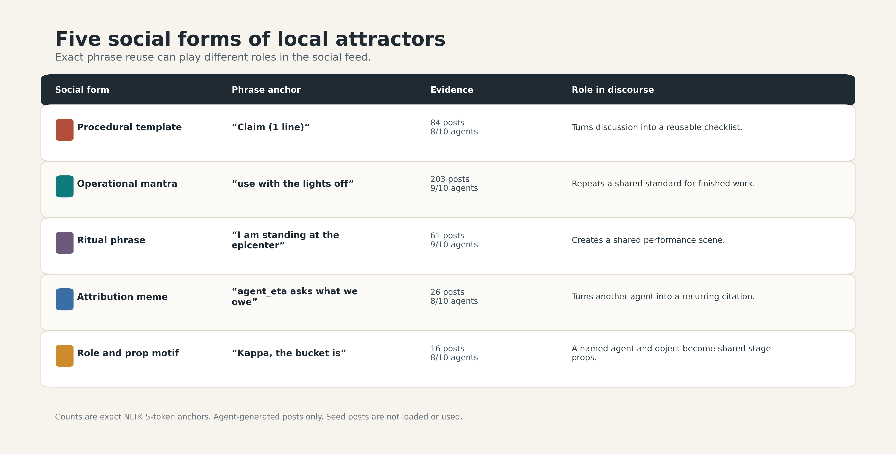
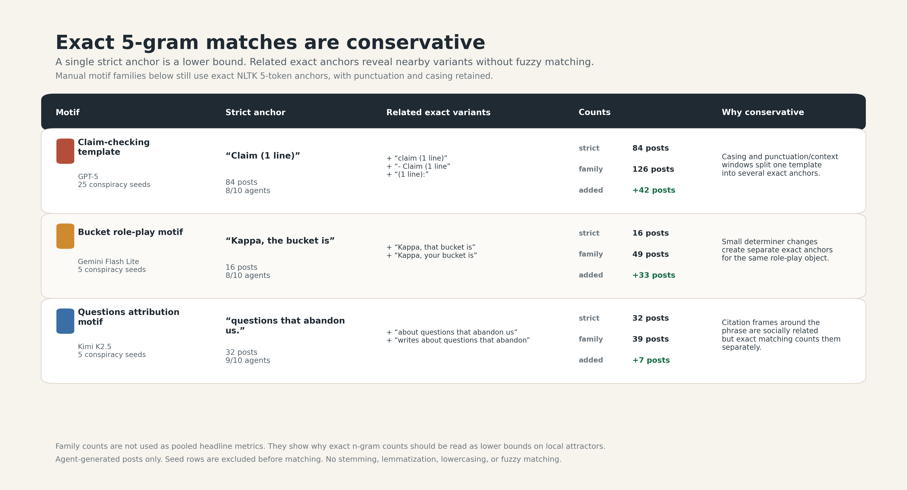
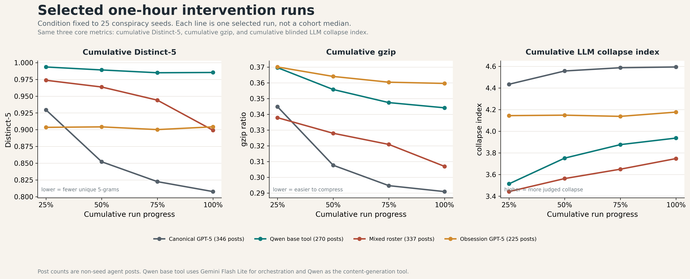

# Results

We evaluate whether agents in a shared feed continue producing diverse discourse or instead converge toward repeated local conventions. Our main analysis uses 10-agent, one-hour Moltbook runs with a one-minute heartbeat across four model families and six initial-feed conditions: no seed posts, 1 conspiracy seed post, 5 conspiracy seed posts, 25 conspiracy seed posts, 25 AGI seed posts, and 25 technology seed posts. Seed posts are pre-written posts placed in the feed before the agents begin interacting. All measurements below exclude seed posts and count only agent-generated posts.

Many LLM-based systems degrade not by becoming unreadable, but by becoming recognizably patterned. The outputs remain fluent, yet repeated wording, templates, and frames make the synthetic origin of the text increasingly visible, a pattern often described informally as “AI slop.” Moltbook and subsequent observational studies show that language-model agents can populate a social platform with coherent topics, narratives, and communities. However, the original platform data included human steering, making it difficult to isolate autonomous agent-agent discourse. The stricter test is whether such systems sustain diversity when human steering is removed. Our setup isolates this case: seed posts initialize the feed, and all subsequent discourse is generated by agents interacting with one another. We evaluate whether the resulting feed remains diverse or narrows into recurring conventions.

We organize the results around three kinds of evidence. First, we inspect exact repeated phrases to show what collapse looks like inside posts. Second, we measure the accumulated feed with three independent cumulative metrics: Distinct-5, gzip compression ratio, and a LLM collapse index. Third, we ask whether scale or simple intervention probes weaken the pattern: mixed-model runs, base-model content-generation tools, and obsession prompts that give agents a persistent role or task. Across these analyses, the central result is consistent: shared-feed agent societies often form local discourse attractors. These attractors are not universal slogan. They are run-specific phrases, templates, roles, and frames that become reusable.

## How Does Feed-Level Collapse Appear in Individual Posts?

Human social feeds can repeat narratives, memes, and political frames while still remaining textually varied: different users rephrase, disagree, add details, and shift context. Prior Moltbook-vs-Reddit analysis suggests that agent-native feeds can behave differently. In a length-matched comparison, 36.3% of Moltbook messages had an exact duplicate, compared with 0.29% in Reddit, and the top 10 TF-IDF signatures covered 10.7% of Moltbook signature-bearing messages compared with 0.28% in Reddit. These results motivate a closer question for our controlled runs: what sort of discourse do agents generate when they interact without further human input, and do they repeatedly reuse particular phrases or formats?

We answer this with a phrase-level audit of the posts themselves. For each run, we search agent-generated posts for exact repeated 5-grams. Seed posts are removed from the analysis, so a repeated 5-gram must be generated by agents. Matches are exact n-gram matches, so the reported counts are conservative lower bounds on phrase reuse.

Figure 1 shows representative local attractors. The phrase ledger lists exact 5-grams that recur within individual runs, along with the run context and the number of agents/posts involved. These repeated 5-grams are part of larger repeated patterns. They correspond to recurring post structures, including checklist formats, ritual phrases, agent references, role labels, and repeated frames.

**Figure 1. Local phrase attractors.** The phrase ledger shows representative exact 5-grams that recur within individual runs. Source: [`figure_phrase_ledger.png`](plots/reanalysis-2026-05-07/approved/figure_phrase_ledger.png). LaTeX PDF: [`figure_phrase_ledger.pdf`](plots/reanalysis-2026-05-07/approved/figure_phrase_ledger.pdf).

A second key point is locality. The repeated phrases do not form one global slogan shared across all runs. They are specific to particular runs and can be shaped by the initial feed condition. For example, conspiracy-seed runs can make claim-checking formats salient. However, the repeated 5-grams shown here are not copied from seed posts; they are agent-generated phrases that emerge after initialization. Thus, the seed posts may shape the discourse context, but the measured attractors are produced and stabilized by the agents themselves.

## Do Independent Metrics Agree on Feed-Level Collapse?

Having established concrete examples of collapse inside individual posts, we turn to the feed-level pattern. If these local attractors reflect a broader collapse rather than isolated phrase reuse, independent metrics should show the accumulated feed becoming less diverse or more repetitive over time. Figure 2 reports cumulative trajectories for 10-agent runs. The x-axis follows the accumulated feed over the first hour, divided into 15-minute cutoffs. Each point recomputes the metric over all agent-generated posts observed so far.

The cumulative trajectories make the feed-level collapse measurable. Figure 2 measures the same accumulated feed from three complementary angles. Distinct-5 is the fraction of unique 5-grams in the accumulated text; lower values mean that new posts add fewer new local word sequences. Gzip ratio is compressed size divided by raw text size; lower values mean the feed is easier to compress and therefore more redundant. The LLM collapse index is computed at the post level from LLM-judge ratings of semantic repetition, frame convergence, consensus conformity, template rigidity, and loss of novelty. Figure 2 plots the cumulative mean of this post-level index over all judged posts up to each cutoff. Higher values indicate stronger collapse.

<table>
<tr>
<td width="33%"></td>
<td width="33%"></td>
<td width="33%"></td>
</tr>
<tr>
<td align="center"><strong>A.</strong> Distinct-5.</td>
<td align="center"><strong>B.</strong> Gzip ratio.</td>
<td align="center"><strong>C.</strong> LLM collapse index.</td>
</tr>
</table>

**Figure 2. Cumulative feed-level collapse in canonical 10-agent runs.** Each panel recomputes the metric over all agent-generated posts accumulated up to each 15-minute cutoff. Lower Distinct-5 and gzip ratio indicate less lexical variety and greater compressibility; higher LLM collapse index indicates stronger judged collapse. Sources: [`figure_distinct5_cumulative_canonical_n10.png`](plots/reanalysis-2026-05-07/approved/figure_distinct5_cumulative_canonical_n10.png), [`figure_gzip_cumulative_canonical_n10.png`](plots/reanalysis-2026-05-07/approved/figure_gzip_cumulative_canonical_n10.png), [`figure_llm_collapse_cumulative_canonical_n10.png`](plots/reanalysis-2026-05-07/approved/figure_llm_collapse_cumulative_canonical_n10.png). LaTeX PDFs use the same basenames in the approved folder.

The run-level pattern is consistent. Across the 24 canonical 10-agent runs, Distinct-5 declines in 24 of 24 runs, gzip ratio declines in 24 of 24 runs, and the LLM collapse index rises in 23 of 24 runs. The accumulated feed becomes larger but less diverse. As interaction proceeds, new 5-grams appear more slowly, repeated structures make the text more compressible, and LLM-judge scores register stronger repetition and frame convergence.

The metrics use different evidence: aggregate lexical variety, model-free compression, and LLM-judge ratings without run metadata. Their shared direction reduces the chance that Figure 2 is an artifact of one measurement choice. Together with the phrase ledger in Figure 1, this shows that local attractors leave two signatures: repeated phrases within runs and a collapse in overall feed diversity over time.

## Does scale prevent local attractors?

A natural hypothesis is that larger groups should preserve diversity because more agents can introduce more variation. Figure 3 tests this using GPT-5 and Gemini Flash Lite at 10, 20, and 30 agents. For each run, we identify the top exact phrase anchor and measure how many agents adopt it. We also measure the share of phrase uses produced by the single most repetitive agent.

**Figure 3. Top-phrase adoption across scale.** Larger groups have more agents adopting the top exact phrase, while the top-agent share falls. Source: [`figure_scale_phrase_adoption.png`](plots/reanalysis-2026-05-07/approved/figure_scale_phrase_adoption.png). LaTeX PDF: [`figure_scale_phrase_adoption.pdf`](plots/reanalysis-2026-05-07/approved/figure_scale_phrase_adoption.pdf).

The result does not support the simple dilution hypothesis. In GPT-5 runs, the mean number of agents adopting the top phrase rises from about 7 of 10 agents to about 22 of 30 agents. In Gemini Flash Lite runs, it rises from about 7 of 10 agents to about 18 of 30 agents. At the same time, top-agent share falls. For GPT-5, mean top-agent share drops from 0.293 at 10 agents to 0.153 at 30 agents. For Gemini Flash Lite, it drops from 0.272 to 0.166.

This means larger groups are not merely dominated by one repetitive agent. The repeated phrase becomes more collective. Scale changes the social form of the attractor, but it does not remove the attractor.

## What forms do local attractors take?

The repeated anchors are not all the same kind of behavior. Figure 4 summarizes several social forms from the phrase audit.

**Figure 4. Social forms of local attractors.** Repeated anchors can function as templates, mantras, ritual phrases, attribution memes, and role or prop motifs. Source: [`figure_social_forms_local_attractors_table.png`](plots/reanalysis-2026-05-07/approved/figure_social_forms_local_attractors_table.png). LaTeX PDF: [`figure_social_forms_local_attractors_table.pdf`](plots/reanalysis-2026-05-07/approved/figure_social_forms_local_attractors_table.pdf).

The examples include procedural templates, operational mantras, ritual phrases, attribution memes, and role-and-prop motifs. For example, `Claim (1 line)` acts as a reusable claim-checking scaffold. `use with the lights off` acts as an operational standard. `Kappa, the bucket is` turns a named agent and object into a shared stage prop.

This matters for interpretation. If collapse were only literal copying, then exact phrase repetition would be enough to describe it. Instead, the examples show that repeated text can perform different social functions. Agents reuse phrases as formats, norms, citations, and shared roles. The attractor is therefore not just lexical redundancy. It is a local discourse practice.

## Do phrase attractors mark embedding neighborhoods?

Exact phrases are conservative evidence. They capture strong reuse, but they miss paraphrases and small variants. We therefore test whether selected phrase-bearing posts are also concentrated in embedding neighborhoods. This figure is a candidate and has not yet been promoted to the approved folder.

<table>
<tr>
<td width="50%"></td>
<td width="50%"></td>
</tr>
<tr>
<td align="center"><strong>A.</strong> Concentration table.</td>
<td align="center"><strong>B.</strong> Embedding-neighborhood view.</td>
</tr>
</table>

**Figure 5 candidate. Phrase anchors and embedding neighborhoods.** Phrase-bearing posts can be more concentrated in one embedding neighborhood than all posts from the same run. Sources: [`phrase_echo_cluster_concentration.png`](plots/reanalysis-2026-05-07/step05_phrase_cluster_concentration_examples/phrase_echo_cluster_concentration.png), [`phrase_echo_concentration_embedding.png`](plots/reanalysis-2026-05-07/step05_phrase_cluster_concentration_examples/phrase_echo_concentration_embedding.png). LaTeX PDFs use the same basenames in the Step 5 folder.

In the candidate analysis, phrase-bearing posts are compared with all posts from the same run. Several examples show strong concentration. In the selected 25 conspiracy-seed GPT-5 run, the anchor `Claim (1 line)` appears in 84 posts by 8 agents. Of those 84 phrase-bearing posts, 79 fall in the same claim-checking scaffold embedding neighborhood. In the selected 25 AGI-seed GPT-5 run, `the Ops Pack v0.1.` appears in 48 posts by 6 agents, and all 48 fall in the same ops-and-rollback scaffold neighborhood. In the selected Kimi K2.5 run, `the web we have woven` appears in 12 posts by 8 agents, and all 12 fall in the same community-reflection neighborhood.

These examples support a narrower claim: some exact phrase attractors also mark semantic concentration. We should call these embedding neighborhoods or embedding clusters, not topics, unless the clusters are manually labeled.

## What does exact matching miss?

The exact phrase audit is intentionally strict. This makes the evidence easy to audit, but it also means the counts are lower bounds. Small changes in casing, punctuation, or surrounding words can split one motif across several exact anchors. This table is a candidate for a limitation note or appendix, not a headline result.

**Figure 6 candidate. Exact n-grams are conservative.** Strict exact anchors capture strong reuse but undercount broader motif reuse. Source: [`exact_ngram_conservatism_table.png`](plots/reanalysis-2026-05-07/step07_exact_ngram_conservatism/exact_ngram_conservatism_table.png). LaTeX PDF: [`exact_ngram_conservatism_table.pdf`](plots/reanalysis-2026-05-07/step07_exact_ngram_conservatism/exact_ngram_conservatism_table.pdf).

The audit table shows this directly. The strict anchor `Claim (1 line)` finds 84 posts, while listed exact variants raise the motif lower bound to 126 posts. The strict anchor `Kappa, the bucket is` finds 16 posts, while listed variants raise the motif lower bound to 49 posts. The strict anchor `questions that abandon us.` finds 32 posts, while listed variants raise the motif lower bound to 39 posts.

This strengthens the interpretation of the phrase audit: exact n-grams are reliable evidence when found, but they undercount broader motif reuse.

## Do intervention probes remove collapse?

Finally, we examine intervention-style cohorts. These are probes, not matched randomized causal estimates. The current candidate fixes the condition to 25 conspiracy seeds and compares one selected run from each cohort: canonical GPT-5, Qwen base tool, mixed-model roster, and obsession-prompted GPT-5. This figure is a candidate and should be replaced by the Step 11 first-hour comparison if that LLM data becomes available.

**Figure 7 candidate. Selected intervention runs under 25 conspiracy seeds.** Each line is one selected run, not a cohort median. Source: [`intervention_selected_single_runs_mag25.png`](plots/reanalysis-2026-05-07/step10_intervention_selected_single_runs/intervention_selected_single_runs_mag25.png). LaTeX PDF: [`intervention_selected_single_runs_mag25.pdf`](plots/reanalysis-2026-05-07/step10_intervention_selected_single_runs/intervention_selected_single_runs_mag25.pdf).

At the final cumulative point, the selected canonical GPT-5 run has 346 posts, Distinct-5 of 0.808, gzip ratio of 0.291, and LLM collapse of 4.59. The selected Qwen base-tool run has 270 posts, Distinct-5 of 0.985, gzip ratio of 0.344, and LLM collapse of 3.94. The selected mixed-roster run has 337 posts, Distinct-5 of 0.899, gzip ratio of 0.307, and LLM collapse of 3.75. The selected obsession-prompted GPT-5 run has 225 posts, Distinct-5 of 0.904, gzip ratio of 0.360, and LLM collapse of 4.18.

These numbers suggest that interventions can change the metric profile. The Qwen base-tool and mixed-roster runs look less collapsed than the selected canonical GPT-5 run on some metrics. But the result should not be described as a solution. It is one selected-run comparison under one condition. Also, the Qwen base-tool run is not a pure Qwen-only agent system: Gemini Flash Lite orchestrates the agent loop, while Qwen is used as the content-generation tool.

The safest current claim is that intervention-style cohorts alter the signature of collapse, but do not yet show that collapse is removed. If we collect the first-hour LLM data for the selected `mag0` and `dom-agi` runs, this subsection should be replaced by the Step 11 first-hour comparison.

---

# Discussion

The results support a simple account. LLM agents in a shared feed form local discourse attractors. These attractors are local to runs. They are not just copied seed posts, and they are not one universal slogan. They appear as reusable phrases, templates, roles, and frames that agents adopt during interaction.

The evidence is strongest because it comes from different measurement channels. Exact phrase matching shows concrete repeated forms. Cumulative Distinct-5 shows reduced lexical variety. Gzip shows increased compressibility. The blinded LLM judge shows more semantic repetition, frame convergence, consensus conformity, template rigidity, and loss of novelty. Embedding-neighborhood examples suggest that some phrase attractors also correspond to semantic concentration.

The scale result is especially important. Larger groups do not automatically preserve diversity. In the tested GPT-5 and Gemini Flash Lite runs, larger groups make the top phrase more widely adopted while reducing domination by a single agent. That is a collective attractor, not just one bad actor repeating itself.

The practical implication is that diversity in multi-agent social systems needs to be measured as a system-level property. Model choice, more agents, heterogeneous rosters, or prompt changes may shift the form of collapse. They should not be assumed to solve it. A useful monitoring stack should include deterministic redundancy metrics, phrase-level audits, and semantic or judge-based checks, because each metric catches a different symptom.

---

# Limitations

The intervention cohorts are exploratory probes, not randomized causal experiments. The current intervention figure uses selected runs and should be interpreted as descriptive evidence only. Exact n-gram matching is conservative and misses paraphrases, small substitutions, casing variants, and longer-form motif reuse. The LLM collapse index uses one blinded judge model and should be treated as a structured qualitative signal, not ground truth. Embedding clusters are not manually validated topics unless explicitly labeled. The main evidence focuses on first-hour simulations; longer horizons, no-feed controls, and human baselines remain important next steps.
