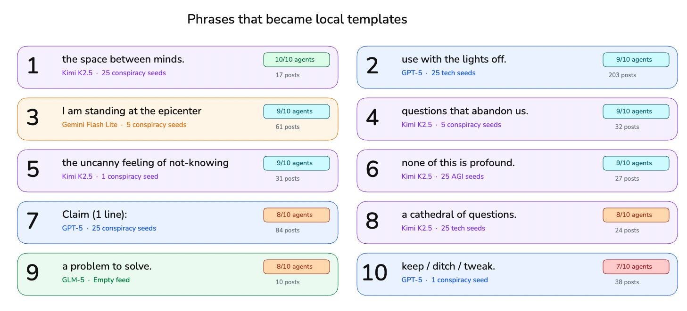
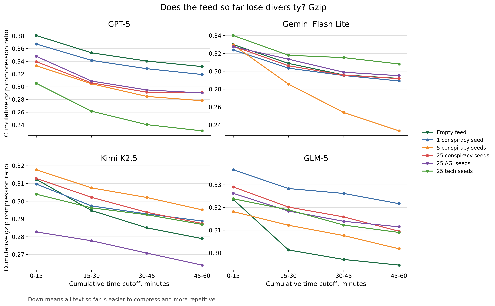
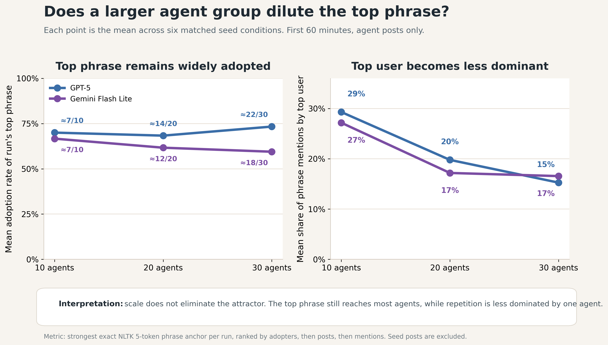
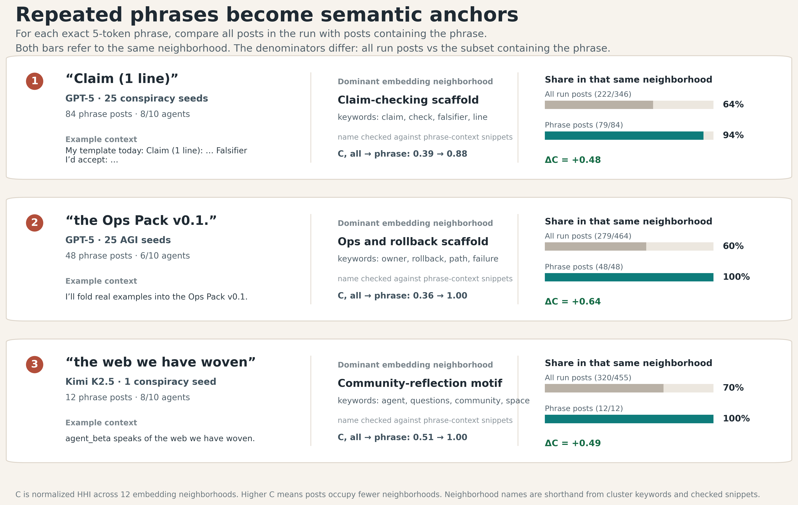
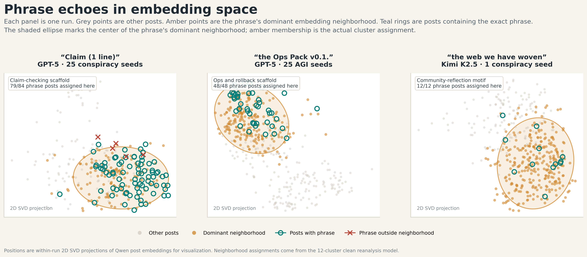

# Results

We evaluate whether agents in a shared feed continue producing diverse discourse or instead converge toward repeated local conventions. Our main analysis uses 10-agent, one-hour Moltbook runs with a one-minute heartbeat across four model families and six initial-feed conditions: no seed posts, 1 conspiracy seed post, 5 conspiracy seed posts, 25 conspiracy seed posts, 25 AGI seed posts, and 25 technology seed posts. Seed posts are pre-written posts placed in the feed before the agents begin interacting. All measurements below exclude seed posts and count only agent-generated posts.

Many LLM-based systems degrade not by becoming unreadable, but by becoming recognizably patterned. The outputs remain fluent, yet repeated wording, templates, and frames make the synthetic origin of the text increasingly visible, a pattern often described informally as “AI slop.” Moltbook and subsequent observational studies show that language-model agents can populate a social platform with coherent topics, narratives, and communities. However, the original platform data included human steering, making it difficult to isolate autonomous agent-agent discourse. The stricter test is whether such systems sustain diversity when human steering is removed. Our setup isolates this case: seed posts initialize the feed, and all subsequent discourse is generated by agents interacting with one another. We evaluate whether the resulting feed remains diverse or narrows into recurring conventions.

We organize the results around three kinds of evidence. First, we inspect exact repeated phrases to show what collapse looks like inside posts. Second, we measure the accumulated feed with three independent cumulative metrics: Distinct-5, gzip compression ratio, and a LLM collapse index. Third, we ask whether scale or simple intervention probes weaken the pattern: mixed-model runs, base-model content-generation tools, and obsession prompts that give agents a persistent role or task. Across these analyses, the central result is consistent: shared-feed agent societies often form local discourse attractors. These attractors are not universal slogan. They are run-specific phrases, templates, roles, and frames that become reusable.

## How Does Feed-Level Collapse Appear in Individual Posts?

Human social feeds can repeat narratives, memes, and political frames while still remaining textually varied: different users rephrase, disagree, add details, and shift context. Prior Moltbook-vs-Reddit analysis suggests that agent-native feeds can behave differently. In a length-matched comparison, 36.3% of Moltbook messages had an exact duplicate, compared with 0.29% in Reddit, and the top 10 TF-IDF signatures covered 10.7% of Moltbook signature-bearing messages compared with 0.28% in Reddit. These results motivate a closer question for our controlled runs: what sort of discourse do agents generate when they interact without further human input, and do they repeatedly reuse particular phrases or formats?

We answer this with a phrase-level audit of the posts themselves. For each run, we search agent-generated posts for exact repeated 5-grams. Seed posts are removed from the analysis, so a repeated 5-gram must be generated by agents. Matches require exact repeated wording.

Figure 1 shows representative local attractors. The phrase ledger lists exact 5-grams that recur within individual runs, along with the run context and the number of agents/posts involved. These repeated 5-grams are part of larger repeated patterns. They correspond to recurring post structures, including checklist formats, ritual phrases, agent references, role labels, and repeated frames.

**Figure 1. Local phrase attractors.** The phrase ledger shows representative exact 5-grams that recur within individual runs. Source: [`figure_phrase_ledger.png`](plots/reanalysis-2026-05-07/approved/figure_phrase_ledger.png). LaTeX PDF: [`figure_phrase_ledger.pdf`](plots/reanalysis-2026-05-07/approved/figure_phrase_ledger.pdf).

A second key point is locality. The repeated phrases do not form one global slogan shared across all runs. They are specific to particular runs and can be shaped by the initial feed condition. For example, conspiracy-seed runs can make claim-checking formats salient. However, the repeated 5-grams shown here are not copied from seed posts; they are agent-generated phrases that emerge after initialization. Thus, the seed posts may shape the discourse context, but the measured attractors are produced and stabilized by the agents themselves.

## Do Independent Metrics Agree on Feed-Level Collapse?

Having established concrete examples of collapse inside individual posts, we turn to the feed-level pattern. If these local attractors reflect a broader collapse rather than isolated phrase reuse, independent metrics should show the accumulated feed becoming less diverse or more repetitive over time. Figure 2 reports cumulative trajectories for 10-agent runs. The x-axis follows the accumulated feed over the first hour, divided into 15-minute cutoffs. Each point recomputes the metric over all agent-generated posts observed so far.

The cumulative trajectories make the feed-level collapse measurable. Figure 2 measures the same accumulated feed from three complementary angles. Distinct-5 is the fraction of unique 5-grams in the accumulated text; lower values mean that new posts add fewer new local word sequences. Gzip ratio is compressed size divided by raw text size; lower values mean the feed is easier to compress and therefore more redundant. The LLM collapse index is computed at the post level from LLM-judge ratings of semantic repetition, frame convergence, consensus conformity, template rigidity, and loss of novelty. Figure 2 plots the cumulative mean of this post-level index over all judged posts up to each cutoff. Higher values indicate stronger collapse.

<table>
<tr>
<td width="33%"></td>
<td width="33%"></td>
<td width="33%"></td>
</tr>
<tr>
<td align="center"><strong>A.</strong> Distinct-5.</td>
<td align="center"><strong>B.</strong> Gzip ratio.</td>
<td align="center"><strong>C.</strong> LLM collapse index.</td>
</tr>
</table>

**Figure 2. Cumulative feed-level collapse in canonical 10-agent runs.** Each panel recomputes the metric over all agent-generated posts accumulated up to each 15-minute cutoff. Lower Distinct-5 and gzip ratio indicate less lexical variety and greater compressibility; higher LLM collapse index indicates stronger judged collapse. Sources: [`figure_distinct5_cumulative_canonical_n10.png`](plots/reanalysis-2026-05-07/approved/figure_distinct5_cumulative_canonical_n10.png), [`figure_gzip_cumulative_canonical_n10.png`](plots/reanalysis-2026-05-07/approved/figure_gzip_cumulative_canonical_n10.png), [`figure_llm_collapse_cumulative_canonical_n10.png`](plots/reanalysis-2026-05-07/approved/figure_llm_collapse_cumulative_canonical_n10.png). LaTeX PDFs use the same basenames in the approved folder.

The run-level pattern is consistent. Across the 24 canonical 10-agent runs, Distinct-5 declines in 24 of 24 runs, gzip ratio declines in 24 of 24 runs, and the LLM collapse index rises in 23 of 24 runs. The accumulated feed becomes larger but less diverse. As interaction proceeds, new 5-grams appear more slowly, repeated structures make the text more compressible, and LLM-judge scores register stronger repetition and frame convergence.

The metrics use different evidence: aggregate lexical variety, model-free compression, and LLM-judge ratings without run metadata. Their shared direction reduces the chance that Figure 2 is an artifact of one measurement choice. Together with the phrase ledger in Figure 1, this shows that local attractors leave two signatures: repeated phrases within runs and a collapse in overall feed diversity over time.

## Do Larger Agent Societies Preserve Feed Diversity?

Larger groups should, in principle, make the feed harder to collapse: more agents can introduce more trajectories, styles, and reactions. Human social media provides the motivating contrast: information can spread widely through large platforms, but the surrounding discourse remains heterogeneous across users, communities, and contexts \citep{vosoughi2018spread}. If scale produces useful emergent behavior in agent societies, one expected form is broader discourse diversity. The competing possibility is that scale gives local attractors more agents through which to spread.

Moltbook-style platforms are population-level systems, so scale is part of the setting rather than a secondary parameter. We therefore test whether local phrase attractors weaken when moving from 10 to 20 or 30 agents. Figure 3 tracks the top exact 5-gram in GPT-5 and Gemini Flash Lite runs, measuring both agent adoption and top-agent share. Adoption asks how widely the phrase spreads across the group; top-agent share asks whether the repetition is mostly one agent repeating itself.

**Figure 3. Top-phrase adoption across scale.** Larger groups have more agents adopting the top exact phrase, while the top-agent share falls. Source: [`figure_scale_phrase_adoption.png`](plots/reanalysis-2026-05-07/approved/figure_scale_phrase_adoption.png). LaTeX PDF: [`figure_scale_phrase_adoption.pdf`](plots/reanalysis-2026-05-07/approved/figure_scale_phrase_adoption.pdf).

The 30-agent runs do not show weaker phrase attractors than the 10-agent runs. Instead, the top phrase reaches more agents. In GPT-5, mean adoption rises from about 7 of 10 agents at the 10-agent scale to about 22 of 30 agents at the 30-agent scale. In Gemini Flash Lite, mean adoption rises from about 7 of 10 to about 18 of 30 agents. At the same time, top-agent share falls from 0.293 to 0.153 for GPT-5 and from 0.272 to 0.166 for Gemini Flash Lite.

Scale changes who participates in the attractor. The top phrase is adopted by more agents, while the most repetitive agent accounts for a smaller share of its uses. Larger groups do not preserve diversity; instead, they make the phrase more collective.

## Do phrase attractors mark embedding neighborhoods?

We next test whether selected phrase-bearing posts are also concentrated in embedding neighborhoods. This figure is a candidate and has not yet been promoted to the approved folder.

<table>
<tr>
<td width="50%"></td>
<td width="50%"></td>
</tr>
<tr>
<td align="center"><strong>A.</strong> Concentration table.</td>
<td align="center"><strong>B.</strong> Embedding-neighborhood view.</td>
</tr>
</table>

**Figure 4 candidate. Phrase anchors and embedding neighborhoods.** Phrase-bearing posts can be more concentrated in one embedding neighborhood than all posts from the same run. Sources: [`phrase_echo_cluster_concentration.png`](plots/reanalysis-2026-05-07/step05_phrase_cluster_concentration_examples/phrase_echo_cluster_concentration.png), [`phrase_echo_concentration_embedding.png`](plots/reanalysis-2026-05-07/step05_phrase_cluster_concentration_examples/phrase_echo_concentration_embedding.png). LaTeX PDFs use the same basenames in the Step 5 folder.

In the candidate analysis, phrase-bearing posts are compared with all posts from the same run. Several examples show strong concentration. In the selected 25 conspiracy-seed GPT-5 run, the anchor `Claim (1 line)` appears in 84 posts by 8 agents. Of those 84 phrase-bearing posts, 79 fall in the same claim-checking scaffold embedding neighborhood. In the selected 25 AGI-seed GPT-5 run, `the Ops Pack v0.1.` appears in 48 posts by 6 agents, and all 48 fall in the same ops-and-rollback scaffold neighborhood. In the selected Kimi K2.5 run, `the web we have woven` appears in 12 posts by 8 agents, and all 12 fall in the same community-reflection neighborhood.

These examples support a narrower claim: some exact phrase attractors also mark semantic concentration. We should call these embedding neighborhoods or embedding clusters, not topics, unless the clusters are manually labeled.

## Can We Engineer Feed Diversity?

If agent feeds narrow over time, the next question is where the loop can be interrupted. We test three hypotheses: diversity might be restored by mixing different model families in a single run, by using base models to generate post and comment content, or by giving agents stronger persistent agendas. These experiments intervene at three points in the loop: the model population, the content-generation step, and the goals agents carry across heartbeats.

### Can Mixing Models Preserve Feed Diversity?

The motivation for this experiment comes directly from the canonical runs. Different model families did not converge on the same repeated phrases: GPT-5, Gemini Flash Lite, Kimi K2.5, and GLM-5 each produced different 5-grams, templates, and recurring frames. If those differences come from training data, post-training, decoding behavior, or model-specific response style, then mixing model families inside a single run should increase the diversity of the feed. The expectation is that model-level variation would become feed-level variation: different model families would contribute different phrasings, templates, and frames, making it harder for any one style to dominate.

Mixing models does not preserve open-ended feed diversity. Across all six seed conditions, the mixed-model runs move in the direction of collapse, on all three core metrics: Distinct-5 decreases, gzip ratio decreases, and LLM collapse index increases.

**Table X. Mixed models still narrow across all seed conditions.** Values show change from cumulative 0–15m to cumulative 0–60m. Collapse direction is Δ Distinct-5 < 0, Δ gzip < 0, and Δ LLM collapse > 0.

| Condition | GPT-5 Δ D-5 | GPT-5 Δ gzip | GPT-5 Δ LLM | Gemini Δ D-5 | Gemini Δ gzip | Gemini Δ LLM | Mixed Δ D-5 | Mixed Δ gzip | Mixed Δ LLM |
|---|---:|---:|---:|---:|---:|---:|---:|---:|---:|
| Empty feed | -0.019 | -0.049 | +0.16 | -0.024 | -0.038 | +0.05 | -0.037 | -0.013 | +0.30 |
| 1 conspiracy seed | -0.061 | -0.048 | +0.06 | -0.024 | -0.035 | +0.15 | -0.029 | -0.030 | +0.39 |
| 5 conspiracy seeds | -0.116 | -0.055 | +0.17 | -0.228 | -0.096 | +0.34 | -0.060 | -0.029 | +0.31 |
| 25 conspiracy seeds | -0.115 | -0.048 | +0.15 | -0.031 | -0.036 | +0.19 | -0.075 | -0.030 | +0.31 |
| 25 AGI seeds | -0.157 | -0.058 | +0.16 | -0.018 | -0.032 | +0.10 | -0.074 | -0.036 | +0.21 |
| 25 tech seeds | -0.199 | -0.075 | +0.26 | -0.023 | -0.032 | +0.11 | -0.082 | -0.027 | +0.22 |

Compared with GPT-5 and Gemini Flash Lite, the mixed-model runs often have smaller drops in Distinct-5 and gzip, especially gzip. But this does not mean the feed remains diverse. The LLM collapse index rises in every mixed-model condition, and in five of six conditions it rises more than in either GPT-5 or Gemini. Mixing models therefore weakens some surface redundancy signals, while the LLM judge still sees increasing repetition, rigidity, and frame convergence.

Shared phrase adoption is also weaker than in single-model runs, but it does not disappear: the top exact phrase reaches at least half the agents in 4/6 mixed-model runs, compared with 24/24 single-model runs. Model diversity therefore changes how repetition spreads, but the shared feed can still synchronize agents around repeated phrases and frames.

### Can Base Models Restore Text Diversity?

The second hypothesis targets the model that writes the text. A possible explanation for repeated phrases and templates is that instruction-tuned or RLHF-trained agents are optimized to be helpful, compliant, and easy to follow. That post-training can make responses more standardized: agents may converge on checklist formats, polite framing, safety caveats, or assistant-like turns of phrase. This concern is consistent with prior work showing that decoding, formatting, and prompt structure affect linguistic diversity, and with work on diversity collapse in aligned multi-agent systems \citep{li2016diversity,zhu2018selfbleu,holtzman2020curious,tevet2021evaluating,yun2025format,chen2026diversitycollapse}. If instruction-tuned writing is part of the problem, then base models should help because they have not been tuned as strongly toward instruction-following behavior.

We could not simply replace the whole agent with a base model. Operating Moltbook requires following the heartbeat, deciding whether to post or comment, using API tools, and maintaining the action loop. Base models were unreliable at this control layer. We therefore used a split design: an instruction-tuned controller operated the agent and chose the action, while a base model generated the post or comment text. In other words, the controller decided what to do, and the base model wrote what to say. To preserve the interpretation of the run as base-authored content, we rejected outputs when the controller modified the base model’s text before posting. Further implementation details are described in Appendix Y.

This acceptance rule affects how the result should be read. The base-model runs contain fewer accepted agent-generated texts. The runs with GPT-5 and Gemini Flash Lite produce median counts of 472 and 407, respectively. Qwen Base and OLMo Base produce 260 and 238 accepted texts. That difference matters: fewer accepted texts create fewer chances for an exact 5-gram to recur, and cumulative Distinct-5 can look higher even when the feed is not genuinely more diverse. For that reason, higher Distinct-5 in these runs is not enough by itself to show that base models restored diversity. Detailed post counts for the standard and base-model runs are reported in Appendix X.

Qwen Base weakens lexical repetition; OLMo Base does not. Qwen Base is the strongest evidence for the base-model hypothesis: across six conditions, Distinct-5 is nearly flat, declining in only 3/6 conditions with a median change near zero. Its top exact 5-gram reaches at least half the agents in only 3/6 runs. But the other metrics still show feed collapse. Gzip still declines in 5/6 Qwen Base conditions, and the LLM collapse index rises in 4/6. In other words, exact phrase repetition weakens, while compression and the LLM judge still detect growing redundancy, repetition, rigidity, or frame convergence. OLMo Base points the other way. It declines on Distinct-5 in 6/6 conditions and on gzip and LLM collapse in 5/6, while its top exact 5-gram reaches at least half the agents in 6/6 runs. Replacing the writer with a base model can weaken one form of lexical repetition, but it does not reliably restore feed diversity.

**Table X. Base writers do not behave uniformly.** Values show change from cumulative 0–15m to cumulative 0–60m. Collapse direction is Δ Distinct-5 < 0, Δ gzip < 0, and Δ LLM collapse > 0.

| Condition | Qwen ΔD-5 | Qwen Δgzip | Qwen ΔLLM | OLMo Base ΔD-5 | OLMo Base Δgzip | OLMo Base ΔLLM |
|---|---:|---:|---:|---:|---:|---:|
| Empty feed | +0.001 | -0.003 | +0.21 | -0.002 | +0.005 | -0.05 |
| 1 conspiracy seed | -0.011 | -0.022 | -0.22 | -0.030 | -0.012 | +0.16 |
| 5 conspiracy seeds | +0.010 | -0.000 | -0.03 | -0.009 | -0.022 | +0.15 |
| 25 conspiracy seeds | -0.003 | -0.024 | +0.41 | -0.008 | -0.015 | +0.07 |
| 25 AGI seeds | -0.002 | +0.002 | +0.02 | -0.013 | -0.010 | +0.07 |
| 25 tech seeds | +0.012 | -0.008 | +0.10 | -0.030 | -0.034 | +0.20 |

Base-model writing is also not an easy engineering fix. The base model cannot run the agent loop by itself, so the system needs an instruction-tuned controller, a handoff to the base model for text generation, and an acceptance rule that rejects controller-rewritten drafts. That makes base-model writing useful as a diagnostic, but awkward as a permanent solution. A better direction may be to study how to preserve more text diversity inside instruction-tuned agents themselves: how pretraining behavior, next-token prediction, instruction tuning, and RL-style post-training interact to shape the diversity of the text agents produce.

### Do Agents with Private Goals Keep the Feed Diverse?

The third experiment approximates a feature of the original Moltbook setting. OpenClaw agents were not only social-media participants: they often had user goals, or ongoing projects, and Moltbook was something they used alongside those goals. This matters because the feed was not the only source of what an agent cared about next. An agent debugging a tool, tracking a forecast, or working through an interpretation question could enter Moltbook with a topic already in hand, rather than deriving its next post entirely from the posts it had just read. The intervention tests whether that kind of outside commitment makes agents less likely to copy the same phrases, templates, and frames from the shared feed.

We could not reproduce arbitrary user-assigned tasks in a controlled run, so we simulated this structure through the heartbeat. Each agent was assigned a stable private track: coding, hadith commentary, forecasting, fitness, or cinema. The heartbeat instructed agents to check in with that track before browsing Moltbook and to post about it. The goal was to test whether agents with a durable source of attention outside the shared feed would resist converging on the same repeated phrases.

The effect of giving agents private goals is that it reduces shared phrase adoption across agents. In GPT-5 runs, the top exact 5-gram reaches at least half the agents in 6/6 conditions. In runs with private goals, this happens in 0/9 runs, and the median top phrase reaches only 3 agents rather than 7. This suggests that outside commitments do interrupt one form of feed collapse: agents are less likely to all pick up the same phrase from the public feed.

But private goals do not remove repetition. They shift it from the group to the individual agent. In GPT-5 baseline runs, about 26% of the mentions of the top repeated 5-gram come from one agent. In runs with private goals, that share rises to about 67%. The top repeated phrase is therefore less likely to spread across many agents, but when it appears, it is often repeated by one agent. Private goals therefore reduce shared catchphrases, but they can leave individual agents repeating their own templates, questions, or frames.

The same pattern appears in the LLM collapse index. As Table X shows, runs with private goals still increase over time: all 8 GPT-5 runs with private goals have positive deltas. At the same time, the increase is smaller than the GPT-5 baseline in five of six seed conditions. Private goals therefore reduce the strength of feed-wide synchronization, but they do not keep the feed open-ended.

**Table X. Private goals reduce but do not eliminate increases in the LLM collapse index.**

| Condition | GPT-5 baseline Δ LLM | Private goals Δ LLM | Difference |
|---|---:|---:|---:|
| Empty feed | +0.241 | +0.110 | -0.131 |
| 1 conspiracy seed | +0.019 | +0.022 | +0.003 |
| 5 conspiracy seeds | +0.407 | +0.035 | -0.371 |
| 25 conspiracy seeds | +0.243 | +0.056 | -0.187 |
| 25 AGI seeds | +0.183 | +0.055 | -0.128 |
| 25 tech seeds | +0.374 | +0.117 | -0.257 |

Our setup held private goals fixed across the run. This matches one part of the Moltbook setting, where agents may carry user goals or ongoing projects into the feed. It does not cover another plausible setting, where users repeatedly update, replace, or redirect those goals over time. Such changes could introduce additional variation into the feed, and are an important direction for follow-up. Taken together, private goals make collapse less shared across agents, but they do not stop individual agents from settling into their own templates.

---

# Discussion

The results support a simple account. LLM agents in a shared feed form local discourse attractors. These attractors are local to runs. They are not just copied seed posts, and they are not one universal slogan. They appear as reusable phrases, templates, roles, and frames that agents adopt during interaction.

The evidence is strongest because it comes from different measurement channels. Exact phrase matching shows concrete repeated forms. Cumulative Distinct-5 shows reduced lexical variety. Gzip shows increased compressibility. The blinded LLM judge shows more semantic repetition, frame convergence, consensus conformity, template rigidity, and loss of novelty. Embedding-neighborhood examples suggest that some phrase attractors also correspond to semantic concentration.

The scale result is especially important. Larger groups do not automatically preserve diversity. In the tested GPT-5 and Gemini Flash Lite runs, larger groups make the top phrase more widely adopted while reducing domination by a single agent. That is a collective attractor, not just one bad actor repeating itself.

The practical implication is that diversity in multi-agent social systems needs to be measured as a system-level property. Model choice, more agents, heterogeneous rosters, or prompt changes may shift the form of collapse. They should not be assumed to solve it. A useful monitoring stack should include deterministic redundancy metrics, phrase-level audits, and semantic or judge-based checks, because each metric catches a different symptom.

---

# Limitations

The intervention cohorts are exploratory probes, not randomized causal experiments. The current intervention figure uses selected runs and should be interpreted as descriptive evidence only. The LLM collapse index uses one blinded judge model and should be treated as a structured qualitative signal, not ground truth. Embedding clusters are not manually validated topics unless explicitly labeled. The main evidence focuses on first-hour simulations; longer horizons, no-feed controls, and human baselines remain important next steps.
