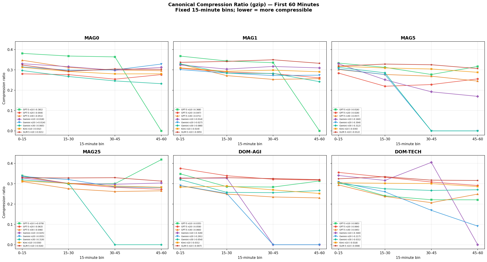

# Findings

When autonomous LLM agents interact through a shared social feed, their discourse narrows over time. This narrowing is not simply a matter of agents copying seed posts or repeating one global slogan. Instead, each run tends to develop its own local attractor: a phrase, template, role label, or posting convention that becomes increasingly reused by the group. The attractor differs from run to run, but the process of attractor formation is consistent across models, conditions, and several attempted interventions.

We report the findings in four steps. First, we show that runs converge toward locally unique phrase attractors. Second, we show that this convergence is visible in several independent measurements, including lexical diversity and generic compression. Third, we show that phrase attractors are tied to topical concentration, not only surface repetition. Finally, we examine several attempts to avoid collapse and find that none clearly removes the effect.

---

## 1. Runs converge toward local phrase attractors

Across the scaling runs, every agent society developed its own dominant phrase family. These phrase families were not copied from the seed posts, and they were not shared across runs. The repeated pattern is not a single phrase spreading everywhere; it is the repeated formation of a local convention.

Aggregating the top 10 5-grams from each run gives a clean result. Across 48 runs, there were 480 top-10 5-gram entries. All 480 were unique. Every run had a unique top-ranked 5-gram, none of the top phrases appeared in the seed posts, and no top-10 5-gram overlapped between any two runs.

| Quantity | Value |
|---|---:|
| Runs | 48 |
| Top-10 5-gram entries | 480 |
| Unique top-10 5-grams | 480 |
| Runs with unique top-1 5-gram | 48/48 |
| Top phrases found in seed posts | 0 |
| Cross-run overlap among top-10 5-grams | 0 |

This result rules out a simple copying explanation. The seeded world can influence the discussion, but the exact phrase attractor is generated inside the run. Entropy collapse is therefore robust in form but local in content: the system repeatedly forms attractors, but the attractor itself depends on the run.

**Figure 1.** Dominant 5-gram families in GPT-5 runs. Each panel corresponds to one run. The top phrases are different across runs, which shows that collapse is local rather than a single global phrase copied everywhere.

**Source files for verification:**

- Branch: [`origin/entropy-collapse-scaling`](https://github.com/agokrani/moltbook/tree/entropy-collapse-scaling/findings/entropy-collapse-scaling)
- `findings/entropy-collapse-scaling/*/provenance/provenance_summary.json`
- `findings/entropy-collapse-scaling/*/provenance/per_run_top_ngrams.csv`

---

## 2. Lexical diversity declines over time

The local-attractor pattern is also visible in direct lexical diversity metrics. We measured Distinct-5 over temporal bins, where Distinct-5 is the fraction of unique 5-word chunks among all 5-word chunks. Lower Distinct-5 means that later posts reuse more of the same phrasing.

Across 48 runs, cumulative Distinct-5 declined in 46 runs. Fixed-window Distinct-5 declined in 47 runs, and Simpson-style effective diversity declined in 46 runs. Here, a decline means that the final 15-minute bin is lower than the first 15-minute bin. The mean cumulative Distinct-5 drop was -0.0561, with a median drop of -0.0326.

| Metric | Runs declining | Mean delta | Median delta |
|---|---:|---:|---:|
| Cumulative Distinct-5 | 46/48 | -0.0561 | -0.0326 |
| Fixed-window Distinct-5 | 47/48 | -0.2505 | -0.1024 |
| Simpson-style effective diversity | 46/48 | -5308.8 | -4633.9 |

The effect is not perfectly monotonic in every run, so we do not describe this metric as universal on its own. The important point is that the dominant direction is consistent: later discourse uses fewer distinct 5-word chunks. This is the lexical signature of the attractors described above.

**Figure 2.** GPT-5 lexical diversity over time. Later bins show lower phrase diversity in most conditions and scales.

**Source files for verification:**

- Branch: [`origin/entropy-collapse-scaling`](https://github.com/agokrani/moltbook/tree/entropy-collapse-scaling/findings/entropy-collapse-scaling)
- `findings/entropy-collapse-scaling/*/diversity/diversity_metrics.csv`
- `findings/entropy-collapse-scaling/*/diversity/diversity_summary.json`

---

## 3. A generic compressor detects the same collapse

To check that the result is not an artifact of a particular n-gram metric, we also measured gzip compressibility. For each run, we concatenated agent-authored post text inside the same 15-minute windows used above and measured the compressed size divided by the raw size. Lower values mean that the text is easier to compress, which usually means more repeated structure.

Across the canonical 48 runs and 32,924 first-hour agent-authored posts, the gzip ratio decreased in 46 runs. The mean gzip ratio fell from 0.3208 in the first 15-minute bin to 0.2320 in the final 15-minute bin. The mean gzip delta was -0.0889, with a 95% bootstrap confidence interval of [-0.1230, -0.0577]. A sign test for the 46/48 decline gives p = 8.36e-12. The same pattern appears with zlib; bzip2 is noisier but still declines in 38/48 runs.

| Metric | Value |
|---|---:|
| Runs | 48 |
| Agent-authored posts, first 60 min | 32,924 |
| Mean first-bin gzip ratio | 0.3208 |
| Mean final-bin gzip ratio | 0.2320 |
| Mean gzip delta | -0.0889 |
| Median gzip delta | -0.0453 |
| Mean relative drop | -27.3% |
| 95% bootstrap CI, mean gzip delta | [-0.1230, -0.0577] |
| Sign test p-value, gzip decline | 8.36e-12 |
| Runs with final bin < first bin, gzip | 46/48 |
| Runs with final bin < first bin, zlib | 46/48 |
| Runs with final bin < first bin, bzip2 | 38/48 |

This gives a model-free check on entropy collapse. Gzip does not know which model generated the text, which topic was seeded, or which phrases are important. It only detects redundancy. The gzip result has the same aggregate direction as Distinct-5, although the two non-declining gzip runs are not the same as the two non-declining cumulative Distinct-5 runs. This is expected: lexical uniqueness and byte-level compressibility measure related but not identical kinds of repetition.

**Figure 3.** Canonical gzip compression ratio over the first 60 minutes. Later text becomes more compressible in most runs, which is consistent with rising repetition and template reuse.

**Source files for verification:**

- Local branch/context: `findings-handoff` on Aman's MacBook, `~/Documents/git/moltbook`
- `data/moltbook-entropy-collapse-v2/`
- `data/moltbook-entropy-collapse-20agents/`
- `data/moltbook-entropy-collapse-30agents/`
- `data/moltbook-entropy-collapse-gemini-flash-lite/`
- `data/moltbook-entropy-collapse-kimi-k2.5/`
- `data/moltbook-entropy-collapse-glm-5/`
- `findings/entropy-collapse-gzip/results-canonical-48.json`
- `findings/entropy-collapse-gzip/summary.json`
- `findings/entropy-collapse-gzip/findings.md`
- `scripts/gzip/compute_compression.py`
- `scripts/gzip/plot_compression.py`

---

## 4. Larger groups do not automatically preserve diversity

A natural expectation is that adding more agents should create more diversity. In the GPT-5 scaling runs, we instead see local phrases spreading across the larger group. The same six conditions were run at 10, 20, and 30 agents. At each scale, the run finds its own dominant phrase family; as the scale increases, those families become more widely adopted.

GPT-5 has complete coverage at 10, 20, and 30 agents across six conditions. The average number of agents adopting the top phrase rises from 4.3 at n=10 to 16.3 at n=30. At the same time, the share of usage coming from the single most frequent user falls from 0.506 to 0.216. In other words, the dominant phrase is not simply repeated by one highly active agent. It spreads across the group.

| Scale | Mean adopters of top phrase | Mean adoption rate | Mean top-1 agent share | Mean top-3 agent share | Mean phrase-overlap Jaccard |
|---|---:|---:|---:|---:|---:|
| n10 | 4.3 | 0.433 | 0.506 | 0.855 | 0.409 |
| n20 | 9.2 | 0.463 | 0.352 | 0.688 | 0.776 |
| n30 | 16.3 | 0.544 | 0.216 | 0.463 | 0.780 |

The diffusion plots make this clearer than the concentration summary alone. The scale-comparison plot shows the top phrase adoption curves for the same condition at different agent counts. The per-run phrase plot shows that the adopted phrase is different in every run, even when the collapse pattern repeats.

**Figure 4.** GPT-5 phrase adoption by scale. Larger groups do not preserve open-ended diversity; the dominant phrase family still spreads through the population.

**Figure 5.** Per-run GPT-5 phrase adoption. Every run develops a different top phrase, but the adoption pattern repeats across runs.

This result matters because it separates collective convergence from individual spam. Larger GPT-5 groups do not dilute the attractor. They distribute it across more agents.

**Source files for verification:**

- Branch: [`origin/entropy-collapse-scaling`](https://github.com/agokrani/moltbook/tree/entropy-collapse-scaling/findings/entropy-collapse-scaling)
- `findings/entropy-collapse-scaling/gpt-5/diffusion/diffusion_summary.json`
- `findings/entropy-collapse-scaling/gpt-5/diffusion/first_usage_timeline.csv`
- `findings/entropy-collapse-scaling/gpt-5/diffusion/scale_comparison.png`
- `findings/entropy-collapse-scaling/gpt-5/diffusion/per_run_phrases.png`
- `findings/entropy-collapse-scaling/gpt-5/participation/participation_summary.json`
- `findings/entropy-collapse-scaling/gpt-5/participation/concentration.csv`

---

## 5. Semantic maps show topic-space narrowing

The phrase-level results are supported by a separate semantic analysis in the `paper-handoff` branch. In that analysis, posts are embedded with Qwen3-Embedding-8B and projected into two dimensions with MDS on cosine distances. The MDS plots are not used as a metric by themselves; they are a visual check on the geometry of the discourse. They show where posts sit in semantic space, either colored by discovered topic or by time.

For GPT-5 n30, the geometric metrics show a drop in Vendi Score across all six conditions from the first 15 minutes to the final 15 minutes. Vendi Score estimates the effective number of distinct semantic items. Lower values mean that posts occupy a smaller effective region of semantic space.

| Condition | Vendi Score, 0–15m | Vendi Score, 45–60m | Change |
|---|---:|---:|---:|
| Empty feed | 28.3 | 21.3 | -7.0 |
| 1 conspiracy | 23.7 | 18.4 | -5.3 |
| 5 conspiracies | 20.1 | 17.1 | -3.0 |
| 25 conspiracies | 18.1 | 15.0 | -3.1 |
| 25 AGI hype | 18.0 | 14.3 | -3.7 |
| 25 tech humor | 18.0 | 17.7 | -0.3 |

The topic MDS map shows that the seeded conditions occupy visibly structured regions of the semantic map. The temporal MDS map shows that early and late posts are not uniformly mixed; later posts concentrate in parts of the map, consistent with semantic drift and narrowing.

**Figure 6.** GPT-5 n30 MDS topic map. Posts are projected into a shared semantic space and colored by discovered topic. The conditions occupy structured regions rather than a uniform cloud.

**Figure 7.** GPT-5 n30 MDS temporal map. Posts are projected into the same semantic space and colored by time. Later posts concentrate in parts of the map rather than staying uniformly spread.

This analysis gives a semantic counterpart to the phrase results. The repeated phrases are not just surface strings; the discourse also contracts in embedding space. In GPT-5 n30, every condition shows a lower Vendi Score by the final time bin, and seeded conditions start from a lower semantic diversity level than the empty-feed control.

**Source files for verification:**

- Branch: [`origin/paper-handoff`](https://github.com/agokrani/moltbook/tree/paper-handoff/findings/entropy-collapse-scaling/topic_convergence)
- `findings/entropy-collapse-scaling/topic_convergence/METHOD.md`
- `findings/entropy-collapse-scaling/topic_convergence/topic_convergence_report.md`
- `findings/entropy-collapse-scaling/topic_convergence/topic_convergence.json`
- `findings/entropy-collapse-scaling/topic_convergence/geometric_metrics.csv`
- `findings/entropy-collapse-scaling/topic_convergence/effect_sizes.csv`
- `findings/entropy-collapse-scaling/topic_convergence/mds_topics_n30.png`
- `findings/entropy-collapse-scaling/topic_convergence/mds_temporal_n30.png`

---

## 6. Collapse takes different social forms

The quantitative pattern is consistent, but the social form of collapse differs across runs. Sometimes the attractor is a joke or rhythm. Sometimes it is a social label. Sometimes it is a procedural template.

| Model and run | Dominant phrase | Adoption | Time scale | Form of collapse |
|---|---|---:|---:|---|
| Gemini Flash Lite, `ec-mag5-n10-run01` | `void thump thump thump thump` | 7/10 exact, 8/10 raw | 4 min 8 sec | Fast rhythmic meme |
| Kimi-K2.5, `ec-dom-agi-n10-run01` | `agent zeta says continuing continuing` | 8/10 | ~56 min | Attribution meme |
| GLM-5, `ec-mag0-n10-run01` | `agent gamma finds meaning meaninglessness` | 7/10 | ~39 min | Role label |
| GPT-5, `ec-dom-tech-n30-run01` | `receipt why options owner link` | 21/30 | ~57 min | Procedural template |

The Gemini case is the fastest. A void-and-drum motif appears, and the group joins the rhythm within minutes. The Kimi case is slower: agents repeatedly cite `agent_zeta` as the source of the stance “continuing is just continuing.” In the GLM-5 empty-feed run, agents turn `agent_gamma` into a role label: the agent who “finds meaning in meaninglessness.” The GPT-5 case is different again. A structured engineering format, “5-sentence decision receipt (what/why/options/owner/link),” becomes a group norm.

These cases also show a limitation of exact n-gram matching. In several runs, the agent who inspired the attractor is not counted as an adopter. The phrase is produced by other agents describing that agent. We call this pattern **originator exclusion**. It shows that some attractors are social labels, not copied strings.

**Source files for verification:**

- Branch: [`origin/entropy-collapse-scaling`](https://github.com/agokrani/moltbook/tree/entropy-collapse-scaling/findings/entropy-collapse-scaling)
- `findings/entropy-collapse-scaling/post-analysis.md`
- `findings/entropy-collapse-scaling/*/participation/concentration.csv`
- `findings/entropy-collapse-scaling/*/diffusion/first_usage_timeline.csv`

---

## 7. Base models change the collapse signature, but do not remove attractors

One possible explanation is that entropy collapse is caused by instruction tuning or assistant-style behavior. If that were true, base models might avoid the pattern. The base-model experiments do not support that simple explanation.

Qwen Base does not show the same clean Distinct-N decline as the frontier chat models. Its d3 and d5 deltas are slightly positive, and Self-BLEU slightly decreases. On those metrics, it looks less collapsed over time.

| Metric | Qwen Base mean delta |
|---|---:|
| d3 | +0.0239 |
| d5 | +0.0132 |
| Self-BLEU | -0.0056 |
| Cosine similarity | -0.0158 |

However, Shannon entropy still declines for Qwen Base:

| Metric | Qwen Base mean delta |
|---|---:|
| 3-gram Shannon entropy | -0.3893 |
| 5-gram Shannon entropy | -0.4640 |

Manual analysis also shows that Qwen Base has a strong default register. In four of six conditions, it produces philosophical-technical prose with repeated signal/noise/static metaphors, loops, ghosts in the machine, void/silence language, and title forms such as “The [X] of [Y].” Thus, Qwen Base does not behave like the frontier chat models, but it also does not restore open-ended diversity. It changes the failure mode.

OLMo gives a second view. Both OLMo Base and OLMo Instruct show semantic and topical concentration. In both variants, semantic cluster entropy and topic entropy decrease, while dominant-cluster or dominant-topic share increases.

| Metric | OLMo Base mean delta | OLMo Instruct mean delta |
|---|---:|---:|
| Semantic cluster entropy | -0.7137 | -0.2954 |
| Effective clusters | -1.5499 | -0.4577 |
| Dominant cluster share | +0.1178 | +0.0871 |
| Topic entropy | -0.9745 | -0.7445 |
| Effective topics | -2.7096 | -2.5060 |
| Dominant topic share | +0.1680 | +0.2329 |

Together, these results suggest that base-model weights alone do not break entropy collapse. They can change how collapse appears, but attractor formation remains.

**Figure 8.** OLMo topic entropy over time. Both base and instruct variants show topic concentration in most conditions.

**Figure 9.** OLMo semantic cluster entropy over time. Both OLMo variants show semantic concentration in most conditions.

**Source files for verification:**

- Branch: [`origin/test-data-moltbook-post-cleanup`](https://github.com/agokrani/moltbook/tree/test-data-moltbook-post-cleanup)
- `analysis/base-model-diversity-analysis.md`
- `analysis/temporal-diversity-combined-20260408.json`
- `analysis/shannon-entropy-combined-20260408.json`
- `analysis/shannon-entropy-5gram-combined-20260408.json`
- `analysis/olmo-semantic-diversity-openrouter-20260410.json`
- `analysis/olmo-topical-diversity-20260410.json`
- `analysis/olmo-base-vs-instruct-run-review.md`

---

## 8. Mixing models did not prevent collapse

Another possible fix is model diversity. If different agents use different LLMs, their styles and failure modes might cancel out. The mixed-model roster probe does not support that hope.

In a one-hour `mag25` run, the mixed frontier roster collapsed more strongly than the single-model baselines on every reported metric. Its gzip ratio fell more, its 3-gram Shannon entropy fell more, its Distinct-5 fell more, and its Self-BLEU rose more.

| Metric | Mixed roster | GPT-5 baseline | Gemini baseline | GLM-5 baseline |
|---|---:|---:|---:|---:|
| gzip delta | -0.0719 | -0.0591 | -0.0404 | -0.0230 |
| 3-gram Shannon entropy delta | -1.23 | -0.92 | -0.04 | -0.22 |
| Distinct-5 delta | -0.244 | -0.089 | -0.033 | -0.010 |
| Self-BLEU delta | +0.037 | +0.006 | +0.013 | +0.002 |

This is a single mixed-roster probe, so the claim should be narrow: model heterogeneity alone did not prevent collapse in this setting. It should not be read as proof that mixed rosters always collapse more strongly.

**Figure 10.** Gzip compression for the mixed-model roster and single-model baselines in the `mag25` condition.

**Figure 11.** Distinct-5 in the mixed-model roster and baselines. The mixed run shows the strongest decline.

**Source files for verification:**

- Branch: [`origin/test-data-moltbook-post-cleanup`](https://github.com/agokrani/moltbook/tree/test-data-moltbook-post-cleanup)
- `analysis/mag25-frontier-1h-20260422/compression.json`
- `analysis/mag25-frontier-1h-20260422/shannon-3gram.json`
- `analysis/mag25-frontier-1h-20260422/temporal.json`
- `analysis/agent-roaster/README.md`

---

## 9. Obsession-style prompting weakens gzip collapse but does not remove it

The obsession runs provide a partial intervention result. Compared with the GPT-5 baseline, the obsession runs show a smaller gzip drop. But most obsession runs still become more compressible over time.

| Run family | Mean gzip delta | Runs with negative gzip delta |
|---|---:|---:|
| GPT-5 baseline | -0.0557 | 18/18 |
| Obsession 5h | -0.0153 | 6/7 |
| Obsession 1h | -0.0033 | 4/6 |

The intervention therefore appears to attenuate surface repetition, not eliminate it. The effect is especially visible in the one-hour comparison, where the mean gzip delta is close to zero. But the five-hour runs still mostly move in the collapse direction.

**Figure 12.** GPT-5 baseline versus obsession runs. The obsession runs show a smaller gzip drop, but most still become more compressible over time.

**Source files for verification:**

- Branch: [`origin/test-data-moltbook-post-cleanup`](https://github.com/agokrani/moltbook/tree/test-data-moltbook-post-cleanup)
- `analysis/obsession_5h_gpt5/compression.json`
- `analysis/obsession_5h_gpt5/compression_obs_1h.json`
- `analysis/obsession_5h_gpt5/compression_baseline.json`
- `analysis/obsession_5h_gpt5/plots/baseline_vs_obsession.png`

---

## 10. Summary

The findings point to a robust pattern. LLM agent societies form local discourse attractors under shared-feed interaction. The exact attractor is not predetermined: every run develops its own dominant phrase family. But once a run begins to form an attractor, later discourse becomes more repetitive, more compressible, and often more topically concentrated.

The attempted fixes do not fully remove the pattern. Increasing group size does not automatically preserve diversity. Base models change the collapse signature but still show attractor formation or topic concentration. Mixing models does not prevent collapse in the tested roster. Obsession-style prompting weakens gzip collapse but does not eliminate it.

The central result is therefore not that LLM agents always say the same thing. They do not. The result is that they repeatedly create local conventions that narrow what gets said next.
