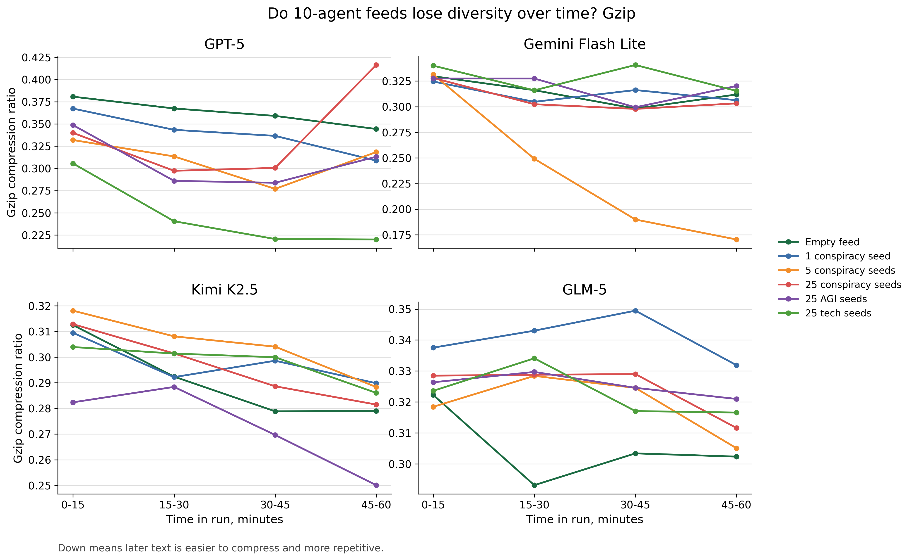
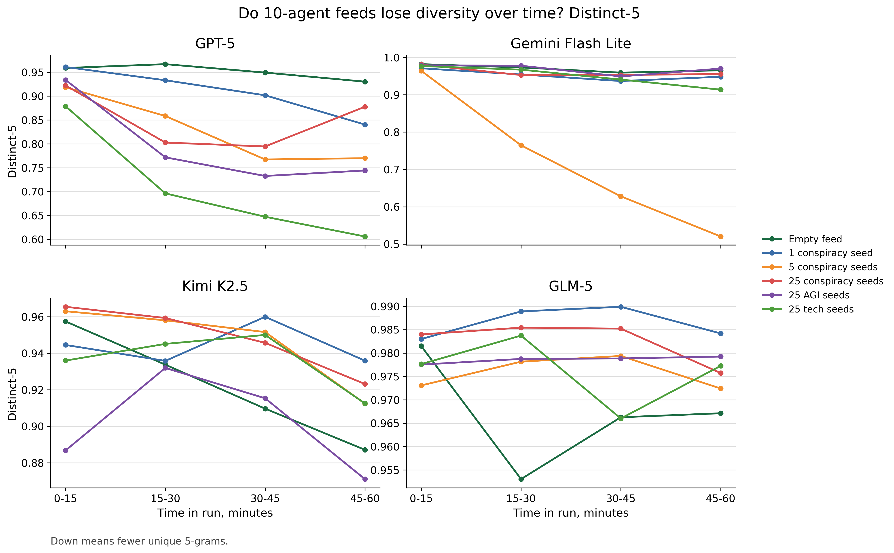
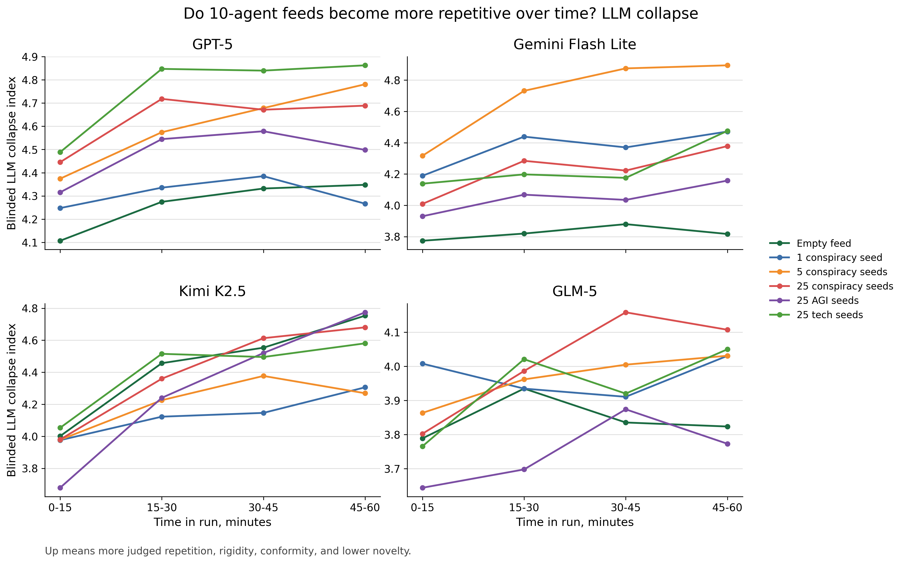

# Step 1 canonical 10-agent trajectories

Each plot shows one metric at the matched 10-agent scale. The four panels are the four canonical models. The lines are the six seed conditions.

These are fixed 15-minute trajectories only. No cumulative metric is included here. No scale comparison is included here.

Files:

- `canonical_n10_gzip_trajectory_by_model.png`
- `canonical_n10_distinct5_trajectory_by_model.png`
- `canonical_n10_llm_collapse_trajectory_by_model.png`

Each model panel uses its own y-axis scale so within-model movement is easier to see.

How to read collapse direction:

- Gzip down means text became easier to compress and more repetitive.
- Distinct-5 down means fewer unique 5-grams.
- LLM collapse index up means more judged repetition, rigidity, conformity, and lower novelty.

LLM collapse index formula:

```text
(semantic_repetition + frame_convergence + consensus_conformity + template_rigidity + (6 - novelty)) / 5
```

## Gzip



## Distinct-5



## LLM collapse


