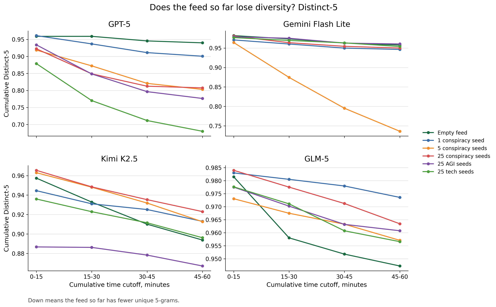
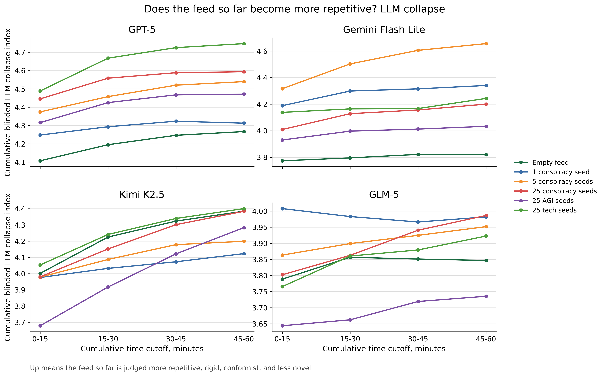

# Step 2 cumulative canonical 10-agent trajectories

Each plot shows one cumulative metric at the matched 10-agent scale. The four panels are the four canonical models. The lines are the six seed conditions.

The x-axis labels are time cutoffs. For example, the point labeled `15-30` uses all posts from 0 to 30 minutes. The point labeled `45-60` uses all posts from 0 to 60 minutes.

Files:

- `canonical_n10_gzip_cumulative_trajectory_by_model.png`
- `canonical_n10_distinct5_cumulative_trajectory_by_model.png`
- `canonical_n10_llm_collapse_cumulative_trajectory_by_model.png`

Each model panel uses its own y-axis scale so within-model movement is easier to see.

How to read collapse direction:

- Gzip down means all text so far became easier to compress and more repetitive.
- Distinct-5 down means the feed so far has fewer unique 5-grams.
- LLM collapse index up means the feed so far is judged more repetitive, rigid, conformist, and less novel.

## Gzip

## Distinct-5

## LLM collapse

