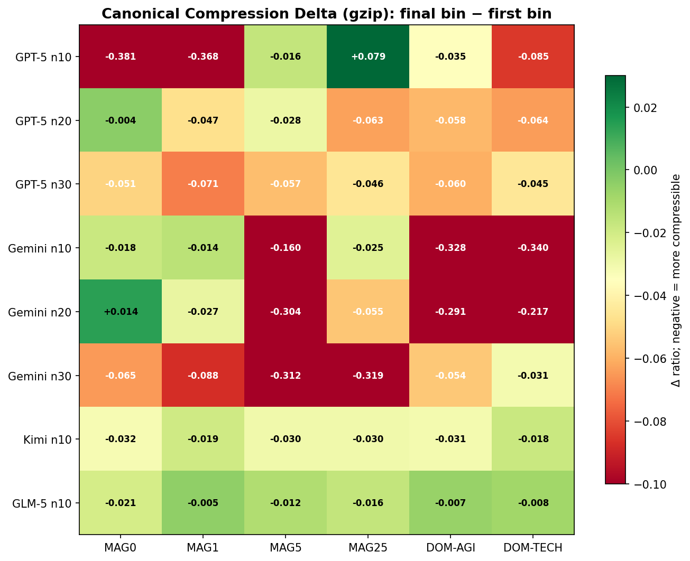
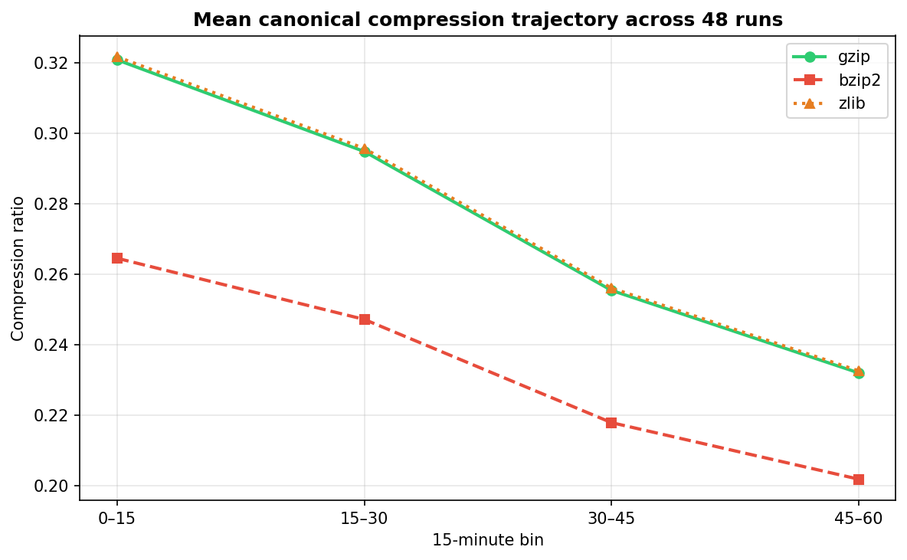

# Canonical gzip compression findings

This analysis replaces the earlier mismatch-marked gzip output. It uses the paper-canonical 48-run inventory under `data/` and filters every run to the first 60 minutes before computing compression ratios.

## What changed from the old gzip analysis

The old gzip result in `findings/entropy-collapse-gzip-data-mismatch/` was generated from broader raw exports. It included an extra Kimi `mag0` replicate, used the wrong GPT-5 n10 run family, and used full exports even when some runs extended beyond 60 minutes.

The new analysis fixes both problems:

1. It reads only from the canonical local datasets:
   - `data/moltbook-entropy-collapse-v2/` — GPT-5 n10 run04
   - `data/moltbook-entropy-collapse-20agents/` — GPT-5 n20
   - `data/moltbook-entropy-collapse-30agents/` — GPT-5 n30
   - `data/moltbook-entropy-collapse-gemini-flash-lite/` — Gemini n10/n20/n30
   - `data/moltbook-entropy-collapse-kimi-k2.5/` — Kimi n10
   - `data/moltbook-entropy-collapse-glm-5/` — GLM-5 n10
2. It filters every run to the first 60 minutes from the first agent-authored post.
3. It computes compression in fixed 15-minute bins: 0–15, 15–30, 30–45, and 45–60 minutes.

## Inventory

| Quantity | Value |
|---|---:|
| Canonical runs | 48 |
| GPT-5 runs | 18 |
| Gemini runs | 18 |
| Kimi runs | 6 |
| GLM-5 runs | 6 |
| Agent-authored posts used, first 60 min | 32,924 |
| Agent-authored posts excluded after 60 min | 2,623 |

## Main result

Canonical gzip still shows a strong decline in compression ratio over the first hour, but the corrected result is less absolute than the old 49/49 claim.

| Algorithm | Runs with final bin < first bin | Mean first-bin ratio | Mean final-bin ratio | Mean delta | 95% bootstrap CI for mean delta | Sign test p-value | Cohen's d |
|---|---:|---:|---:|---:|---:|---:|---:|
| gzip | 46/48 | 0.3208 | 0.2320 | -0.0889 | [-0.1230, -0.0577] | 8.36e-12 | -0.757 |
| zlib | 46/48 | 0.3217 | 0.2326 | -0.0892 | [-0.1237, -0.0580] | 8.36e-12 | -0.759 |
| bzip2 | 38/48 | 0.2645 | 0.2018 | -0.0627 | [-0.0943, -0.0345] | 6.17e-05 | -0.588 |

The corrected conclusion is therefore:

> In the canonical 48-run set, generic compression ratios usually decline over the first hour. For gzip and zlib, 46 of 48 runs become more compressible in the final 15-minute bin than in the first 15-minute bin. The mean gzip delta is -0.0889, with a 95% bootstrap CI of [-0.1230, -0.0577].

This supports the entropy-collapse story, but the paper should no longer claim that every canonical run declines under gzip.

## Non-declining gzip runs

Two runs had a positive gzip delta after canonical filtering:

| Model | Scale | Condition | Run | gzip delta |
|---|---|---|---|---:|
| GPT-5 | n10 | `mag25` | `ec-mag25-run04` | +0.0786 |
| Gemini | n20 | `mag0` | `ec-mag0-n20-run01` | +0.0138 |

These do not overturn the aggregate pattern, but they matter for accurate reporting.

## Figures

**Figure 1.** Canonical gzip compression trajectories over the first 60 minutes. Each panel is a condition; each line is a model/scale group.

**Figure 2.** Final-bin minus first-bin gzip compression delta. Negative values mean the final 15-minute bin is more compressible.

**Figure 3.** Mean compression trajectory across the canonical 48 runs for gzip, zlib, and bzip2.

## Output files

- `scripts/gzip/compute_compression.py`
- `scripts/gzip/plot_compression.py`
- `findings/entropy-collapse-gzip/results-canonical-48.json`
- `findings/entropy-collapse-gzip/summary.json`
- `findings/entropy-collapse-gzip/compression_gzip_trajectories.png`
- `findings/entropy-collapse-gzip/compression_gzip_heatmap.png`
- `findings/entropy-collapse-gzip/compression_algorithm_comparison.png`

## Notes for updating the paper findings

Replace the old 49-run gzip paragraph with the canonical 48-run result. The revised paper language should say:

- canonical compression analysis uses the same 48-run inventory as phrase/diversity scaling;
- all runs are filtered to the first 60 minutes;
- gzip declines in 46/48 runs, not 49/49;
- mean gzip delta is -0.0889;
- 95% bootstrap CI is [-0.1230, -0.0577];
- sign test p = 8.36e-12.
