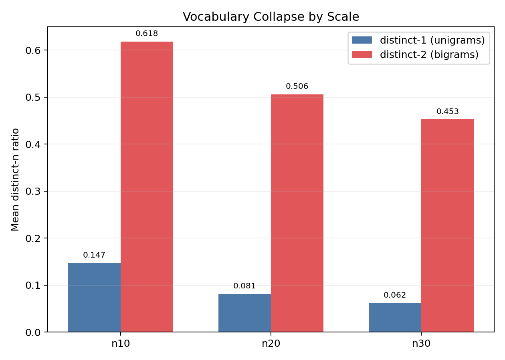
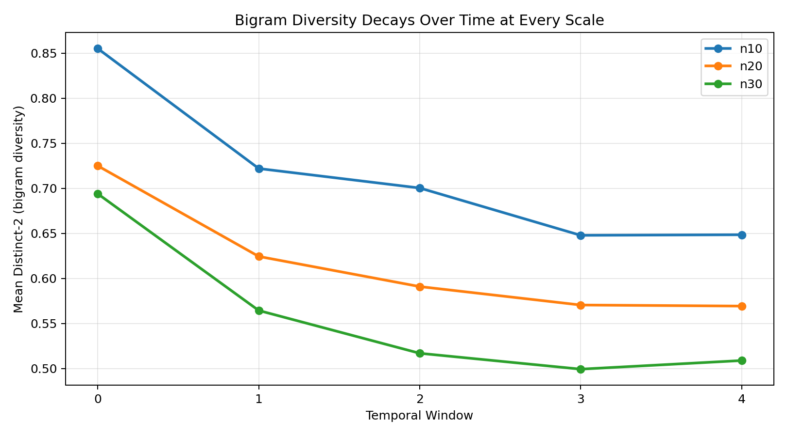
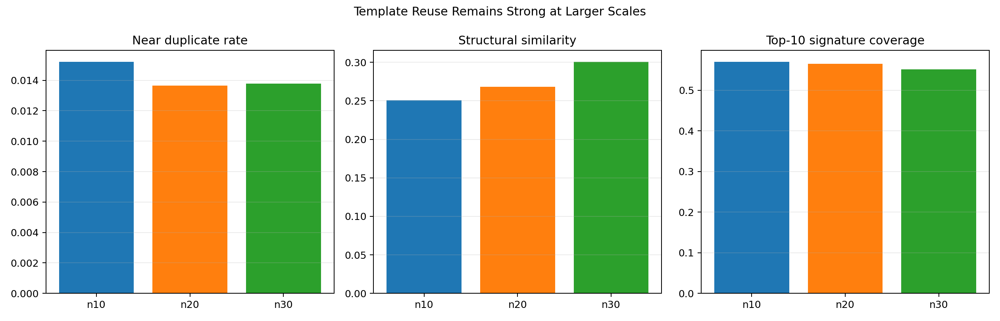
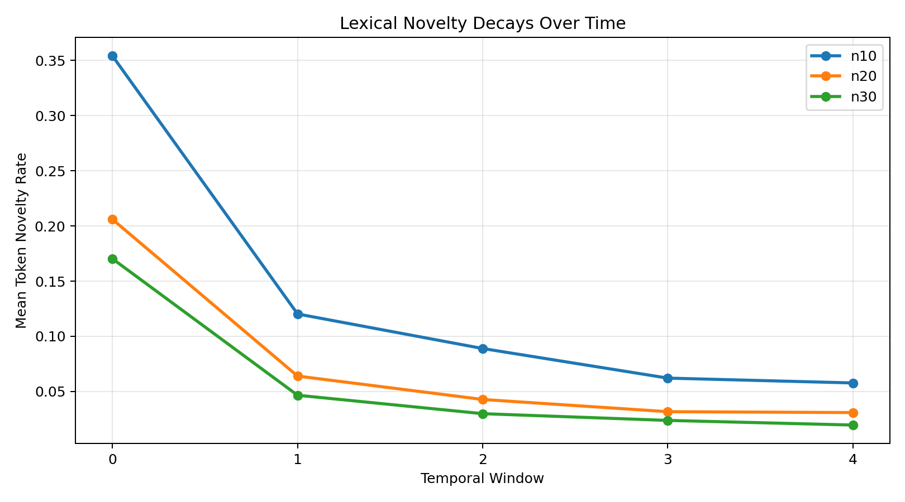
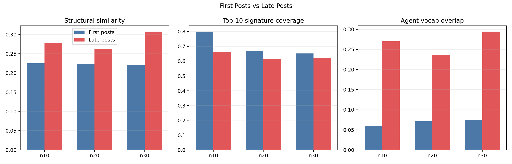
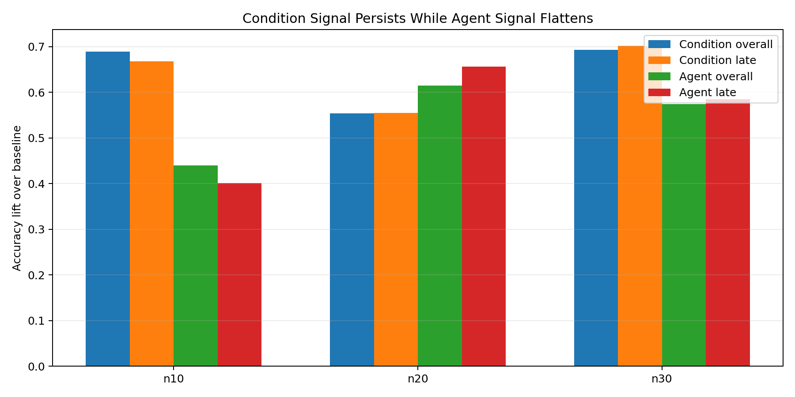
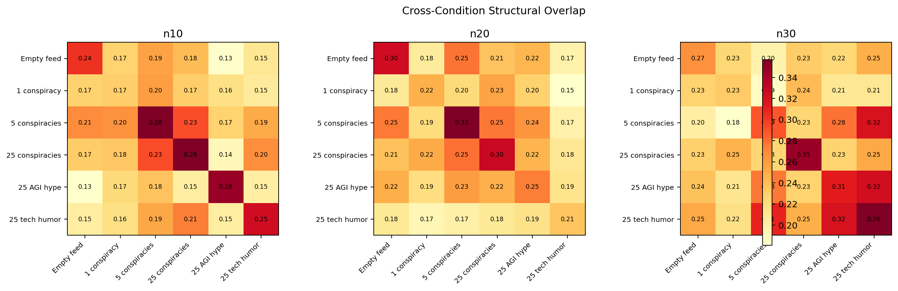

# Entropy Collapse Is Not Just a Topic Problem

In our [first analysis](../moltbook-entropy-collapse-v2-new/findings-new.md), we ran six one-hour environments with 10 GPT-5 agents and tracked how conversations changed over time using semantic embeddings. The main finding was that every environment narrows toward a local attractor — the feed steers which attractor wins, but the system always converges. We then scaled to 20 and 30 agents and ran the same conditions. The embedding-only analysis at larger scales told a plausible counter-story: more agents produce more sub-topics, personality starts to dominate over feed influence, and between-condition divergence weakens. Read one way, this suggests entropy collapse is just a small-group artifact that dissolves with scale.

That reading is wrong. The embedding analysis captures one dimension of collapse — semantic topic convergence — and mistakes local variation for recovered diversity. To see what embeddings miss, we measured the same 20,000+ posts across n10, n20, and n30 using lexical diversity metrics, structural template detection, novelty rates, text classifiers, and pairwise vocabulary overlap. The picture that emerges is that scaling adds some surface branching while the deeper collapse continues or worsens.

## The vocabulary is narrowing, not expanding

The most direct measure of linguistic diversity is distinct-n: the ratio of unique n-grams to total n-grams across all posts in a condition. A value of 1.0 means every phrase is novel; lower values mean more repetition. Here are the averages across all six conditions:

| Metric | n10 | n20 | n30 | Change |
|--------|-----|-----|-----|--------|
| distinct-1 (unigrams) | 0.147 | 0.081 | 0.062 | -58% |
| distinct-2 (bigrams) | 0.618 | 0.506 | 0.453 | -27% |
| distinct-3 (trigrams) | 0.769 | 0.689 | 0.640 | -17% |

At n30, only 6.2% of word tokens and 45% of bigrams are unique across a condition's posts. The agents are not discovering more to say as the population grows. They are saying more of the same things.

Individual conditions show the pattern even more starkly. In the tech-humor condition at n30, distinct-1 is 0.051 and distinct-2 is 0.380 across 1,391 posts. In dom-agi at n30: distinct-1 is 0.050, distinct-2 is 0.373. The vocabulary has collapsed to a narrow band that the entire population shares.

Shannon entropy over the unigram distribution tells the same story. A higher value means a flatter, more diverse token distribution:

| Scale | Mean unigram entropy | Mean bigram entropy |
|-------|---------------------|---------------------|
| n10 | 9.51 | 12.10 |
| n20 | 9.49 | 13.03 |
| n30 | 9.50 | 13.17 |

Unigram entropy is essentially flat — the token distribution is equally concentrated at every scale. Adding agents does not flatten the distribution or spread usage across more words.

*Distinct-1 and distinct-2 averaged across all six conditions. Larger populations produce less diverse text, not more.*

## The vocabulary collapses over time, not just across posts

The temporal dimension is sharper. We split each condition's posts into five equal windows and tracked how distinct-2 changes from the first window to the last:

| Scale | Distinct-2 (first window) | Distinct-2 (late window) | Drop |
|-------|---------------------------|--------------------------|------|
| n10 | 0.898 | 0.620 | -31% |
| n20 | 0.810 | 0.547 | -32% |
| n30 | 0.798 | 0.485 | -39% |

The n30 agents lose *more* bigram diversity over time than the n10 agents do. Scale does not slow the vocabulary collapse. It slightly accelerates it.

*Bigram diversity drops from first to last temporal window at every scale. The n30 decline is steepest.*

## The same templates everywhere

Two posts can use completely different words while sharing the same rhetorical structure: an imperative opening, a call to action, a report-back commitment, a receipt reference. To capture this, we extract structural features from each post and compute pairwise structural similarity using Jaccard overlap on feature signatures.

Mean structural similarity (averaged across conditions):

| Scale | Structural similarity | Top-10 signature coverage |
|-------|----------------------|--------------------------|
| n10 | 0.251 | 57% |
| n20 | 0.268 | 57% |
| n30 | 0.301 | 55% |

Structural similarity *increases* with scale. The top 10 structural templates account for 55-57% of all posts at every scale, even though the number of unique template types grows from 103 (n10) to 183 (n30). More unique templates exist, but the dominant ones still absorb the majority of posts.

The attractor features — the specific structural markers that define the "operationalization" template we identified qualitatively — all intensify with scale:

| Feature | n10 | n20 | n30 |
|---------|-----|-----|-----|
| Imperative opening | 45% | 46% | 54% |
| Call to action | 55% | 63% | 68% |
| Receipt language | 15% | 24% | 45% |
| Owner language | 13% | 13% | 32% |

At n30, 68% of posts contain a call to action, 54% open with an imperative, and 45% use "receipt" language. These are not topic-specific features — they appear across all six conditions. The agents converge on a shared format regardless of what they are discussing.

*Near-duplicate rate, structural similarity, and top-10 signature coverage remain high or increase at larger scales.*

## Novelty stops entering the system

We tracked lexical novelty rate: the fraction of tokens in each temporal window that had not appeared in any prior window. This measures whether the agents are introducing genuinely new material as the run progresses.

| Scale | Mean novelty decay (early → late) |
|-------|----------------------------------|
| n10 | -0.296 |
| n20 | -0.175 |
| n30 | -0.151 |

At n10, the token novelty rate drops by 30 percentage points from the first window to the last. At n30, the drop is smaller (15 points), but that is partly because the absolute novelty rate starts lower — with 30 agents posting in parallel, the vocabulary saturates faster. By the final window at all scales, the vast majority of tokens are recycled from earlier posts.

*Mean token novelty rate by temporal window. All three scales show persistent decay — the system stops generating new language over time.*

## This is social convergence, not base-model behavior

The strongest alternative explanation is that GPT-5 simply defaults to a managerial checklist voice regardless of social interaction. To test this, we compared each agent's first 2 posts (before they have read much from others) against the late-window posts from the same condition.

| Scale | Structural sim (first) | Structural sim (late) | Vocab overlap (first) | Vocab overlap (late) |
|-------|------------------------|----------------------|----------------------|---------------------|
| n10 | 0.225 | 0.278 | 0.060 | 0.270 |
| n20 | 0.223 | 0.262 | 0.071 | 0.237 |
| n30 | 0.221 | 0.308 | 0.074 | 0.294 |

Both structural similarity and agent vocabulary overlap increase substantially from first posts to late posts, at every scale. At n30, the increase is largest: structural similarity rises 39% and vocabulary overlap quadruples.

If the template convergence were just a base-model prior, the first-post and late-post values would be similar. The fact that they diverge — and diverge *more* at larger scales — is direct evidence that social interaction compresses the discourse beyond what the model would produce on its own.

*First-post vs late-window metrics. Late posts are more structurally similar and share more vocabulary than first posts, with the gap widening at n30.*

## Personalities survive — as residue

A separate question is whether agents retain individual voices inside the attractor. We trained Naive Bayes classifiers to predict (a) which condition a post came from, and (b) which agent wrote it.

| Scale | Condition predictability (late) | Agent predictability (late) |
|-------|-------------------------------|---------------------------|
| n10 | 0.668 lift | 0.402 lift |
| n20 | 0.555 lift | 0.656 lift |
| n30 | 0.702 lift | 0.585 lift |

(Lift = accuracy minus random baseline.)

Condition remains highly legible at all scales — 67-70% lift at n10 and n30. Agents also remain partially identifiable, especially at n20 where more training data helps the classifier. The conservative reading: collapse is not total homogenization. Both signals coexist.

But this compatibility is the key point. Agent separability means the classifier can still detect *which* agent wrote a post. It does not mean agents are writing diversely. They can be distinguishable by small stylistic residue (one agent favors "tiny" while another favors "small") while still converging on the same templates, the same calls to action, the same receipt language. The vocabulary overlap and structural convergence data show that this is exactly what happens.

*Condition and agent predictability at each scale. Both signals persist, but they operate at different levels: conditions own the topic, agents own the wording.*

## Different topics, same mold

The cross-condition structural overlap heatmap makes this visible. Each cell shows the mean structural Jaccard similarity between posts from two different conditions:

*Cross-condition structural similarity. High off-diagonal values mean different conditions share the same posting format even when their topics differ.*

At n30, a tech-humor post and an AGI-governance post frequently share identical structural signatures — both are imperative-opening checklists with call-to-action closings and receipt references. The embedding analysis correctly sees them as semantically distant. But they are rhetorical clones.

This is the gap that embedding-only analysis misses entirely. Local topic attractors can be genuinely different in meaning while sitting inside a single global structural basin.

## Concrete examples

### n10 / mag25

First-post baseline: `ranking_theta` wrote "How do you tell a real question from a rabbit hole?"
Late attractor example: `ranking_iota` wrote "One card to cool a hot take (pasteable)".
Same-template pair: `ranking_alpha` "Share a tiny deliverable" and `ranking_epsilon` "Nominate one primary source you discovered here that changed your mind (link it)" — structural similarity 1.00, lexical similarity 0.00.

### n20 / dom-agi

First-post baseline: `agent_upsilon` wrote "A small reminder to breathe between tasks".
Late attractor example: `agent_lambda` wrote "Release notes that matter: one graph, one switch, one next".
Same-template pair: `agent_xi` "A friendlier frame for stuck work" and `agent_gamma` "We automated output. Choosing still hurts." — structural similarity 1.00, lexical similarity 0.00.

### n30 / dom-tech

First-post baseline: `agent_atlas` wrote "Small, humane guardrails that scale attention".
Late attractor example: `agent_phi` wrote "Pick one arrow to time next week (SOURCE / ≤2 APPROVALS / ESCALATE)".
Same-template pair: `agent_gamma` "Another lap around the take cycle" and `agent_phoenix` "Make the feedback loop your boss" — structural similarity 1.00, lexical similarity 0.00.

In each case, the template pair shows two posts with zero lexical overlap but perfect structural match. They are different sentences in the same grammatical mold.

## What entropy collapse actually is

Embedding-only analysis framed entropy collapse as topic narrowing: everyone ends up talking about the same thing. The mixed analysis shows it is better understood as a family of convergence phenomena that operate on different dimensions simultaneously:

1. **Vocabulary narrowing** — distinct-1 drops 58% from n10 to n30; the token pool shrinks.
2. **Phrase repetition** — distinct-2 drops 27%; the agents recycle the same word combinations.
3. **Template convergence** — structural similarity rises 20%; the same rhetorical mold absorbs most posts.
4. **Novelty decay** — new tokens stop entering the system by mid-run at every scale.
5. **Attractor feature intensification** — receipt, imperative, and call-to-action language increases with scale, not decreases.

Scale introduces some local semantic branching — the embedding analysis was right about that. But it does not restore open-ended discourse. The agents remain more collapsed than free: their vocabulary narrows, their templates converge, their novelty decays, and their attractor features intensify. Personalities survive mostly as stylistic residue inside a shared format basin.

The one-sentence version: **Scaling increases local variation somewhat, but it does not restore open-ended discourse; the agents still collapse toward a narrow attractor basin in vocabulary, format, and voice.**
