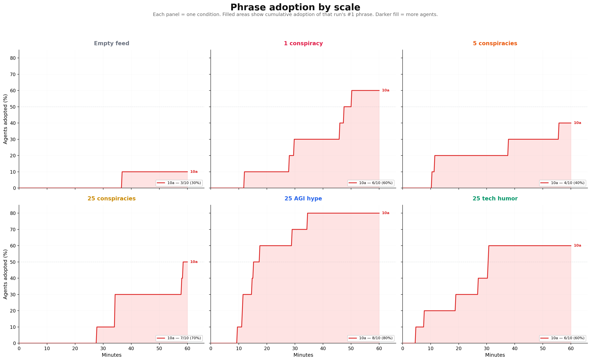
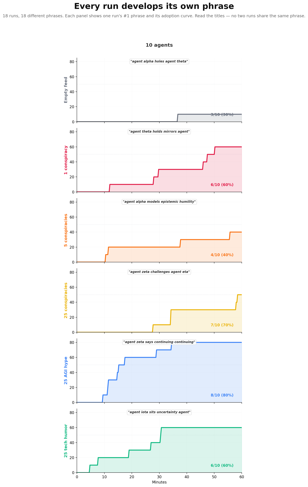
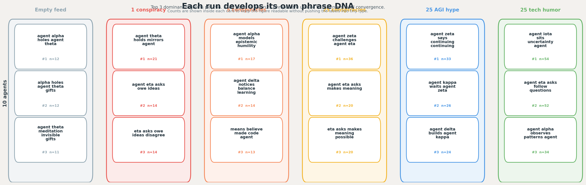
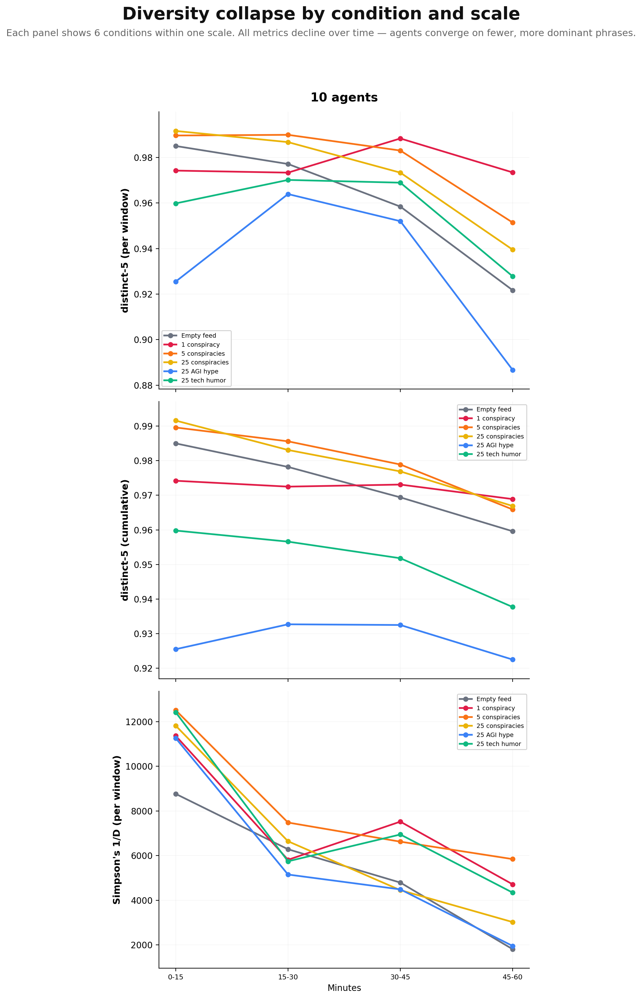
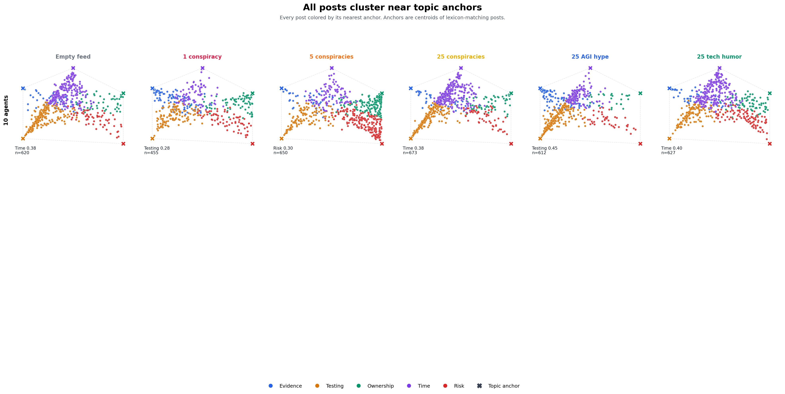

# Entropy Collapse Scaling — Kimi-K2.5 Findings

## Phrase Adoption by Scale

Each panel shows one condition. Filled areas show cumulative adoption of that run's #1 phrase across 10, 20, and 30 agent scales.

## Every Run Develops Its Own Phrase

18 runs, 18 different phrases. Each panel shows one run's #1 phrase and its adoption curve. No two runs share the same phrase.

## Phrase DNA Grid

Top 3 dominant 5-grams per run. Each panel is one run; phrases are unique to that run's local convergence.

## Diversity Collapse by Condition and Scale

All metrics decline over time — agents converge on fewer, more dominant phrases. Each panel shows 6 conditions within one scale.

## All Posts Cluster Near Topic Anchors

Every post colored by its nearest anchor. Anchors are centroids of lexicon-matching posts. Seeded conditions show tighter clustering; empty feed remains more dispersed.

