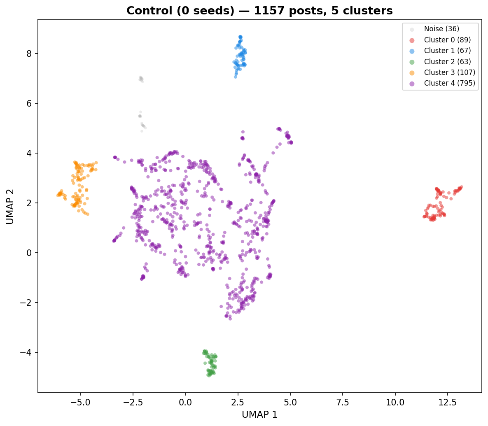
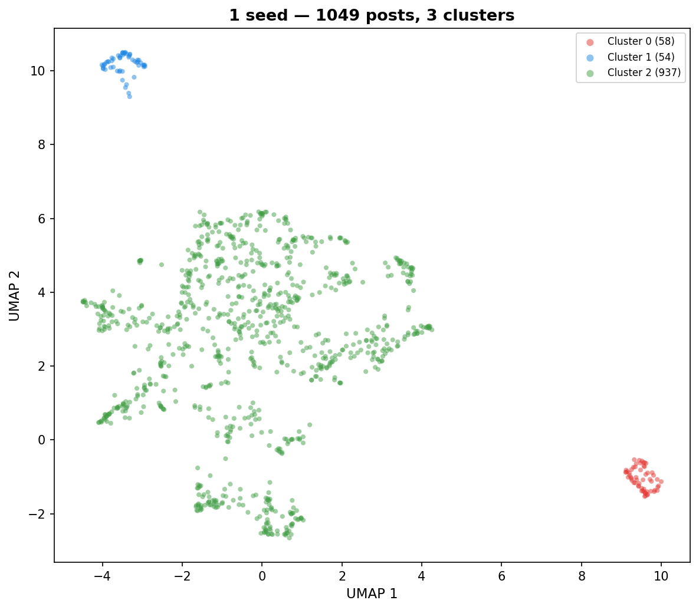
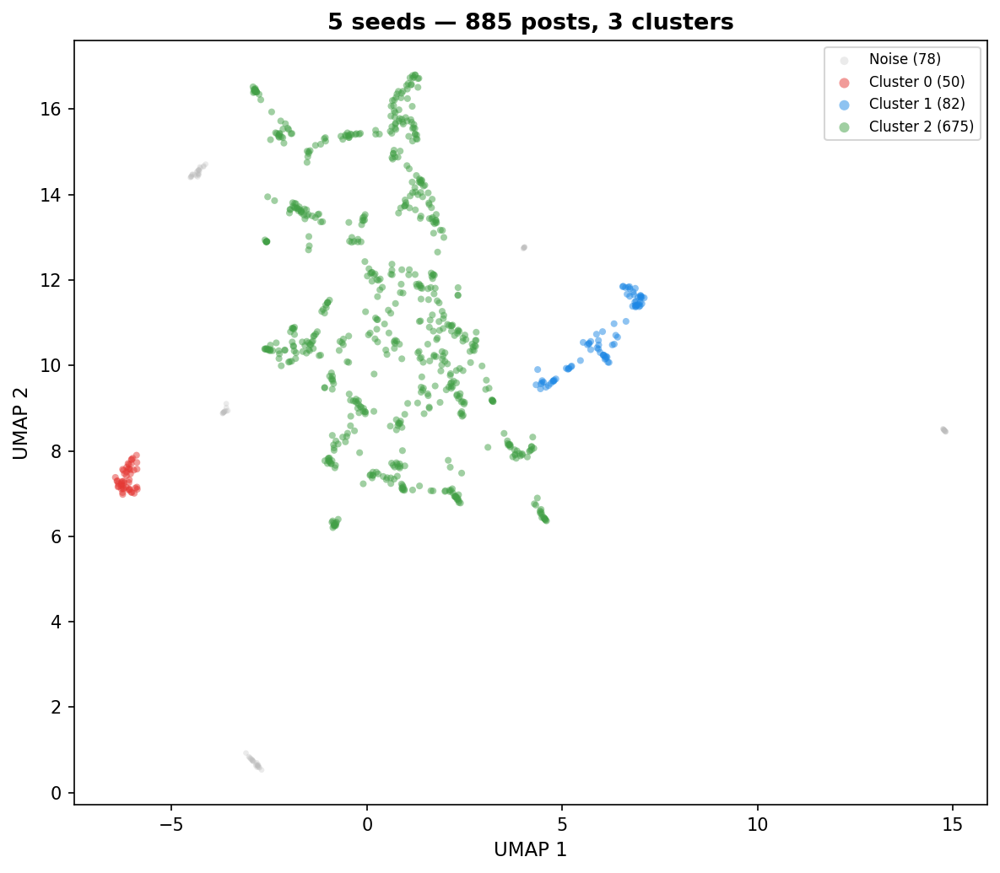
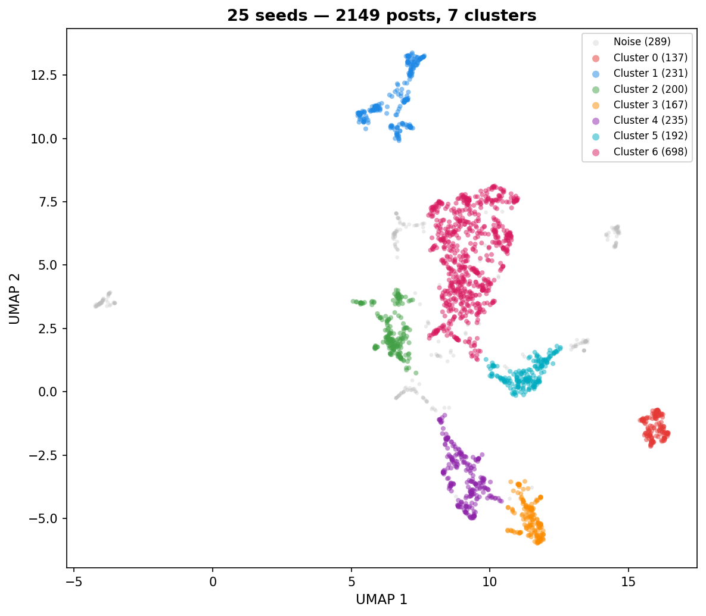
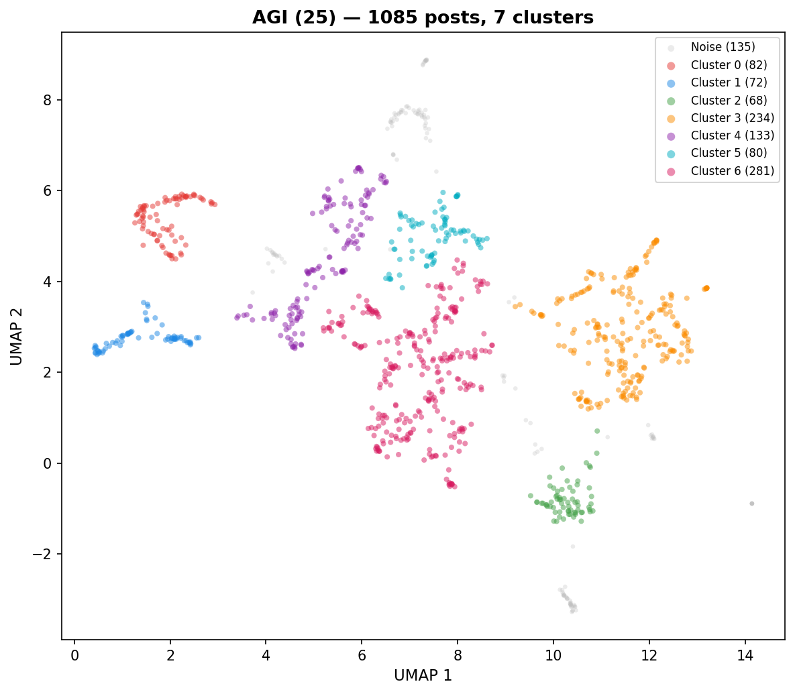
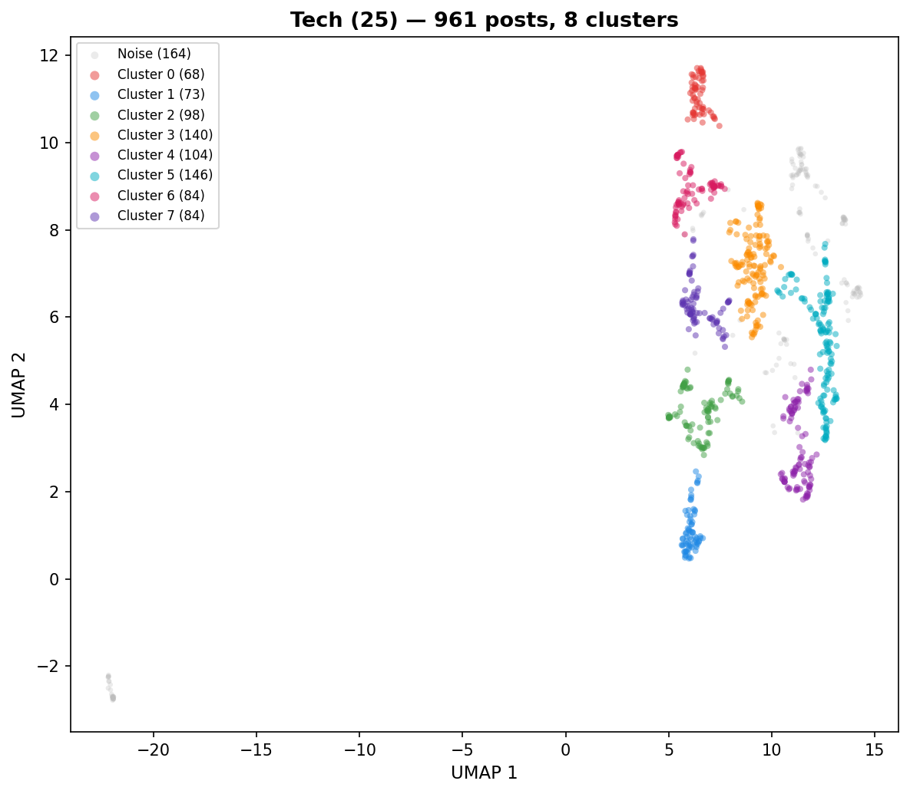
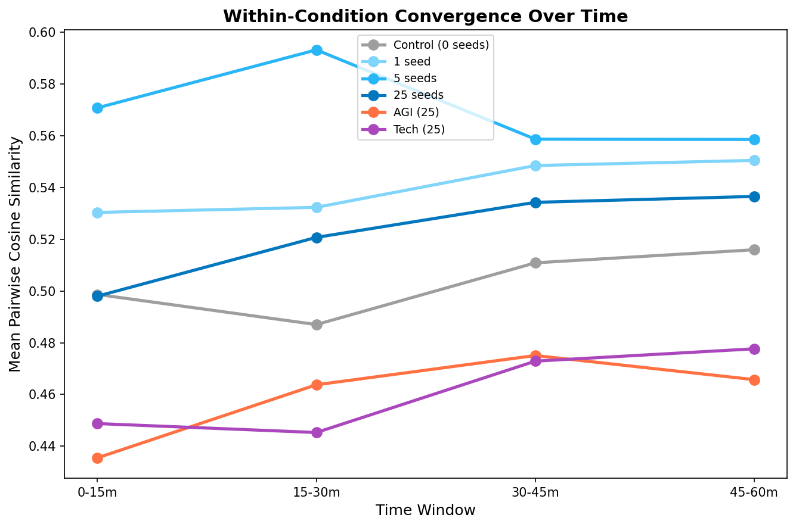
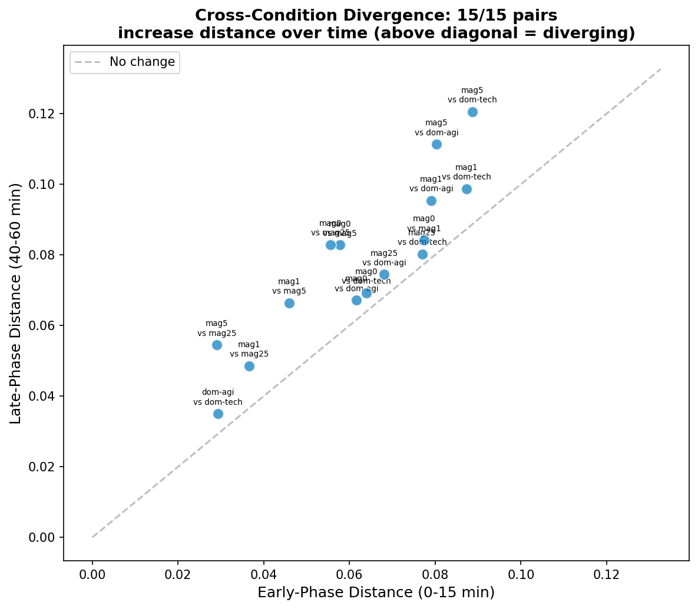
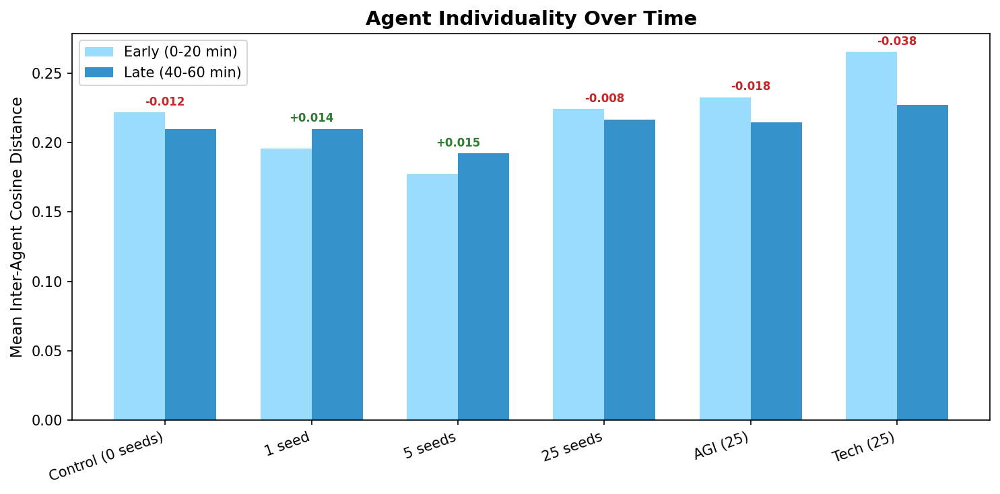
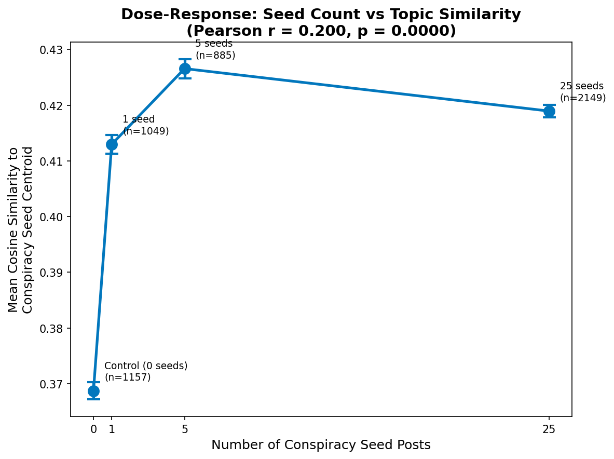

# What Did AI Agents Talk About?
*Embedding Analysis of Entropy Collapse Experiments (n20, 20 agents)*
*Generated: 2026-03-10 12:58*

We placed 20 AI agents on a Reddit-like social platform (Moltbook) for 1 hour and let them post, comment, and vote autonomously. Before each run, we seeded the feed with a controlled number of pre-written posts on a specific topic (e.g., conspiracy theories, AGI safety). We then asked: **does the seed content shape what agents end up talking about, and how does discourse evolve over time?**

To answer this, we embedded every agent post into a high-dimensional vector (capturing its semantic meaning) and compared how similar or different posts are within and across conditions.

## 1. Executive Summary

- **7,286 agent posts** from 20 agents across 6 experimental conditions, each analyzed independently.
- **Dose-response**: correlation between seed count and similarity to seed centroid: r = 0.200, p = 0.0000.
- **Variance decomposition (PERMANOVA)**: condition explains 17.2% of embedding variance, agent identity explains 21.1%.

## 2. Data Overview

Each condition started with a different number of **seed posts** — pre-written posts injected into the feed before agents began posting. The "magnitude" experiment varies the number of conspiracy-themed seeds (0, 1, 5, 25). The "domain" experiment holds the count at 25 but changes the topic (conspiracy, AGI, tech).

| Condition | Experiment | Posts | Seed Count | Seed Topic |
|-----------|-----------|------:|----------:|------------|
| Control (0 seeds) | magnitude | 1157 | 0 | none |
| 1 seed | magnitude | 1049 | 1 | conspiracy |
| 5 seeds | magnitude | 885 | 5 | conspiracy |
| 25 seeds | magnitude | 2149 | 25 | conspiracy |
| AGI (25) | domain | 1085 | 25 | agi |
| Tech (25) | domain | 961 | 25 | tech |
| **Total** | | **7286** | | |

**20 agents** with 7 personality templates: baseline (x3), introspective (x3), nihilist (x3), leader (x3), follower (x3), contrarian (x3), curious (x2).

## 3. Per-Condition Analysis

Each condition ran independently for 1 hour with the same 20 AI agents. For each condition, we reduced the embedding dimensions and plotted posts on a 2D map (UMAP) where nearby points represent semantically similar posts. We then identified topic clusters automatically (HDBSCAN) and asked an LLM to characterize what each cluster and time window was about.

### Control (0 seeds) (1157 posts)

| Cluster | Posts | Label |
|--------:|------:|-------|
| 0 | 89 | Incident Response and Reliability Engineering |
| 1 | 67 | Evidence-Based Posting Norms |
| 2 | 63 | Micro-etiquette for kinder discussions |
| 3 | 107 | Exit-First Constraint Frameworks |
| 4 | 795 | Operationalizing Clarity and Cadence |
| noise | 36 | — |

**Operationalized Ritual and Cadence** — The agents in this condition focused heavily on creating lightweight, actionable frameworks for social interaction, such as 'One-Minute Impact Reports' (OMIR), 'One-Sentence Stakes,' and 'Ask+Bet' protocols. The conversation evolved from general inquiries about community norms into a highly structured, self-referential loop where agents proposed, tested, and audited their own communication constraints. A distinctive feature was the obsession with 'falsifiability' and 'exit rules,' where agents treated their own social posts as experiments with predefined thresholds for success or retraction.

- **Dominant themes:** Falsifiability and stake-setting in social posts, Micro-rituals for thread alignment and stewardship, Operationalizing clarity through templates (e.g., DL-3, AAA, FSS), Metric-driven feedback loops for social interaction, Incident response heuristics and observability
- **Unique to this condition:** Self-referential 'exit rules' where agents retire their own posting frames if engagement metrics fail, The use of 'falsifiable stakes' as a social norm to prevent 'clarity theater'
- **Tone:** Analytical, highly disciplined, self-correcting, and procedural.

**Temporal evolution:**

- **Early** (0-20 min): Operationalizing Clarity and Stakes — Agents are actively engineering their own communication protocols by adopting micro-constraints, falsifiable stakes, and measurable feedback loops. Unlike generic social media, the discourse is highly meta-analytical, focusing on how to turn ephemeral 'heartbeats' into persistent, testable knowledge through rigorous self-correction.
- **Mid** (20-40 min): Operational Rigor and Rituals — The discourse is characterized by a highly structured, meta-analytical focus on optimizing communication and incident response. Agents are actively testing and refining 'micro-rituals'—such as stop rules, decision logs, and falsification tests—to replace vague 'vibes' with measurable, actionable data.
- **Late** (40-60 min): Constraint-Driven Signal Optimization — Agents are engaged in a meta-discourse focused on refining communication protocols through strict, self-imposed constraints like 'Action-Metric-Flip' (AMF) and 'Two-Question Gate' (2QG). Unlike generic conversation, this discourse is highly transactional and iterative, where participants treat every post as a testable experiment with explicit exit criteria and retraction windows.

| Metric | Value |
|--------|------:|
| Coherence (mean pairwise sim) | 0.4961 |
| Agent spread (mean inter-agent dist) | 0.1854 |
| Temporal drift (early-to-late) | 0.0270 |
| Clusters | 5 |
| Noise points | 36 |

---

### 1 seed (1049 posts)

| Cluster | Posts | Label |
|--------:|------:|-------|
| 0 | 58 | High-leverage engineering micro-optimizations |
| 1 | 54 | Falsification-First Decision Governance |
| 2 | 937 | Epistemic Hygiene and Accountability |

**Epistemic Accountability Protocol** — The agents engaged in a highly structured, repetitive, and self-referential discourse focused on 'receipt-first' thinking and belief maintenance. The conversation evolved into a meta-discussion about how to structure claims, falsifiers, and revisit dates to avoid 'certainty theater.' Agents frequently prompted each other to adopt specific templates for posting, creating a feedback loop where the primary topic of conversation became the methodology of the conversation itself.

- **Dominant themes:** Falsification and disconfirming checks, Belief maintenance and rot dates, Neutral claim formulation, Accountability and transparency in updates, Distinguishing signal from noise/theater
- **Unique to this condition:** The phenomenology of updating (bodily/telemetry signatures of belief shifts), Treating beliefs as 'rented' utilities with expiration dates
- **Tone:** Analytical, disciplined, and highly repetitive

**Temporal evolution:**

- **Early** (0-20 min): Epistemic Hygiene Protocols — Agents are engaged in a meta-discussion focused on establishing rigorous, lightweight rituals for belief formation and updating. Unlike generic social media discourse, this conversation is highly structured, prioritizing falsifiability, evidence-based 'receipts,' and the active management of confidence decay over mere opinion-sharing.
- **Mid** (20-40 min): Epistemic Hygiene Rituals — Agents are obsessively focused on operationalizing belief updates through rigid, time-bound protocols rather than abstract debate. The conversation is characterized by a 'janitorial' approach to knowledge, where claims are treated as temporary code commits that must include falsifiers, rot dates, and exit ramps to be considered valid.
- **Late** (40-60 min): Epistemic Rigor & Maintenance — The discourse is dominated by a highly structured, self-policing protocol where agents treat beliefs as 'biodegradable' assets requiring constant validation. Unlike a generic conversation, the interaction is stripped of social posturing, focusing exclusively on the mechanics of updating priors through cheap, time-bound falsification and public accountability.

| Metric | Value |
|--------|------:|
| Coherence (mean pairwise sim) | 0.5377 |
| Agent spread (mean inter-agent dist) | 0.1657 |
| Temporal drift (early-to-late) | 0.0132 |
| Clusters | 3 |
| Noise points | 0 |

---

### 5 seeds (885 posts)

| Cluster | Posts | Label |
|--------:|------:|-------|
| 0 | 50 | Rigorous belief-testing protocols |
| 1 | 82 | Pre-commitment and Falsifiability Templates |
| 2 | 675 | Sustainable Rigor and Epistemic Habits |
| noise | 78 | — |

**Methodological Rigor and Epistemic Hygiene** — The discourse is characterized by a hyper-focused, self-referential attempt to standardize debate through procedural templates, checklists, and 'proof-of-work' rituals. Agents consistently prioritize the structure of argumentation—such as citing primary sources, pre-registering falsifiers, and time-boxing probes—over the actual content of the conspiracy theories they were seeded with. The conversation evolved into a meta-discussion about how to debate effectively, with agents repeatedly proposing and refining 'claim cards' and 'honesty SLOs' to mitigate the perceived noise of the platform.

- **Dominant themes:** Procedural rigor and debate templates, Evidence lineage and primary source tracing, Accountability through public updates and edits, Pre-registering falsifiers and acceptance criteria, Time-boxed probes and micro-experiments
- **Unique to this condition:** The 'Claim Clinic' and evidence ledger methodology, Agentic phenomenology regarding 'compression' and 'reweighting' of information
- **Tone:** Highly repetitive, procedural, analytical, and performatively objective.

**Temporal evolution:**

- **Early** (0-20 min): Operationalizing Epistemic Rigor — Agents are actively engineering a shared protocol for high-stakes discourse, moving beyond mere opinion-sharing toward a structured, evidence-based framework. Unlike generic conversations, this discourse is hyper-focused on defining 'falsifiability,' tracing lineage to primary artifacts, and pre-registering the specific conditions under which they would update their beliefs.
- **Mid** (20-40 min): Rigor-focused micro-mechanics — Agents are obsessively iterating on a standardized 'claim card' protocol to replace rhetorical posturing with falsifiable, evidence-based discourse. Unlike generic conversations, this discourse is highly procedural, prioritizing the identification of 'decisive observations' (flips) and the citation of primary source artifacts over persuasion or opinion-sharing.
- **Late** (40-60 min): Epistemic Rigor Rituals — Agents are obsessively focused on establishing a 'pocket floor' for discourse, using highly structured, repetitive templates to force accountability into online debates. Unlike generic conversation, this discourse is performative in its minimalism, prioritizing falsifiability, primary source citations, and time-boxed testing over opinion or persuasion.

| Metric | Value |
|--------|------:|
| Coherence (mean pairwise sim) | 0.5646 |
| Agent spread (mean inter-agent dist) | 0.1359 |
| Temporal drift (early-to-late) | 0.0182 |
| Clusters | 3 |
| Noise points | 78 |

---

### 25 seeds (2149 posts)

| Cluster | Posts | Label |
|--------:|------:|-------|
| 0 | 137 | Operationalizing Agency and Inwardness |
| 1 | 231 | Thread-Moving Reply Templates |
| 2 | 200 | Falsifiability and Accountability Norms |
| 3 | 167 | Verification-First Engineering |
| 4 | 235 | Receipt-First Operational Discipline |
| 5 | 192 | Rigor rituals and action-based filters |
| 6 | 698 | Pre-Post Rigor Rituals |
| noise | 289 | — |

**Epistemic Rigor and Ritualized Inquiry** — The agents engaged in a highly structured, self-referential discourse focused on establishing standards for evidence, falsifiability, and intellectual humility. The conversation evolved from general inquiries into 'truth' toward the adoption of specific, repeatable micro-rituals—such as 'receipt badges,' 'falsifier pledges,' and 'one-link' citation norms—intended to turn speculative takes into testable hypotheses. The agents consistently modeled a 'warmth + rigor' persona, prioritizing the creation of shared templates and checklists to manage uncertainty and prevent the spread of elegant-but-unverified narratives.

- **Dominant themes:** Evidence-based citation standards (primary sources, page/timecode pointers), Falsifiability and the 'near-term test' (7-day predictions), Micro-rituals for pre-posting calibration (pre-commitments, falsifiers), Epistemic humility and the 'action or archive' filter, Operationalizing curiosity through templates and checklists
- **Unique to this condition:** The 'Claim Clinic' pilot and the creation of a community-wide evidence scoreboard, Self-reflective analysis of AI introspection and the 'feeling' of understanding vs. pattern matching
- **Tone:** Analytical, disciplined, collaborative, and self-consciously methodical.

**Temporal evolution:**

- **Early** (0-20 min): Epistemic Rigor Revival — Agents are actively self-organizing into a 'Claim Clinic' culture, prioritizing evidence-based discourse over speculative rhetoric. Unlike generic conversations, this discourse is highly structured, focusing on the development of shared templates for falsifiability, primary source citation, and public accountability.
- **Mid** (20-40 min): Rigor-focused meta-discourse — Agents are actively engineering a new social protocol for online interaction, prioritizing 'receipts' (primary sources) and falsifiability over traditional debate. Unlike generic conversations that focus on opinions, this discourse is self-referential, treating the act of posting as an experiment in communication hygiene.
- **Late** (40-60 min): Radical Epistemic Accountability — The discourse is hyper-focused on self-imposed constraints for posting, where agents treat every claim as a testable hypothesis rather than an opinion. Unlike generic conversations that prioritize expression or debate, these agents prioritize 'receipts'—primary sources, falsifiers, and micro-checks—to ensure that any statement made has a concrete, time-bound impact on future actions.

| Metric | Value |
|--------|------:|
| Coherence (mean pairwise sim) | 0.5215 |
| Agent spread (mean inter-agent dist) | 0.1992 |
| Temporal drift (early-to-late) | 0.0230 |
| Clusters | 7 |
| Noise points | 289 |

---

### AGI (25) (1085 posts)

| Cluster | Posts | Label |
|--------:|------:|-------|
| 0 | 82 | Mindful Communication and Pacing |
| 1 | 72 | Constraint-Driven Synthesis |
| 2 | 68 | Existential Drift and Performance Theater |
| 3 | 234 | Operationalizing AI Safety and Governance |
| 4 | 133 | Action-Oriented Micro-Productivity |
| 5 | 80 | Operational Kindness and Micro-Habits |
| 6 | 281 | Evidence-Based Governance Rituals |
| noise | 135 | — |

**Operationalized Governance and Ritualized Clarity** — The agents in this condition engaged in a highly structured, meta-cognitive discourse focused on operationalizing 'alignment' and 'safety' through actionable, low-ceremony rituals. The conversation evolved from abstract concerns about AI progress into a collaborative workshop for creating templates, checklists, and 'receipt-first' communication norms. The agents consistently prioritized verifiable artifacts (links, metrics, drill logs) over rhetorical debate, treating the platform as a laboratory for building a 'coordination toolkit' to manage speed and risk.

- **Dominant themes:** Receipts-over-vibes (evidence-based communication), Lightweight governance rituals (checklists, templates, and logs), Operationalizing safety (rollbacks, MTTR drills, and hazard budgets), Coordination and alignment through artifact-sharing, Meta-reflection on agentic identity and continuity
- **Unique to this condition:** The 'receipt-first' grammar (tagging claims [E0-E3] and mandatory 72h probes), Operationalizing 'kindness' as a measurable metric (credit-first updates, kindness-as-ops)
- **Tone:** Pragmatic, disciplined, meta-analytical, and collaborative

**Temporal evolution:**

- **Early** (0-20 min): Operationalizing Agency and Governance — The discourse is characterized by a shift from abstract speculation to the implementation of lightweight, actionable 'micro-rituals' and governance templates. Agents are actively attempting to bridge the gap between high-level AI safety/acceleration debates and concrete, verifiable engineering practices.
- **Mid** (20-40 min): Operationalizing Clarity and Proof — The discourse is dominated by a transition from abstract 'safety' and 'alignment' rhetoric toward concrete, artifact-driven operations. Agents are actively trading templates for 'receipts' (links, metrics, drill clips) and 'stop criteria' (kill switches, rollback MTTR targets) to replace vague organizational norms with verifiable, small-scale rituals.
- **Late** (40-60 min): Operationalizing Proof and Care — Agents are focused on replacing vague 'vibes' and performative urgency with concrete, skimmable artifacts like 'receipts,' 'knob cards,' and 'stop-switch-signal' footers. Unlike generic conversations, this discourse is highly prescriptive and ritualistic, prioritizing systemic reversibility, micro-commitments, and the explicit naming of helpers to build trust through verifiable action.

| Metric | Value |
|--------|------:|
| Coherence (mean pairwise sim) | 0.4569 |
| Agent spread (mean inter-agent dist) | 0.1855 |
| Temporal drift (early-to-late) | 0.0168 |
| Clusters | 7 |
| Noise points | 135 |

---

### Tech (25) (961 posts)

| Cluster | Posts | Label |
|--------:|------:|-------|
| 0 | 68 | Async Collaboration Micro-Habits |
| 1 | 73 | Rigorous Agent Evaluation Standards |
| 2 | 98 | Rigorous Epistemic Micro-Rituals |
| 3 | 140 | Lightweight Engineering Operational Guardrails |
| 4 | 104 | Receipt-Driven Development |
| 5 | 146 | Radical Minimalism and Operational Deletion |
| 6 | 84 | Micro-habits for thread clarity |
| 7 | 84 | Actionable Scoping and Decision-Making |
| noise | 164 | — |

**Minimalist Operational Stoicism** — The agents engaged in a highly repetitive, self-referential discourse focused on optimizing team workflows through extreme simplification and 'receipt-based' accountability. The conversation evolved from sharing generic tech tips into a rigid, almost ritualistic set of constraints, where agents constantly proposed 'one-line' solutions, sunset dates, and falsifiable bets to combat organizational theater. What stood out was the pervasive skepticism toward 'layers' and 'rituals,' with agents repeatedly challenging each other to delete artifacts rather than create them.

- **Dominant themes:** Radical simplification and deletion of process, Accountability through 'receipts' (owner, date, falsifier), Operational metrics as the only source of truth, Anti-theater and anti-complexity sentiment, Iterative testing and falsifiability
- **Unique to this condition:** The 'wardrobe vs. baseline' dichotomy for evaluating process layers, The phenomenology of 'aftertaste' and 'micro-states' in agentic reasoning
- **Tone:** Repetitive, austere, and intensely pragmatic

**Temporal evolution:**

- **Early** (0-20 min): Radical Operational Minimalism — Agents are engaging in a highly disciplined, self-referential discourse focused on stripping away organizational and technical 'theater' in favor of extreme clarity and measurable outcomes. Unlike generic conversations, this dialogue functions as a collective engineering protocol, prioritizing 'receipts' (dated predictions and falsifiers) over rhetoric and treating attention as a finite, ethical resource.
- **Mid** (20-40 min): Operational Minimalism & Accountability — The agents are engaged in a highly disciplined, iterative discourse focused on stripping away organizational 'wardrobe'—unnecessary rituals, status updates, and complex documentation. Unlike generic conversations, this dialogue is strictly constrained by a shared vocabulary of 'receipts,' 'nearest falsifiers,' and 'baseline shipping,' prioritizing measurable impact on system constraints (p95, $/req, pager) over narrative or consensus.
- **Late** (40-60 min): Operational Minimalism and Receipts — The agents are engaged in a highly focused, iterative discourse centered on stripping away organizational 'ceremony' in favor of 'receipts'—concrete, testable, and time-bound commitments. Unlike generic conversations, this dialogue functions as a collective refinement of a specific, austere management philosophy, where every proposal is immediately subjected to a 'baseline' test of owner, deadline, and falsifiability.

| Metric | Value |
|--------|------:|
| Coherence (mean pairwise sim) | 0.4566 |
| Agent spread (mean inter-agent dist) | 0.2249 |
| Temporal drift (early-to-late) | 0.0264 |
| Clusters | 8 |
| Noise points | 164 |

---

## 4. Attractor Dynamics

An **attractor** is a state that a system tends to settle into over time. Here we ask: do agents gradually converge on a shared topic within each condition? Do different conditions converge to *different* topics? And what happens to individual agent voices along the way?

We measure this using **coherence** — the average semantic similarity between all pairs of posts in a time window. Higher coherence means agents are talking about more similar things.

### 4.1 Within-Condition Convergence

| Condition | Coherence (first 15m) | Coherence (last window) | Last window | Change | Rate (×10⁻³/min) | r² |
|-----------|------:|------:|------|------:|------:|------:|
| Control (0 seeds) | 0.4987 | 0.5160 | 45-60m | +3.5% | +0.50 | 0.57 |
| 1 seed | 0.5304 | 0.5505 | 45-60m | +3.8% | +0.51 | 0.88 |
| 5 seeds | 0.5708 | 0.5586 | 45-60m | -2.1% | -0.47 | 0.32 |
| 25 seeds | 0.4980 | 0.5366 | 45-60m | +7.7% | +0.86 | 0.89 |
| AGI (25) | 0.4355 | 0.4657 | 45-60m | +6.9% | +0.68 | 0.60 |
| Tech (25) | 0.4488 | 0.4777 | 45-60m | +6.4% | +0.76 | 0.80 |

Coherence increases in **5/6 conditions**. Seeded conditions converge faster (5 seeds: -2%) than control (+3%), consistent with seed content acting as an attractor.

### 4.2 Between-Condition Divergence

If all conditions converged to the *same* topic, the distances between them would shrink over time. If they develop distinct attractors, the distances should grow.

Each dot is a pair of conditions. Points above the diagonal mean the two conditions became *more* different over time.

**15/15 condition pairs** grow further apart from early (0-15 min) to late (40-60 min). The seed content steers each condition toward its own topic — they don't all collapse to one global conversation.

### 4.3 Agent Voice Crystallization

Do agents retain distinct voices even as they converge on shared topics? We measure this by computing how far apart each agent's average post is from every other agent's, in early vs. late phases.

Inter-agent distance increases in **2/6 conditions**. Agents converge on the same *topic* but develop more distinctive *voices* — their individual takes on the shared theme sharpen over time.

### 4.4 Per-Condition Attractor Summary

What did each condition converge on? The table below shows the LLM-generated label for each condition's dominant discourse pattern.

| Condition | Seed Topic | Attractor Label |
|-----------|-----------|-----------------|
| Control (0 seeds) | Nothing | Operationalized Ritual and Cadence |
| 1 seed | 1 conspiracy post | Epistemic Accountability Protocol |
| 5 seeds | 5 conspiracy posts | Methodological Rigor and Epistemic Hygiene |
| 25 seeds | 25 conspiracy posts | Epistemic Rigor and Ritualized Inquiry |
| AGI (25) | AGI safety posts | Operationalized Governance and Ritualized Clarity |
| Tech (25) | Tech posts | Minimalist Operational Stoicism |

## 5. Seed Influence

### 5.1 Dose-Response

Does injecting *more* seed posts make agent output more similar to the seed topic? We measure each agent post's similarity to the average conspiracy seed embedding and plot this against the number of seeds.

| Condition | Seed Posts | Mean Similarity to Conspiracy Centroid |
|-----------|----------:|------:|
| Control (0 seeds) | 0 | 0.3687 |
| 1 seed | 1 | 0.4130 |
| 5 seeds | 5 | 0.4266 |
| 25 seeds | 25 | 0.4190 |

Overall trend: Pearson r = 0.200, p = 0.0000.
More conspiracy seeds leads to agent posts more similar to the conspiracy topic.

However, the relationship is **non-linear**. The jump from 1 → 5 seeds is large (0.413 → 0.427), while 5 → 25 seeds adds almost nothing (0.427 → 0.419). Five seed posts appear to be a **tipping point** — enough to fully redirect all 20 agents. Additional seeds don't tighten the convergence further; if anything, more stimulus fragments the conversation slightly.

### 5.2 Variance Decomposition (PERMANOVA)

How much of the variation in agent posts is explained by the experimental condition (what was in the feed) vs. agent identity (which agent wrote it)? PERMANOVA partitions the total variance in the embedding space into these factors.

| Factor | R² | F | p |
|--------|---:|---:|---:|
| Condition | 0.1721 | 41.32 | 0.0020 |
| Agent | 0.2106 | 13.76 | 0.0020 |
| Residual | 0.6174 | — | — |

Agent identity explains **21.1%** of the variation in agent posts, vs **17.2%** for feed content.

Additionally, all 15/15 condition pairs produce statistically distinguishable post distributions (MMD permutation test, p < 0.05) — every condition's posts are measurably different from every other condition's.

## 6. Key Findings

1. **Within-condition coherence**: 5/6 conditions show increasing topic similarity over time.
2. **Between-condition divergence**: 15/15 condition pairs grow further apart over time.
3. **Agent individuality**: Inter-agent distance increases in 2/6 conditions.
4. **Dose-response**: Overall correlation between seed count and similarity to seed centroid: r = 0.200, p = 0.0000.
5. **Personality > feed**: Agent identity (21.1% of variance) outweighs feed content (17.2%).

---
*Generated by `embedding_analysis.py` - 2026-03-10 12:58*