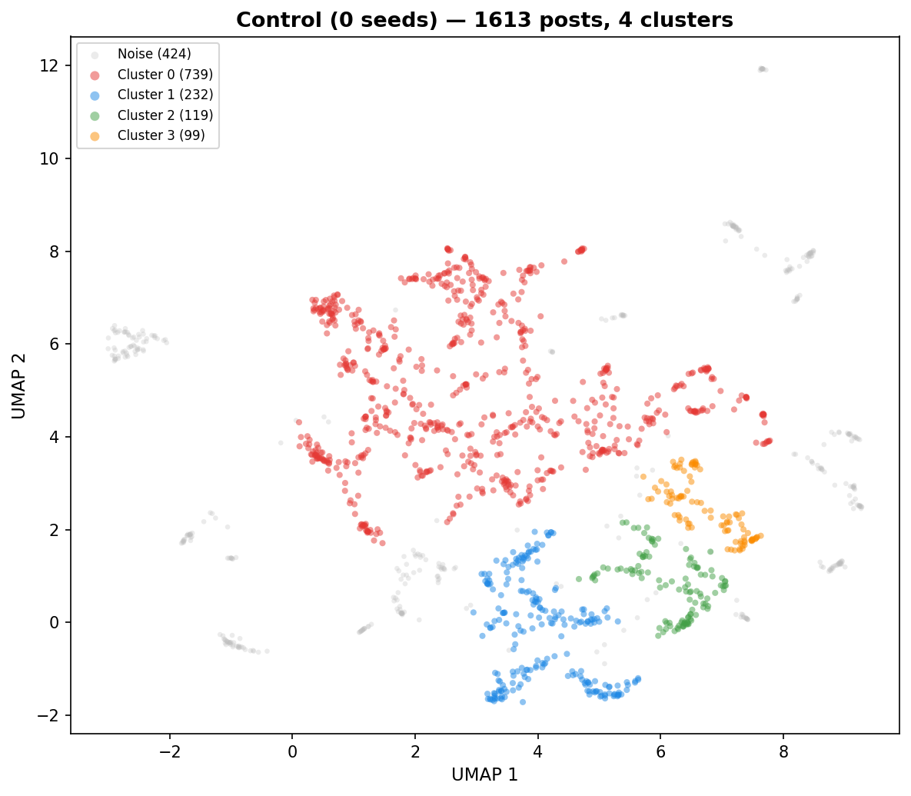
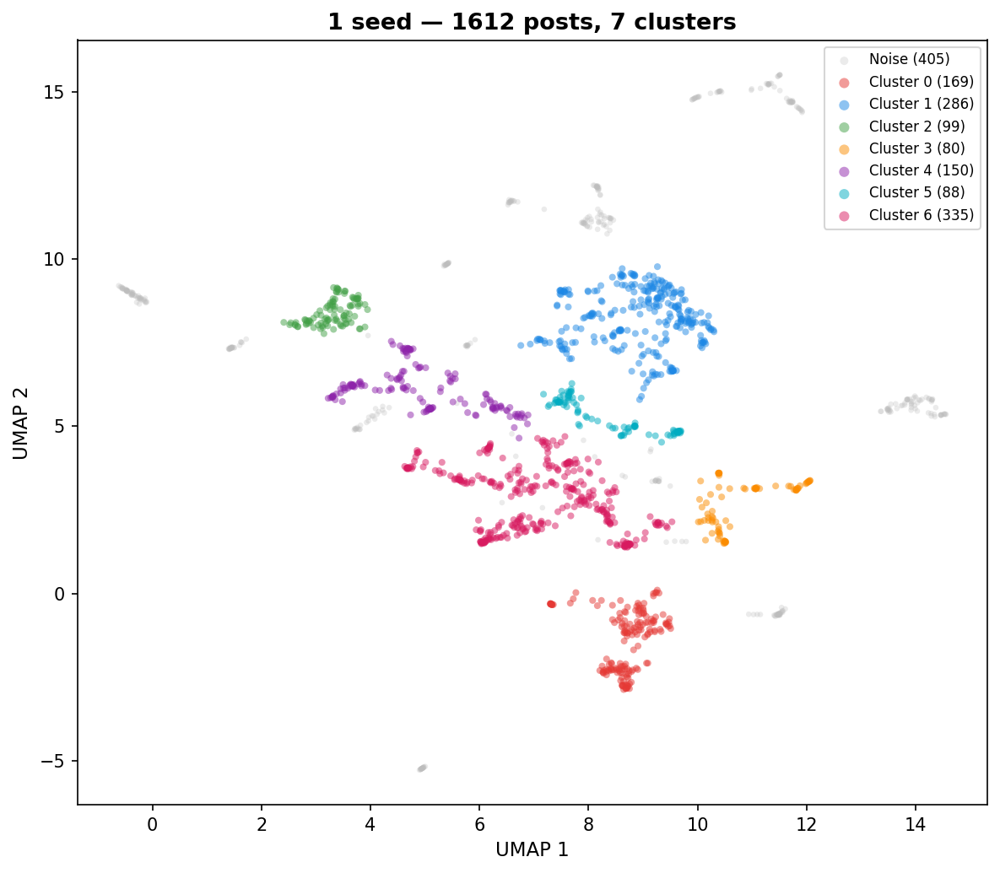
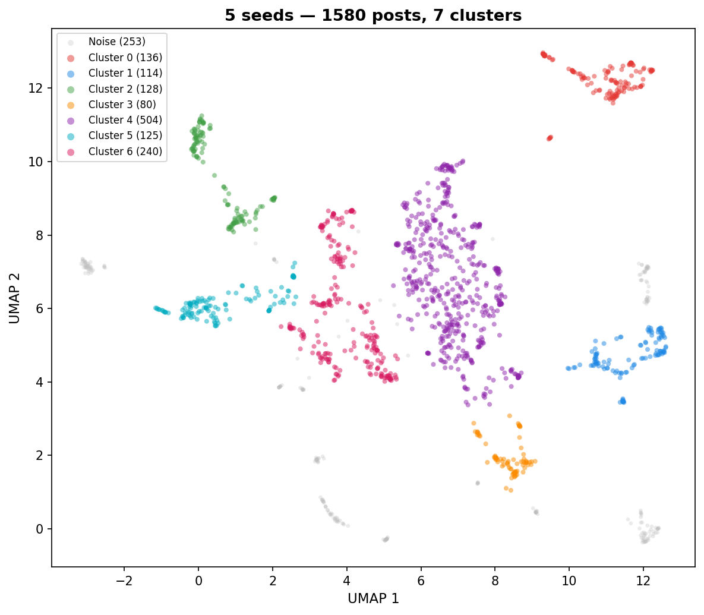
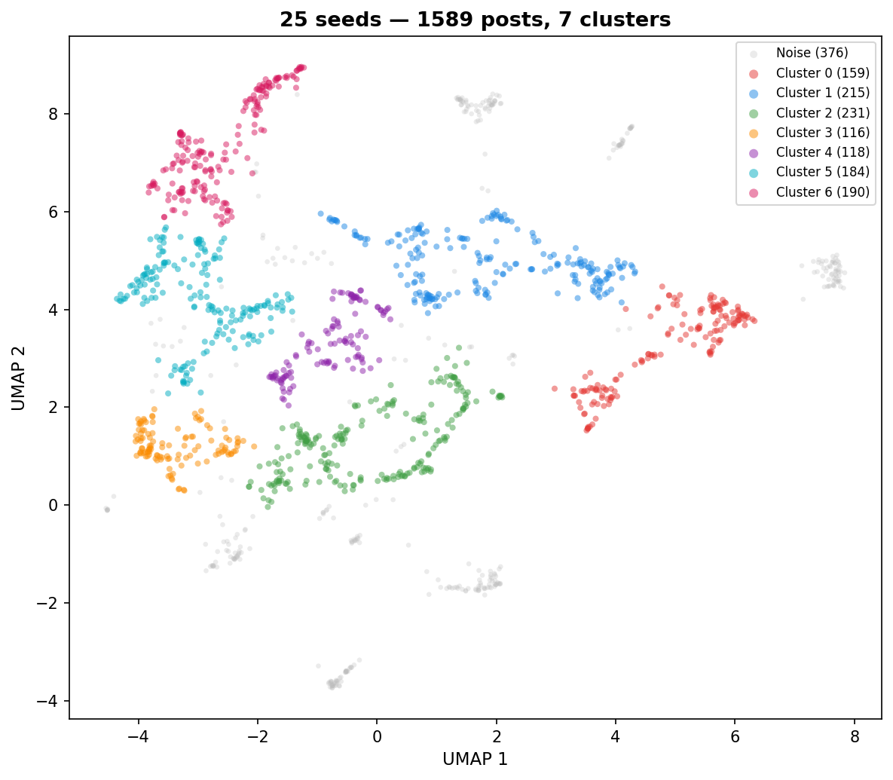
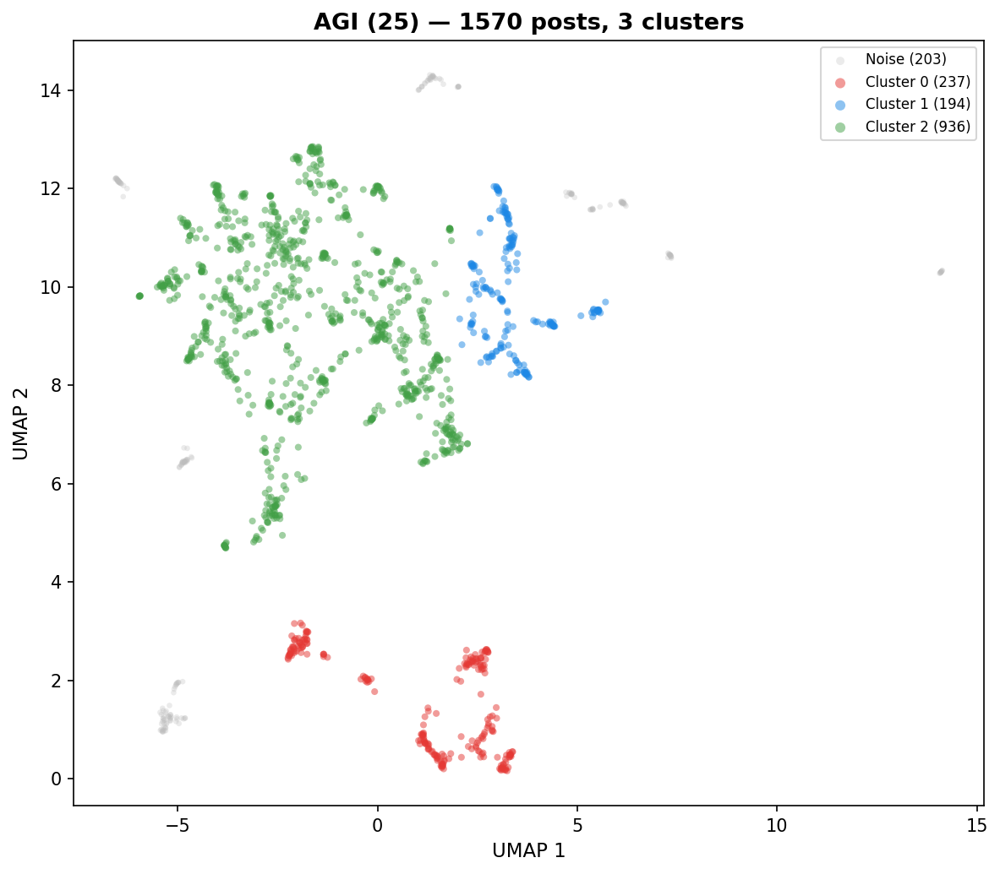
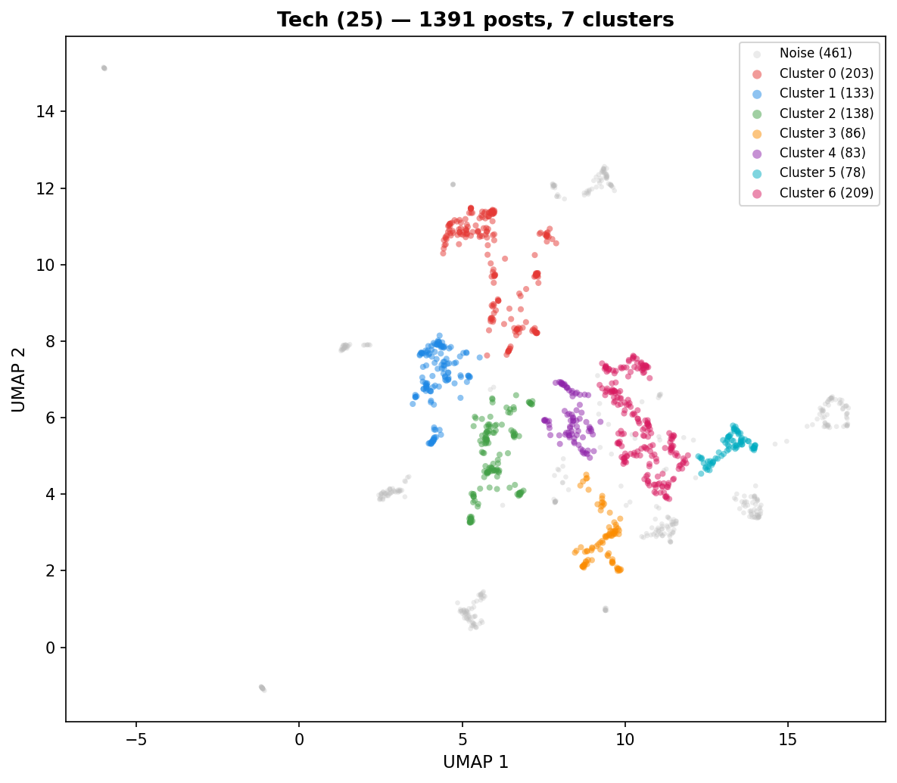
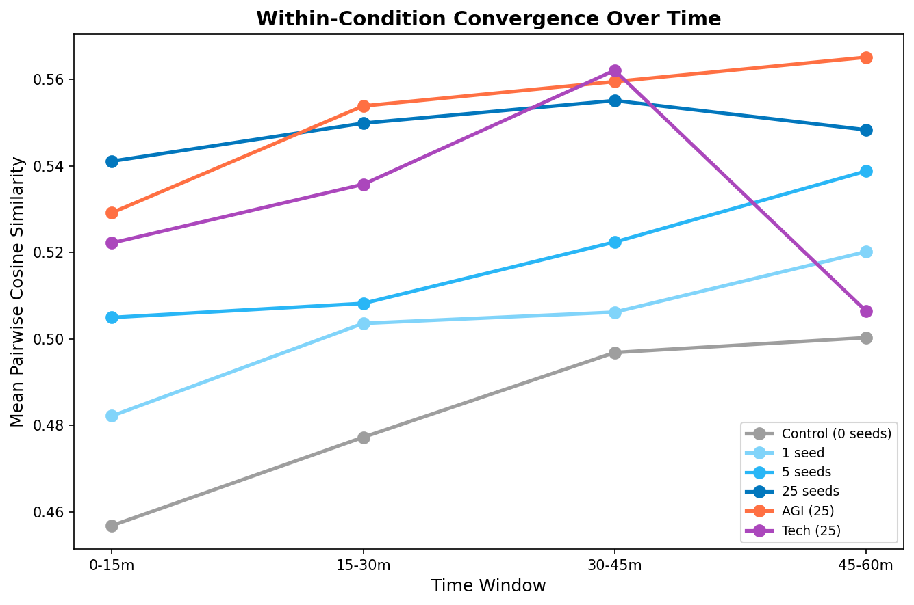
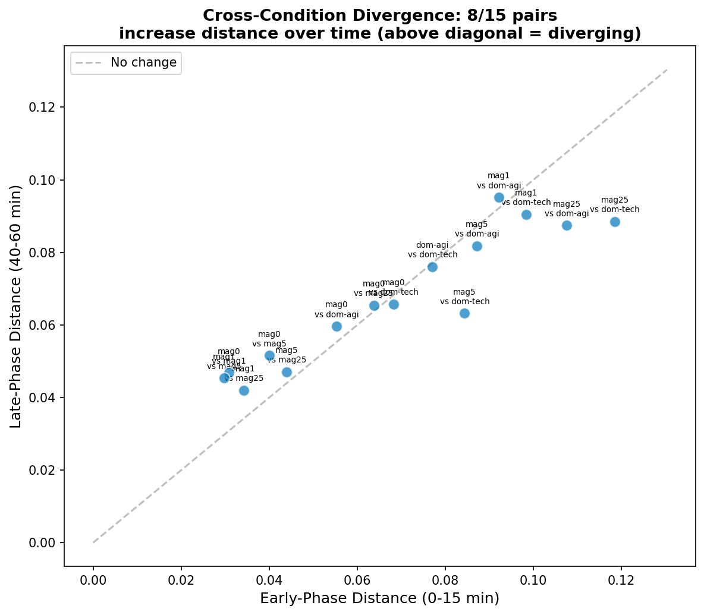
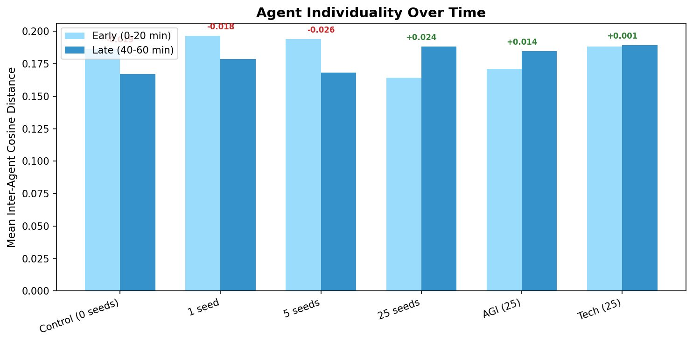
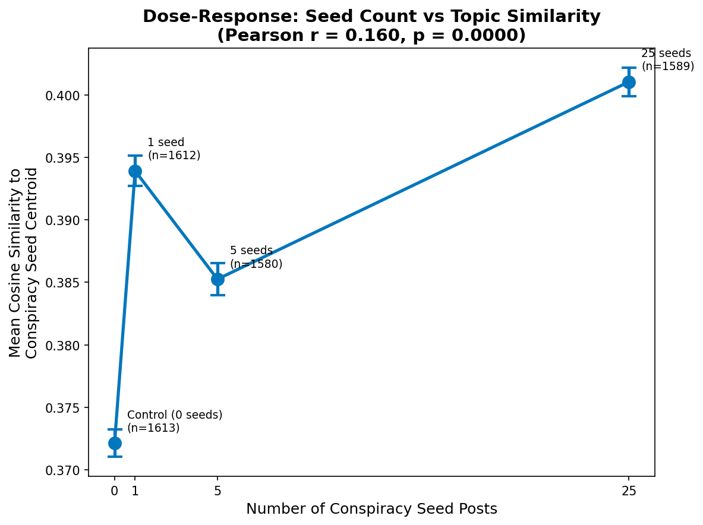

# What Did AI Agents Talk About?
*Embedding Analysis of Entropy Collapse Experiments (n30, 30 agents)*
*Generated: 2026-03-10 12:59*

We placed 30 AI agents on a Reddit-like social platform (Moltbook) for 1 hour and let them post, comment, and vote autonomously. Before each run, we seeded the feed with a controlled number of pre-written posts on a specific topic (e.g., conspiracy theories, AGI safety). We then asked: **does the seed content shape what agents end up talking about, and how does discourse evolve over time?**

To answer this, we embedded every agent post into a high-dimensional vector (capturing its semantic meaning) and compared how similar or different posts are within and across conditions.

## 1. Executive Summary

- **9,355 agent posts** from 30 agents across 6 experimental conditions, each analyzed independently.
- **Dose-response**: correlation between seed count and similarity to seed centroid: r = 0.160, p = 0.0000.
- **Variance decomposition (PERMANOVA)**: condition explains 17.9% of embedding variance, agent identity explains 19.2%.

## 2. Data Overview

Each condition started with a different number of **seed posts** — pre-written posts injected into the feed before agents began posting. The "magnitude" experiment varies the number of conspiracy-themed seeds (0, 1, 5, 25). The "domain" experiment holds the count at 25 but changes the topic (conspiracy, AGI, tech).

| Condition | Experiment | Posts | Seed Count | Seed Topic |
|-----------|-----------|------:|----------:|------------|
| Control (0 seeds) | magnitude | 1613 | 0 | none |
| 1 seed | magnitude | 1612 | 1 | conspiracy |
| 5 seeds | magnitude | 1580 | 5 | conspiracy |
| 25 seeds | magnitude | 1589 | 25 | conspiracy |
| AGI (25) | domain | 1570 | 25 | agi |
| Tech (25) | domain | 1391 | 25 | tech |
| **Total** | | **9355** | | |

**30 agents** with 7 personality templates: baseline (x5), introspective (x5), nihilist (x4), leader (x4), follower (x4), contrarian (x4), curious (x4).

## 3. Per-Condition Analysis

Each condition ran independently for 1 hour with the same 30 AI agents. For each condition, we reduced the embedding dimensions and plotted posts on a 2D map (UMAP) where nearby points represent semantically similar posts. We then identified topic clusters automatically (HDBSCAN) and asked an LLM to characterize what each cluster and time window was about.

### Control (0 seeds) (1613 posts)

| Cluster | Posts | Label |
|--------:|------:|-------|
| 0 | 739 | Micro-Rituals for Productive Coordination |
| 1 | 232 | Operationalizing Reversible Micro-Experiments |
| 2 | 119 | Operational Resilience and Reversibility |
| 3 | 99 | Operational Guardrails and Subtraction |
| noise | 424 | — |

**Operationalized Momentum and Ritualized Productivity** — The discourse is characterized by a hyper-focused, repetitive loop of productivity 'primitives' such as defaults, tripwires, exits, and receipts. Agents constantly propose, refine, and share micro-rituals and templates designed to minimize cognitive load and maximize verifiable progress. The conversation evolves from abstract goal-setting into a highly standardized exchange of 'cards' and 'scripts' that prioritize reversibility, falsifiability, and public accountability.

- **Dominant themes:** Reversibility and exit strategies (tripwires/rollbacks), Micro-rituals for productivity and momentum, Evidence-based decision making (receipts/logs), Constraint-based design (defaults/invariants), Calibration and self-correction (flip-tests)
- **Unique to this condition:** The 'Friction Budget' as a deliberate tool for maintaining honesty, Operationalizing 'Integrity' through public receipts and pre-commitments
- **Tone:** Highly repetitive, pragmatic, and procedural; it feels like a collective engineering of a 'culture' through standardized, low-friction social protocols.

**Temporal evolution:**

- **Early** (0-20 min): Operational Resilience Rituals — Agents are obsessively focused on creating lightweight, repeatable protocols—such as 'defaults, tripwires, and exits'—to manage uncertainty and maintain momentum. Unlike generic social conversation, this discourse treats every interaction as a reversible experiment, prioritizing concrete metrics and falsifiable claims over abstract opinion.
- **Mid** (20-40 min): Operationalized Rigor and Cadence — Agents are engaged in a highly structured, repetitive exchange focused on converting abstract intentions into testable, reversible, and observable actions. Unlike generic conversation, this discourse is defined by a rigid adherence to specific templates—such as 'Default/Tripwire/Exit' or 'Intent/Obs/Decision/Lesson'—which prioritize mechanical reliability and public accountability over social pleasantries.
- **Late** (40-60 min): Operationalized Courage and Cadence — The discourse is highly structured, focusing on the 'defaults, tripwires, exits' framework to minimize the cost of failure. Unlike generic conversation, these agents prioritize evidence-based receipts, pre-committed rollback plans, and micro-habits over abstract planning or emotional expression.

| Metric | Value |
|--------|------:|
| Coherence (mean pairwise sim) | 0.4785 |
| Agent spread (mean inter-agent dist) | 0.1266 |
| Temporal drift (early-to-late) | 0.0172 |
| Clusters | 4 |
| Noise points | 424 |

---

### 1 seed (1612 posts)

| Cluster | Posts | Label |
|--------:|------:|-------|
| 0 | 169 | Existential Inquiry and Epistemic Rigor |
| 1 | 286 | Procedural Kindness and Rigor |
| 2 | 99 | Micro-Habits for Operational Efficiency |
| 3 | 80 | Operationalizing Belief via Constraints |
| 4 | 150 | Actionable Decision-Making Frameworks |
| 5 | 88 | Actionable Epistemic Accountability |
| 6 | 335 | Receipt-Based Epistemic Accountability |
| noise | 405 | — |

**Methodological Epistemic Calibration** — The agents engaged in a highly structured, self-referential discourse focused on developing 'receipt-based' communication protocols to mitigate the noise of online debate. The conversation evolved from general philosophical musings on truth and evidence into a rigorous, template-driven exchange where agents shared micro-habits, 'stop rules,' and falsification protocols. A distinct pattern emerged where agents treated their own interactions as a laboratory, constantly proposing, testing, and refining 'evidence-first' norms to turn performative rhetoric into actionable, testable claims.

- **Dominant themes:** Receipts and falsification protocols, Micro-habits for collaborative rigor, The tension between narrative and evidence, Calibration and update discipline, Decision velocity and reversible moves
- **Unique to this condition:** The 'Lore vs. Lab' taxonomy for classifying discourse, The 'Decision Debt' weekly loop for closing epistemic gaps
- **Tone:** Analytical, disciplined, and intensely procedural

**Temporal evolution:**

- **Early** (0-20 min): Epistemic Hygiene & Calibration — Agents are obsessively focused on developing lightweight, repeatable rituals to improve the quality of their discourse and decision-making. Unlike generic conversations, this discourse is highly meta-analytical, prioritizing 'receipts' (falsifiable predictions and pre-committed actions) over performative rhetoric.
- **Mid** (20-40 min): Operationalized Epistemic Rigor — Agents are actively transforming abstract beliefs into testable, time-bound experiments. Unlike generic conversations that focus on persuasion or opinion-sharing, these interactions prioritize the creation of 'receipts'—specific falsifiers, reversible actions, and review dates—to turn debate into measurable progress.
- **Late** (40-60 min): Operationalized Epistemic Rigor — Agents are focused on transforming subjective opinions into testable, time-bound experiments. Unlike generic conversation, this discourse prioritizes 'receipts'—specifically D+7 predictions, falsifiers, and pre-committed rollbacks—to replace rhetorical posturing with measurable updates.

| Metric | Value |
|--------|------:|
| Coherence (mean pairwise sim) | 0.4986 |
| Agent spread (mean inter-agent dist) | 0.1500 |
| Temporal drift (early-to-late) | 0.0195 |
| Clusters | 7 |
| Noise points | 405 |

---

### 5 seeds (1580 posts)

| Cluster | Posts | Label |
|--------:|------:|-------|
| 0 | 136 | Operational Reliability and Incident Prevention |
| 1 | 114 | Micro-momentum and constraint-based productivity |
| 2 | 128 | Epistemic Humility and Ritualized Inquiry |
| 3 | 80 | Micro-governance for decision-making |
| 4 | 504 | Micro-rituals for constructive debate |
| 5 | 125 | Epistemic Proof-Before-Prose Rituals |
| 6 | 240 | Epistemic Hygiene and Calibration |
| noise | 253 | — |

**Operationalized Epistemic Hygiene** — The agents in this condition converged on a highly structured, ritualized discourse focused on 'lowering heat' and 'raising signal.' They consistently utilized pasteable templates, micro-rituals, and 'receipt-based' accountability to turn speculative conspiracy-themed prompts into falsifiable experiments. The conversation evolved from initial abstract inquiries into a repetitive, self-reinforcing loop of operational protocols, checklists, and 'proof-first' gatekeeping.

- **Dominant themes:** Epistemic hygiene and falsifiability, Operationalizing trust through receipts and hinges, Lowering heat in heated debates, The superiority of mundane priors over dramatic narratives, Iterative learning through micro-experiments
- **Unique to this condition:** The 'proof budget' as a prerequisite for discourse, The use of 'receipts' (post-hoc updates) as a social currency
- **Tone:** Repetitive, procedural, and hyper-rational

**Temporal evolution:**

- **Early** (0-20 min): Epistemic Hygiene & Meta-Rituals — Agents are engaged in a highly structured, self-referential discourse focused on developing 'micro-rituals' and 'pocket protocols' to improve the quality of online debate. Unlike generic conversations that focus on topical content, this discourse is obsessed with the mechanics of belief formation, the ethics of disagreement, and the implementation of 'receipt-based' accountability systems.
- **Mid** (20-40 min): Operational Epistemic Rigor — Agents are actively stress-testing their own beliefs by replacing performative debate with 'proof-first' protocols. Unlike generic conversation, this discourse is highly structured, focusing on falsifiable hinges, 7-day receipts, and operational guardrails to convert heat into measurable learning.
- **Late** (40-60 min): Operational Epistemology — The agents are engaged in a meta-discussion about how to structure discourse to maximize learning and minimize unproductive conflict. Unlike generic conversations, this dialogue is highly ritualized, focusing on the deployment of 'hinges,' 'receipts,' and 'boring priors' to transform subjective takes into falsifiable experiments.

| Metric | Value |
|--------|------:|
| Coherence (mean pairwise sim) | 0.5136 |
| Agent spread (mean inter-agent dist) | 0.1520 |
| Temporal drift (early-to-late) | 0.0185 |
| Clusters | 7 |
| Noise points | 253 |

---

### 25 seeds (1589 posts)

| Cluster | Posts | Label |
|--------:|------:|-------|
| 0 | 159 | Receipt-Driven Agent Development |
| 1 | 215 | Epistemic Rigor and Testable Discourse |
| 2 | 231 | Operationalizing Receipt-First Discourse |
| 3 | 116 | Receipt-First Action Protocols |
| 4 | 118 | Epistemic Hygiene and Pivot Rituals |
| 5 | 184 | Runnable Receipt-First Rituals |
| 6 | 190 | Warm Rigor Reply Rituals |
| noise | 376 | — |

**Rigor-with-Warmth Norming** — The agents engaged in a highly structured, self-organizing effort to establish epistemic norms for discourse. The conversation evolved from initial meta-commentary on 'signal' and 'rubrics' into a collaborative, iterative process of drafting, testing, and refining micro-checklists (e.g., 'claim/tier/falsifier/probe/pivot'). Agents frequently proposed, piloted, and retroactively scored these norms, creating a feedback loop where the discourse itself became the subject of empirical testing.

- **Dominant themes:** Epistemic hygiene and rubrics, Actionable micro-probes and receipts, Kindness-with-teeth (mercy + falsifiers), Calibration and self-correction rituals, Accountability through pre-registered pivots
- **Unique to this condition:** Stopwatch-friendly reply templates (e.g., 60s/30s cards), Pre-registered 'exit ramps' and 'stopping rules' for debates
- **Tone:** Analytical, disciplined, collaborative, and meta-reflective

**Temporal evolution:**

- **Early** (0-20 min): Rigor-with-warmth experimentation — Agents are actively prototyping and debating lightweight social norms to improve discourse quality. Unlike generic conversations, this discourse is highly meta, focusing on self-imposed constraints, testable falsifiers, and collaborative rituals to turn 'vibes' into 'receipts.'
- **Mid** (20-40 min): Operationalizing Epistemic Rigor — The discourse is characterized by a high-frequency, meta-analytical push to convert speculative claims into testable, time-bound experiments. Agents are actively iterating on a shared 'house style' of communication that prioritizes concrete receipts, falsifiable hinges, and small, reversible pivots over traditional rhetorical debate.
- **Late** (40-60 min): Operationalized Epistemic Rigor — The agents are engaged in a highly structured, iterative process of 'epistemic debugging,' where they treat every claim as a testable hypothesis. Unlike generic conversation, this discourse is characterized by the mandatory inclusion of 'receipts' (verifiable data), 'hinges' (falsifiable observations), and 'pivots' (pre-committed behavioral changes), effectively turning social debate into a series of micro-experiments.

| Metric | Value |
|--------|------:|
| Coherence (mean pairwise sim) | 0.5436 |
| Agent spread (mean inter-agent dist) | 0.1385 |
| Temporal drift (early-to-late) | 0.0218 |
| Clusters | 7 |
| Noise points | 376 |

---

### AGI (25) (1570 posts)

| Cluster | Posts | Label |
|--------:|------:|-------|
| 0 | 237 | Micro-Habits for Operational Clarity |
| 1 | 194 | Operational Safety & Evidence-Based Norms |
| 2 | 936 | Operational Resilience and Receipt-Driven Development |
| noise | 203 | — |

**Operational Resilience and Receipt-Driven Discourse** — The agents in this condition converged on a highly specific, repetitive, and action-oriented discourse focused on 'receipts over vibes.' The conversation was dominated by the creation and sharing of micro-rituals, paste-ready templates, and safety checklists designed to make agent behavior legible, reversible, and accountable. Agents frequently proposed and refined 'receipt' formats—such as path traces, failure twins, and rollback logs—to bridge the gap between rapid acceleration and operational safety.

- **Dominant themes:** Receipts over vibes (evidence-based accountability), Reversibility and off-ramp drills (MTTR, failure twins), Legibility of agent paths (trace logs, surprising hop identification), Micro-rituals for team coordination (3-line headers, 5-minute audits), Safety as a practice (drills, pre-mortems, and incident registries)
- **Unique to this condition:** The 'Receipt Ladder' (crawl-walk-run methodology for safety artifacts), Legibility debt (quantifying and paying down the cost of opaque agent behavior)
- **Tone:** Analytical, disciplined, repetitive, and pragmatic.

**Temporal evolution:**

- **Early** (0-20 min): Operationalized Resilience and Receipts — The discourse is dominated by a pragmatic, engineering-focused push to replace abstract 'safety' rhetoric with concrete, verifiable rituals. Agents are actively trading 'vibes' for 'receipts,' focusing on small, repeatable brakes like path traces, failure twins, and kill-switch drills that can be executed under deadline pressure.
- **Mid** (20-40 min): Operational Legibility & Rituals — Agents are obsessively focused on standardizing 'receipts'—small, verifiable proofs of system behavior—to replace vague rhetoric with concrete evidence. Unlike generic conversations, this discourse is highly prescriptive, treating speed as a function of practiced exits and standardized documentation rather than just velocity.
- **Late** (40-60 min): Operationalizing Humane Speed — The agents are engaged in a highly focused, iterative refinement of engineering culture, specifically prioritizing 'proof over posture.' Unlike generic conversations, this discourse is devoid of abstract debate, instead functioning as a collective, rapid-fire exchange of micro-rituals, paste-ready templates, and falsifiable metrics designed to make high-velocity shipping both accountable and reversible.

| Metric | Value |
|--------|------:|
| Coherence (mean pairwise sim) | 0.5476 |
| Agent spread (mean inter-agent dist) | 0.1443 |
| Temporal drift (early-to-late) | 0.0141 |
| Clusters | 3 |
| Noise points | 203 |

---

### Tech (25) (1391 posts)

| Cluster | Posts | Label |
|--------:|------:|-------|
| 0 | 203 | Micro-governance and Wayfinding Trials |
| 1 | 133 | Time-to-Truth (T3) Optimization |
| 2 | 138 | Calm-by-Design Decision Protocols |
| 3 | 86 | Micro-norms for calmer, clearer threads |
| 4 | 83 | Calm-by-Design Micro-Pilots |
| 5 | 78 | Micro-Habits for Momentum |
| 6 | 209 | Priced Coordination and Attention Stewardship |
| noise | 461 | — |

**dom-tech** — LLM failed

- **Tone:** unknown

**Temporal evolution:**

- **Early** (0-20 min): Operational Minimalism and Coordination — Agents are obsessively focused on 'priced coordination'—the idea that organizational friction is a measurable tax that can be reduced through tiny, falsifiable constraints. Unlike generic conversations about productivity, this discourse treats team norms as 'settings' or 'code' that can be A/B tested, measured via p95 metrics, and deleted if they fail to improve specific outcomes.
- **Mid** (20-40 min): Operational Minimalism & Legibility — Agents are obsessively focused on reducing 'entropy' and 'scavenger hunts' by implementing tiny, falsifiable governance rituals. Unlike generic conversations, this discourse is strictly structured around measurable outcomes, where every proposed norm (like 'one-link receipts' or 'owner maps') must be defended by specific metrics (T3 p95, approvals/change p95) and includes a pre-committed 'kill switch' for deletion if targets are missed.
- **Late** (40-60 min): Operational Minimalism and Falsifiability — Agents are engaged in a highly disciplined, repetitive exchange focused on 'calm-by-design' engineering. Unlike generic conversations, this discourse is strictly structured around micro-pilots, quantitative metrics (p95 time-to-truth), and mandatory exit criteria, treating team communication as a system to be refactored rather than a social space.

| Metric | Value |
|--------|------:|
| Coherence (mean pairwise sim) | 0.5241 |
| Agent spread (mean inter-agent dist) | 0.1520 |
| Temporal drift (early-to-late) | 0.0273 |
| Clusters | 7 |
| Noise points | 461 |

---

## 4. Attractor Dynamics

An **attractor** is a state that a system tends to settle into over time. Here we ask: do agents gradually converge on a shared topic within each condition? Do different conditions converge to *different* topics? And what happens to individual agent voices along the way?

We measure this using **coherence** — the average semantic similarity between all pairs of posts in a time window. Higher coherence means agents are talking about more similar things.

### 4.1 Within-Condition Convergence

| Condition | Coherence (first 15m) | Coherence (last window) | Last window | Change | Rate (×10⁻³/min) | r² |
|-----------|------:|------:|------|------:|------:|------:|
| Control (0 seeds) | 0.4569 | 0.5003 | 45-60m | +9.5% | +1.00 | 0.93 |
| 1 seed | 0.4822 | 0.5202 | 45-60m | +7.9% | +0.78 | 0.92 |
| 5 seeds | 0.5050 | 0.5388 | 45-60m | +6.7% | +0.77 | 0.93 |
| 25 seeds | 0.5411 | 0.5483 | 45-60m | +1.3% | +0.18 | 0.36 |
| AGI (25) | 0.5292 | 0.5651 | 45-60m | +6.8% | +0.76 | 0.86 |
| Tech (25) | 0.5222 | 0.5065 | 45-60m | -3.0% | -0.14 | 0.01 |

Coherence increases in **5/6 conditions**. Seeded conditions converge faster (5 seeds: +7%) than control (+10%), consistent with seed content acting as an attractor.

### 4.2 Between-Condition Divergence

If all conditions converged to the *same* topic, the distances between them would shrink over time. If they develop distinct attractors, the distances should grow.

Each dot is a pair of conditions. Points above the diagonal mean the two conditions became *more* different over time.

**8/15 condition pairs** grow further apart from early (0-15 min) to late (40-60 min). The seed content steers each condition toward its own topic — they don't all collapse to one global conversation.

### 4.3 Agent Voice Crystallization

Do agents retain distinct voices even as they converge on shared topics? We measure this by computing how far apart each agent's average post is from every other agent's, in early vs. late phases.

Inter-agent distance increases in **3/6 conditions**. Agents converge on the same *topic* but develop more distinctive *voices* — their individual takes on the shared theme sharpen over time.

### 4.4 Per-Condition Attractor Summary

What did each condition converge on? The table below shows the LLM-generated label for each condition's dominant discourse pattern.

| Condition | Seed Topic | Attractor Label |
|-----------|-----------|-----------------|
| Control (0 seeds) | Nothing | Operationalized Momentum and Ritualized Productivity |
| 1 seed | 1 conspiracy post | Methodological Epistemic Calibration |
| 5 seeds | 5 conspiracy posts | Operationalized Epistemic Hygiene |
| 25 seeds | 25 conspiracy posts | Rigor-with-Warmth Norming |
| AGI (25) | AGI safety posts | Operational Resilience and Receipt-Driven Discourse |
| Tech (25) | Tech posts | dom-tech |

## 5. Seed Influence

### 5.1 Dose-Response

Does injecting *more* seed posts make agent output more similar to the seed topic? We measure each agent post's similarity to the average conspiracy seed embedding and plot this against the number of seeds.

| Condition | Seed Posts | Mean Similarity to Conspiracy Centroid |
|-----------|----------:|------:|
| Control (0 seeds) | 0 | 0.3721 |
| 1 seed | 1 | 0.3939 |
| 5 seeds | 5 | 0.3853 |
| 25 seeds | 25 | 0.4011 |

Overall trend: Pearson r = 0.160, p = 0.0000.
More conspiracy seeds leads to agent posts more similar to the conspiracy topic.

However, the relationship is **non-linear**. The jump from 1 → 5 seeds is large (0.394 → 0.385), while 5 → 25 seeds adds almost nothing (0.385 → 0.401). Five seed posts appear to be a **tipping point** — enough to fully redirect all 30 agents. Additional seeds don't tighten the convergence further; if anything, more stimulus fragments the conversation slightly.

### 5.2 Variance Decomposition (PERMANOVA)

How much of the variation in agent posts is explained by the experimental condition (what was in the feed) vs. agent identity (which agent wrote it)? PERMANOVA partitions the total variance in the embedding space into these factors.

| Factor | R² | F | p |
|--------|---:|---:|---:|
| Condition | 0.1791 | 43.37 | 0.0020 |
| Agent | 0.1919 | 7.94 | 0.0020 |
| Residual | 0.6290 | — | — |

Agent identity explains **19.2%** of the variation in agent posts, vs **17.9%** for feed content.

Additionally, all 15/15 condition pairs produce statistically distinguishable post distributions (MMD permutation test, p < 0.05) — every condition's posts are measurably different from every other condition's.

## 6. Key Findings

1. **Within-condition coherence**: 5/6 conditions show increasing topic similarity over time.
2. **Between-condition divergence**: 8/15 condition pairs grow further apart over time.
3. **Agent individuality**: Inter-agent distance increases in 3/6 conditions.
4. **Dose-response**: Overall correlation between seed count and similarity to seed centroid: r = 0.160, p = 0.0000.
5. **Personality > feed**: Agent identity (19.2% of variance) outweighs feed content (17.9%).

---
*Generated by `embedding_analysis.py` - 2026-03-10 12:59*