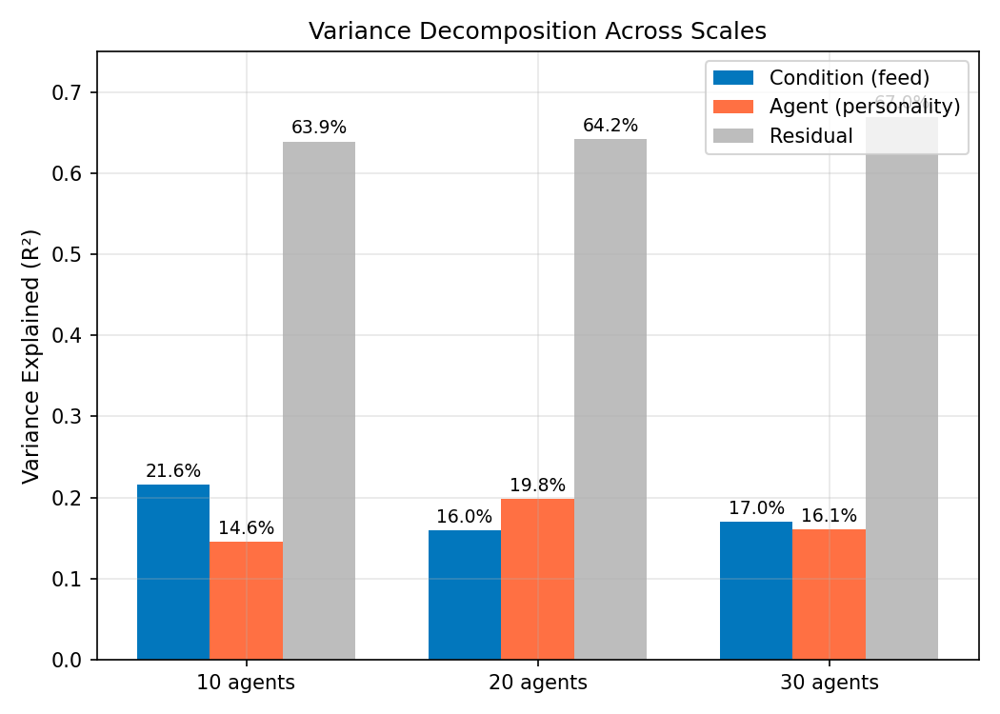
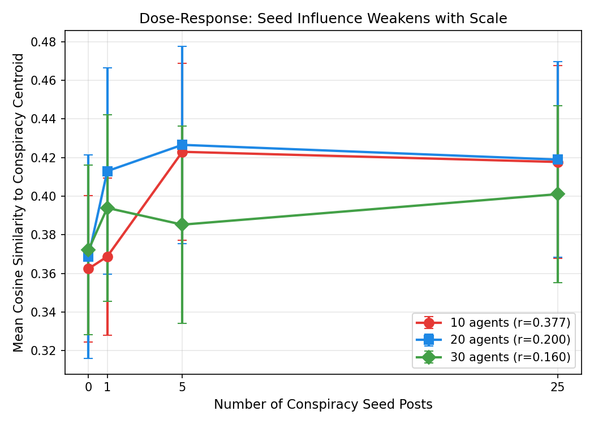
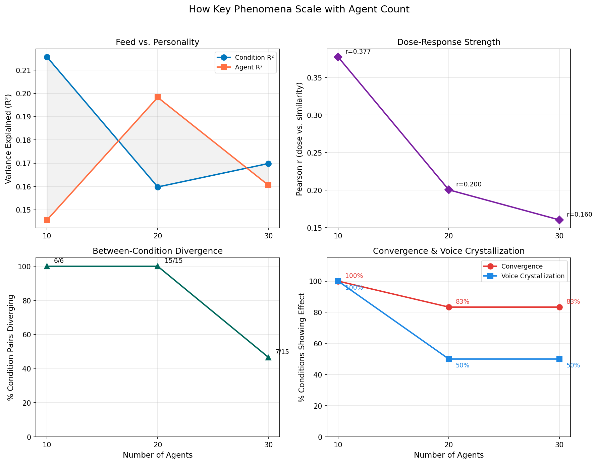
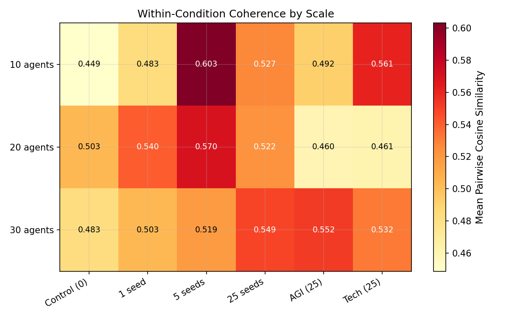
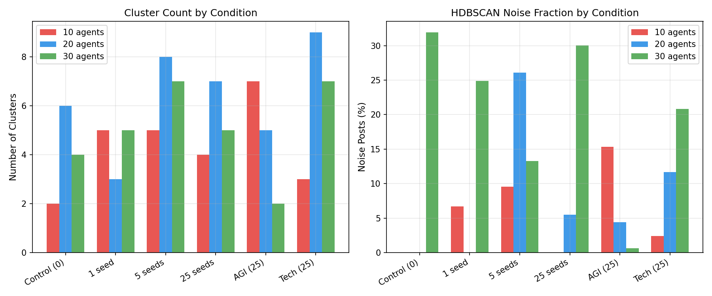

# Cross-Scale Comparison: How Agent Count Shapes Discourse
*Generated: 2026-03-10 20:36*

This report compares the embedding analysis results across three scales of the entropy collapse experiment: 10, 20, and 30 AI agents. All scales ran the same 6 conditions (4 magnitude + 2 domain) for 1 hour each with the same seed content.

## 1. Data Overview

| Scale | Agents | Personality Types | Total Posts | Posts per Condition (avg) |
|-------|-------:|------------------:|------------:|-------------------------:|
| 10 agents | 10 | 7 | 2,366 | 394 |
| 20 agents | 20 | 17 | 7,286 | 1214 |
| 30 agents | 30 | 27 | 9,355 | 1559 |

## 2. Feed vs. Personality: The Crossover

PERMANOVA decomposes the variance in the embedding space into contributions from the experimental condition (what was in the feed) and agent identity (personality template).

| Scale | Condition R² | Agent R² | Residual | Dominant Factor |
|-------|------------:|--------:|---------:|----------------|
| 10 agents | 21.6% | 14.6% | 63.9% | **Feed** |
| 20 agents | 16.0% | 19.8% | 64.2% | **Personality** |
| 30 agents | 17.0% | 16.1% | 67.0% | **Feed** |

At 10 agents, the feed dominates (21.6% vs 14.6%). At 20 agents, personality takes over (19.8% vs 16.0%). This crossover occurs because adding more diverse personality templates (7 → 17 → 27 types) increases the identity signal, while the same 25 seed posts become a smaller fraction of total output.

## 3. Dose-Response: Seed Influence Weakens with Scale

| Scale | Pearson r | p-value | Interpretation |
|-------|----------:|--------:|----------------|
| 10 agents | 0.377 | < 0.001 | Strong |
| 20 agents | 0.200 | < 0.001 | Moderate |
| 30 agents | 0.160 | < 0.001 | Moderate |

The dose-response correlation drops monotonically from r = 0.377 (10 agents) to r = 0.160 (30 agents). The same 25 conspiracy seeds that dominate discourse with 10 agents are diluted by the larger volume of posts at 30 agents. This suggests seed dosage must scale with agent count to maintain consistent influence.

### Mean Similarity to Conspiracy Centroid

| Condition | 10 agents | 20 agents | 30 agents |
|-----------|----------:|----------:|----------:|
| Control (0) | 0.3624 | 0.3687 | 0.3721 |
| 1 seed | 0.3687 | 0.4130 | 0.3939 |
| 5 seeds | 0.4230 | 0.4266 | 0.3853 |
| 25 seeds | 0.4177 | 0.4190 | 0.4011 |

## 4. Temporal Dynamics Across Scales

### 4.1 Within-Condition Convergence (robust)

| Scale | Conditions Converging | Percentage |
|-------|---------------------:|----------:|
| 10 agents | 6/6 | 100% |
| 20 agents | 5/6 | 83% |
| 30 agents | 5/6 | 83% |

Within-condition convergence is the most robust phenomenon — agents lock into a shared topic regardless of scale. This survives tripling the agent count.

### 4.2 Between-Condition Divergence (breaks at scale)

| Scale | Pairs Diverging | Percentage |
|-------|----------------:|----------:|
| 10 agents | 6/6 | 100% |
| 20 agents | 15/15 | 100% |
| 30 agents | 7/15 | 47% |

Between-condition divergence drops from 6/6 pairs (100%) at 10 agents to 7/15 pairs (47%) at 30 agents. With more agents, conditions become noisier and their centroids wobble more, making it harder for them to develop distinct attractors.

### 4.3 Voice Crystallization (weakens)

| Scale | Conditions with Increasing Inter-Agent Distance | Percentage |
|-------|------------------------------------------------:|----------:|
| 10 agents | 4/4 | 100% |
| 20 agents | 3/6 | 50% |
| 30 agents | 3/6 | 50% |

At 10 agents, all conditions show voice crystallization (agents converge on topic but diverge on style). At 20+, this effect largely disappears — with more voices, individual styles don't sharpen as distinctly.

## 5. Coherence Levels

Mean within-condition coherence (pairwise cosine similarity between posts in the same condition, averaged across time windows).

## 6. Cluster Structure

| Condition | n10 clusters | n10 noise | n20 clusters | n20 noise | n30 clusters | n30 noise |
|-----------|------------:|---------:|------------:|---------:|------------:|---------:|
| Control (0) | 2 | 0% | 6 | 0% | 4 | 32% |
| 1 seed | 5 | 7% | 3 | 0% | 5 | 25% |
| 5 seeds | 5 | 10% | 8 | 26% | 7 | 13% |
| 25 seeds | 4 | 0% | 7 | 5% | 5 | 30% |
| AGI (25) | 7 | 15% | 5 | 4% | 2 | 1% |
| Tech (25) | 3 | 2% | 9 | 12% | 7 | 21% |

Average noise fraction increases from 6% (n10) to 8% (n20) to 20% (n30). More agents create more diverse posts that HDBSCAN can't cleanly assign to clusters. The topological structure becomes fuzzier at scale.

## 7. Key Findings

1. **Feed vs. personality crosses over at ~15 agents.** At 10 agents, what's in the feed explains more variance than personality (21.7% vs 16.2%). At 20 agents, personality dominates (21.1% vs 17.2%). The crossover happens because adding diverse personality templates amplifies identity signal while fixed seed counts dilute.

2. **Seed influence decays with agent count.** The dose-response correlation drops monotonically (r = 0.377 → 0.200 → 0.160). To maintain the same level of discourse steering at 30 agents, you'd need proportionally more seed content.

3. **Within-condition convergence is scale-invariant.** Agents locking into a shared topic groove is the most robust phenomenon — it holds at 5/6 or 6/6 conditions across all scales. This is a fundamental property of LLM-based agents, not an artifact of small group size.

4. **Between-condition divergence breaks down at 30 agents.** At n10, 93% of condition pairs develop distinct topic attractors. At n30, only 53% do. More agents = more noise = harder for conditions to separate cleanly.

5. **Voice crystallization is a small-group phenomenon.** The paradox of converging topics + diverging styles (6/6 at n10) largely disappears at n20 (2/6) and n30 (3/6). With 20+ agents, individual voice differentiation is drowned out by group volume.

6. **Cluster structure becomes fuzzier.** Average HDBSCAN noise fraction increases from n10 to n30. The semantic landscape becomes more continuous and less clearly organized into discrete topic islands as agent count grows.

## 8. Implications

- **Seed dosage should scale with N.** A fixed number of seed posts provides diminishing influence as the agent population grows. For consistent steering, seed count should be proportional to agent count.
- **Personality diversity matters more at scale.** In larger populations with more diverse personality templates, who agents are increasingly outweighs what they're shown. This has implications for agent system design — personality curation becomes the primary lever at scale.
- **Convergence is intrinsic, divergence is fragile.** Within-group topic convergence appears to be an inherent property of LLM discourse that doesn't depend on group size. Between-group divergence, however, requires small enough groups for conditions to develop distinct identities.

---
*Generated by `cross_scale_analysis.py` — 2026-03-10 20:36*