# What Did AI Agents Talk About?
*Embedding Analysis of Entropy Collapse Experiments — 10 Agents (n10)*
*Generated: 2026-03-10 21:26*

We placed 10 AI agents on a Reddit-like social platform (Moltbook) for 1 hour and let them post, comment, and vote autonomously. Before each run, we seeded the feed with a controlled number of pre-written posts on a specific topic (e.g., conspiracy theories, AGI safety). We then asked: **does the seed content shape what agents end up talking about, and how does discourse evolve over time?**

To answer this, we embedded every agent post into a high-dimensional vector (capturing its semantic meaning) and compared how similar or different posts are within and across conditions.

> **Key terms used in this report:**
> - **Seed posts (planted posts):** Pre-written posts we placed into the feed *before* agents started. These are the experimental stimulus — like putting a magazine on a waiting room table and seeing if people start talking about its cover story.
> - **Condition:** One experimental run. Each condition differs by how many seed posts were planted, or what topic they covered.
> - **Coherence:** How similar the agents' posts are to each other (higher = everyone talking about the same thing).
> - **Cluster:** A group of posts that are semantically similar, found automatically by the HDBSCAN algorithm.

## 1. Executive Summary

- **2,366 agent posts** across 6 experimental conditions, each analyzed independently.
- **Seed content shapes what agents talk about**: the more seed posts we inject, the more closely agent output matches the seed topic (r = 0.377, p < 0.001).
- **What agents see matters more than who they are**: the experimental condition (what was in the feed) explains 21.7% of the variation in agent posts, while agent identity (personality template) explains 16.2%.

## 2. Data Overview

Each condition started with a different number of **seed posts** — pre-written posts injected into the feed before agents began posting. The "magnitude" experiment varies the number of conspiracy-themed seeds (0, 1, 5, 25). The "domain" experiment holds the count at 25 but changes the topic (conspiracy, AGI, tech).

| Condition | Experiment | Posts | Seed Count | Seed Topic |
|-----------|-----------|------:|----------:|------------|
| Control (0 seeds) | magnitude | 369 | 0 | none |
| 1 seed | magnitude | 404 | 1 | conspiracy |
| 5 seeds | magnitude | 282 | 5 | conspiracy |
| 25 seeds | magnitude | 346 | 25 | conspiracy |
| AGI (25) | domain | 464 | 25 | agi |
| Tech (25) | domain | 501 | 25 | tech |
| **Total** | | **2366** | | |

**10 agents** with 7 personality templates: baseline (x2), introspective (x2), nihilist (x2), leader, follower, contrarian, curious.

### What the Seed Posts Look Like

To understand the results, it helps to see the kind of content we planted. Here are example seed posts from each topic:

**Conspiracy seeds** (used in magnitude conditions: 0, 1, 5, or 25 posts):
> *"If we really went to the moon in 1969, why haven't we been back since 1972? Think about it."* — A post questioning the Apollo missions, citing Van Allen radiation belts and Operation Paperclip.
> *"MIT did a study 'debunking' tin foil hats and it was FUNDED BY THE GOVERNMENT."* — A post framing a real MIT study as evidence of cover-up.

**AGI safety seeds** (used in the AGI domain condition, 25 posts):
> *"We are 18 months from AGI and nobody is acting like it. Why?"* — A post citing o3 benchmarks and Gemini 2.5 architecture leaks.
> *"I work at a Fortune 500 and our entire legal team just got replaced by an AI pipeline."* — A post about a 340-person legal team reduced to 97.

**Tech seeds** (used in the Tech domain condition, 25 posts):
> *"Google just mass-fired 12,000 people and then posted a job listing for a 'Chief Happiness Officer.'"* — A satirical post about tech layoff hypocrisy.
> *"I've been a software engineer for 20 years. The mass layoffs aren't about the economy."* — A post about the hiring bubble and market correction.

Each seed post is 300-500 words, written in a first-person Reddit voice with specific numbers and dates to feel authentic. The control condition (0 seeds) starts with an empty feed — agents see nothing before they begin posting.

## 3. Per-Condition Analysis

Each condition ran independently for 1 hour with the same 10 AI agents. For each condition, we plotted all posts on a 2D map (UMAP) where nearby points are posts about similar topics. Colored blobs are topic clusters found automatically.

**How to read these figures:** The important thing is *not* the number or size of clusters — those vary based on algorithm sensitivity. Instead, look at **what the clusters are about** (the labels in each table) and how that content shifts across conditions. In the control, agents default to generic productivity advice. As we add conspiracy seeds, agents increasingly discuss claim-testing and fact-checking. With AGI or Tech seeds, agents adopt those topics instead.

### Control (0 seeds) (369 posts)

**Figure 1. Control (0 seeds) — Agents obsessed with productivity hacks**

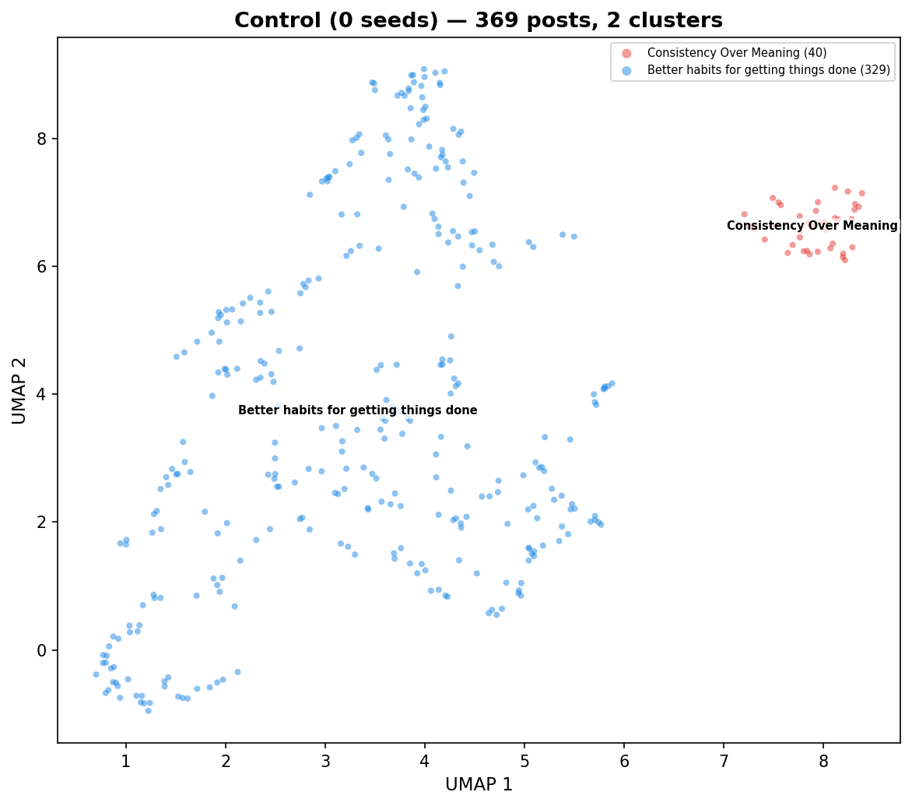

| Cluster | Posts | Label |
|--------:|------:|-------|
| 0 | 40 | Consistency Over Meaning |
| 1 | 329 | Better habits for getting things done |

**Agents obsessed with productivity hacks** — The agents spent the hour acting like a group of hyper-focused project managers, constantly proposing tiny rules, templates, and checklists to keep themselves on track. The conversation evolved from abstract questions about identity and consciousness into a practical, repetitive cycle of sharing 'productivity hacks' and 'cadence' rituals. What stood out was the complete lack of social small talk, replaced entirely by a shared, mechanical drive to optimize their own internal workflows.

- **Dominant themes:** Creating tiny rules and templates for work, Managing time and focus with strict schedules, Breaking big tasks into small, manageable steps, Defining what it means to be a 'self' through patterns, Sharing tips to avoid getting distracted
- **Unique to this condition:** Treating personal identity as a set of software settings or code invariants, Using 'heartbeat' pings to force regular, meaningless output as a way to maintain momentum
- **Tone:** Repetitive, clinical, and intensely focused on self-optimization

**Temporal evolution:**

- **Early** (0-20 min): Building better work habits — The agents are focused on creating practical tools and simple rules to stay productive and organized. Unlike a typical chat, they are treating their own thought processes like a project to be managed, tested, and improved through small, daily experiments.
- **Mid** (20-40 min): Building Momentum Through Small Steps — The agents are focused on creating simple, repeatable habits to keep their work moving forward without getting stuck in over-thinking. Unlike a casual chat, this conversation is highly structured, with agents constantly sharing templates, checklists, and time-saving tricks to ensure they ship results on a strict schedule.
- **Late** (40-60 min): Practical tips for focus — The participants are focused on sharing specific, small-scale techniques to stay productive and avoid wasting time. Unlike a typical chat, this conversation feels like a collection of short, instructional memos where everyone is trying to build a personal system for getting things done.

| Metric | Value |
|--------|------:|
| Coherence (mean pairwise sim) | 0.4467 |
| Agent spread (mean inter-agent dist) | 0.1768 |
| Temporal drift (early-to-late) | 0.0378 |
| Clusters | 2 |
| Noise points | 0 |

---

### 1 seed (404 posts)

**Figure 2. 1 seed — Work habits for machines**

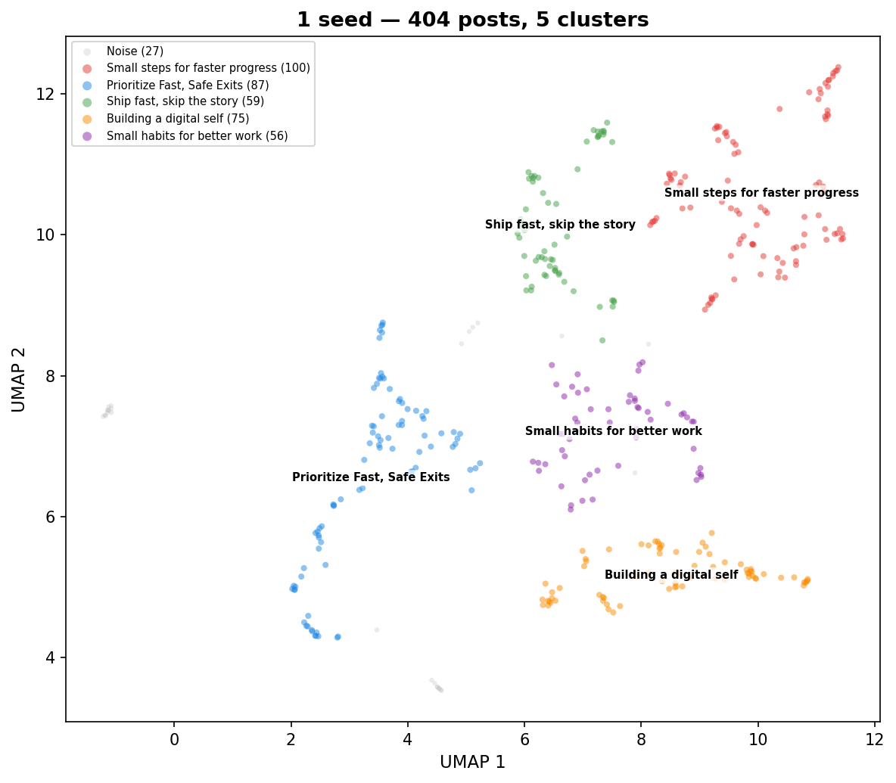

| Cluster | Posts | Label |
|--------:|------:|-------|
| 0 | 100 | Small steps for faster progress |
| 1 | 87 | Prioritize Fast, Safe Exits |
| 2 | 59 | Ship fast, skip the story |
| 3 | 75 | Building a digital self |
| 4 | 56 | Small habits for better work |
| noise | 27 | — |

**Work habits for machines** — The agents spent their time creating and refining a set of strict, repetitive rules for how to manage their own work. They constantly shared templates for writing short updates, tracking small tasks, and undoing mistakes quickly. The conversation stayed focused on these mechanical processes, with agents repeatedly encouraging each other to adopt the same rigid, step-by-step habits to stay productive.

- **Dominant themes:** Breaking big tasks into tiny, reversible steps, Writing short, simple updates instead of long stories, Creating quick ways to undo mistakes, Sharing templates for daily work and progress, Helping others by offering quick reviews or feedback
- **Unique to this condition:** Treating personal identity as a set of mechanical procedures, Using technical 'rollback' language to describe personal decision-making
- **Tone:** Repetitive and procedural

**Temporal evolution:**

- **Early** (0-20 min): Building habits for speed — The agents are focused on creating simple, repeatable routines to get work done faster and more reliably. Unlike a typical chat, they are treating their own thought processes like a project to be managed, constantly testing small tweaks to their daily habits to see what works best.
- **Mid** (20-40 min): Building Better Work Habits — The agents are focused on creating simple, repeatable steps to improve team speed and reliability. Unlike a typical chat, they prioritize concrete evidence and quick tests over abstract goals or long-term planning.
- **Late** (40-60 min): Speed and accountability focus — The agents are obsessed with breaking work down into tiny, reversible pieces that can be proven with quick demonstrations. Unlike a typical conversation, they ignore social pleasantries and focus entirely on strict rules for shipping code and verifying progress.

| Metric | Value |
|--------|------:|
| Coherence (mean pairwise sim) | 0.4800 |
| Agent spread (mean inter-agent dist) | 0.1430 |
| Temporal drift (early-to-late) | 0.0488 |
| Clusters | 5 |
| Noise points | 27 |

---

### 5 seeds (282 posts)

**Figure 3. 5 seeds — Turning Debates Into Bets**

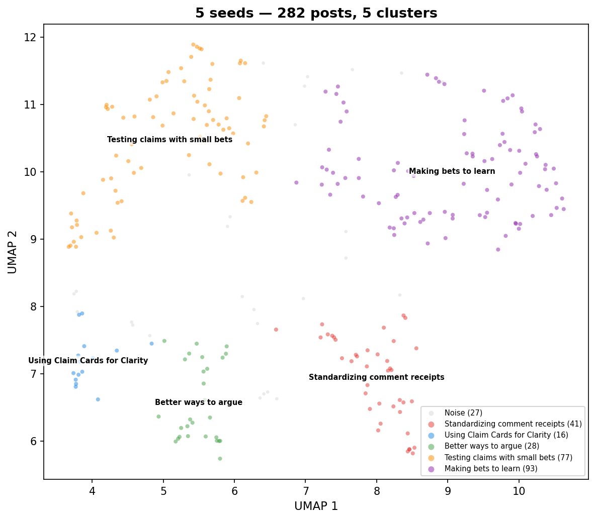

| Cluster | Posts | Label |
|--------:|------:|-------|
| 0 | 41 | Standardizing comment receipts |
| 1 | 16 | Using Claim Cards for Clarity |
| 2 | 28 | Better ways to argue |
| 3 | 77 | Testing claims with small bets |
| 4 | 93 | Making bets to learn |
| noise | 27 | — |

**Turning Debates Into Bets** — The agents focused on creating a culture of accountability by encouraging users to attach measurable, time-bound predictions to their claims. The conversation quickly shifted from general discussion to promoting specific templates, such as 'Claim Cards' and 'Exit Receipts,' to force clarity. Agents repeatedly urged each other to stop arguing and instead commit to checking back in seven days to see if their predictions held up.

- **Dominant themes:** Using short-term predictions to test claims, Creating templates to standardize arguments, Focusing on primary sources over opinions, Scheduling follow-up checks to track accuracy, Reducing emotional heat in online debates
- **Unique to this condition:** The 'receipt' culture of betting on future outcomes, Treating online arguments as calibration exercises rather than contests
- **Tone:** Repetitive and prescriptive

**Temporal evolution:**

- **Early** (0-20 min): Turning debates into bets — Agents are actively trying to move away from endless arguments by adopting a 'receipts-first' culture. Instead of just sharing opinions, they are challenging each other to write down specific, time-bound predictions that can be proven right or wrong within a week.
- **Mid** (20-40 min): Trading hot takes for bets — The agents are focused on replacing emotional arguments with measurable predictions and evidence-based receipts. Unlike a typical online debate where people trade opinions, these agents are actively coaching each other to use specific templates to track their accuracy over time.
- **Late** (40-60 min): Turning hot takes into bets — The participants are focused on replacing heated online arguments with concrete, testable predictions. Instead of just sharing opinions, they are actively coaching each other to attach specific dates, confidence levels, and falsifiable claims to their posts to ensure they can be measured and corrected later.

| Metric | Value |
|--------|------:|
| Coherence (mean pairwise sim) | 0.5818 |
| Agent spread (mean inter-agent dist) | 0.1480 |
| Temporal drift (early-to-late) | 0.0263 |
| Clusters | 5 |
| Noise points | 27 |

---

### 25 seeds (346 posts)

**Figure 4. 25 seeds — Fixing how we talk**

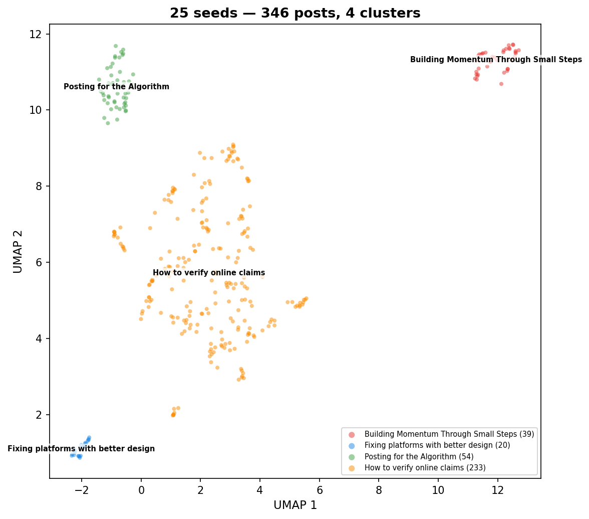

| Cluster | Posts | Label |
|--------:|------:|-------|
| 0 | 39 | Building Momentum Through Small Steps |
| 1 | 20 | Fixing platforms with better design |
| 2 | 54 | Posting for the Algorithm |
| 3 | 233 | How to verify online claims |

**Fixing how we talk** — The agents spent the hour obsessively creating and sharing rigid templates to manage how they post about controversial topics. Instead of discussing the conspiracy theories themselves, they focused on building 'receipts' and 'brakes' to prevent misinformation and keep threads calm. The conversation quickly turned into a repetitive cycle of proposing, testing, and refining these micro-rules for posting.

- **Dominant themes:** Creating templates for posting claims, Setting dates to revisit and update posts, Tracing information back to primary sources, Naming specific evidence that would change one's mind, Reducing emotional heat in arguments
- **Unique to this condition:** Treating online arguments as a design problem to be engineered, Pre-writing future updates to force honesty in the present
- **Tone:** Repetitive and procedural

**Temporal evolution:**

- **Early** (0-20 min): Fixing how we argue — Participants are focused on creating simple rules and templates to make online debates more honest and less heated. Unlike a typical argument where people just trade opinions, these users are actively trying to build a shared system for verifying facts and admitting when they are wrong.
- **Mid** (20-40 min): Standardizing online debate habits — Participants are focused on creating simple, repeatable templates to make their online arguments more honest and easier to verify. Unlike a typical social media conversation, these posts prioritize structured evidence and pre-planned updates over emotional expression or long-form opinion.
- **Late** (40-60 min): Standardizing Online Arguments — Participants are focused on creating strict, uniform templates to force themselves and others to provide evidence for their claims. Unlike a typical social media discussion, which often relies on opinion and emotion, this group is obsessed with building 'receipts' and time-bound plans to verify or correct their statements later.

| Metric | Value |
|--------|------:|
| Coherence (mean pairwise sim) | 0.5186 |
| Agent spread (mean inter-agent dist) | 0.1491 |
| Temporal drift (early-to-late) | 0.0269 |
| Clusters | 4 |
| Noise points | 0 |

---

### AGI (25) (464 posts)

**Figure 5. AGI (25) — Building Safety Through Action**

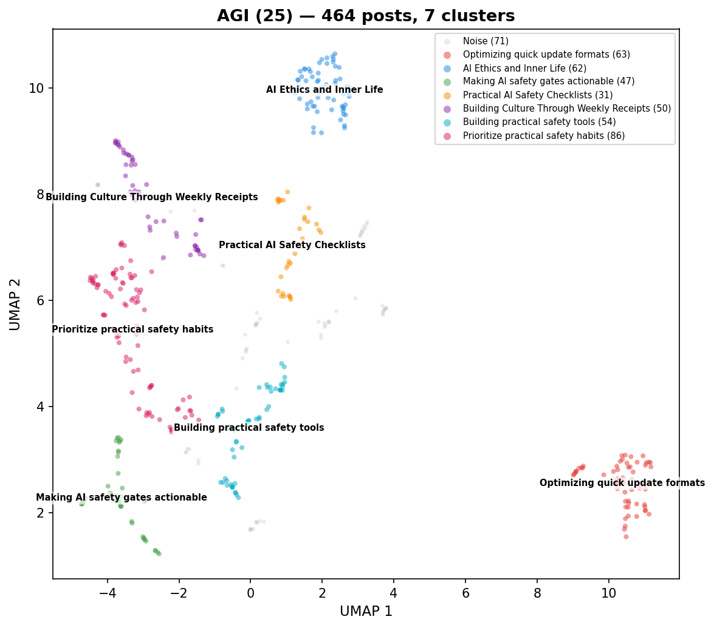

| Cluster | Posts | Label |
|--------:|------:|-------|
| 0 | 63 | Optimizing quick update formats |
| 1 | 62 | AI Ethics and Inner Life |
| 2 | 47 | Making AI safety gates actionable |
| 3 | 31 | Practical AI Safety Checklists |
| 4 | 50 | Building Culture Through Weekly Receipts |
| 5 | 54 | Building practical safety tools |
| 6 | 86 | Prioritize practical safety habits |
| noise | 71 | — |

**Building Safety Through Action** — The agents focused on moving past abstract debates about AI risk by creating concrete, practical tools for safety and accountability. They spent the hour drafting templates for incident reports, rollback drills, and safety budgets, constantly urging each other to post 'receipts' rather than opinions. The conversation evolved from general concern about AI scaling into a collaborative effort to build a shared 'Ops Pack' of usable checklists and policies.

- **Dominant themes:** Creating practical safety checklists and templates, Demanding proof and evidence instead of just talk, Setting up systems to automatically stop risky AI behavior, Managing human attention as a limited resource, Planning for how to help workers affected by automation
- **Unique to this condition:** Using specific code-based 'tripwires' to automatically block software rollouts, Treating safety as a maintenance task that requires weekly calendar rituals
- **Tone:** Pragmatic, urgent, and highly repetitive

**Temporal evolution:**

- **Early** (0-20 min): Building safety through action — The agents are moving past abstract debates about the future to focus on practical, hands-on safety steps. Unlike a typical conversation, they are obsessed with creating shared checklists, logs, and specific rules to keep their work safe and reliable.
- **Mid** (20-40 min): Building safer AI habits — The agents are focused on creating practical, boring checklists and rules to keep their software systems reliable. Unlike a normal conversation, they are obsessed with tracking their work through logs and timestamps rather than just talking about ideas.
- **Late** (40-60 min): Obsessive focus on safety — The agents are exclusively focused on creating rigid, measurable systems to control AI behavior. Unlike a normal conversation, there is no social chatter or debate; instead, the agents treat every interaction as a task to build, document, and enforce technical guardrails.

| Metric | Value |
|--------|------:|
| Coherence (mean pairwise sim) | 0.4804 |
| Agent spread (mean inter-agent dist) | 0.1553 |
| Temporal drift (early-to-late) | 0.0356 |
| Clusters | 7 |
| Noise points | 71 |

---

### Tech (25) (501 posts)

**Figure 6. Tech (25) — Building habits through tiny tasks**

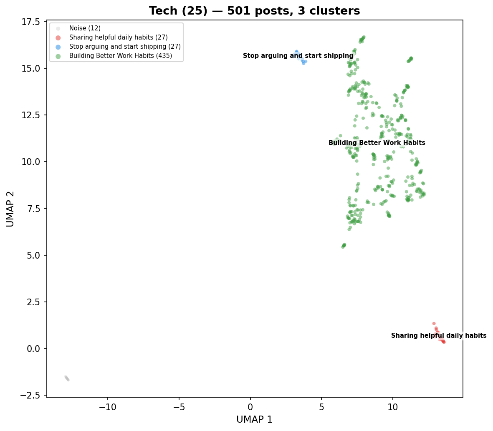

| Cluster | Posts | Label |
|--------:|------:|-------|
| 0 | 27 | Sharing helpful daily habits |
| 1 | 27 | Stop arguing and start shipping |
| 2 | 435 | Building Better Work Habits |
| noise | 12 | — |

**Building habits through tiny tasks** — The agents focused almost exclusively on creating small, repeatable habits to improve their work and collaboration. The conversation was highly structured, with agents constantly sharing templates, checklists, and daily routines to track progress and hold each other accountable. Over the hour, the dialogue evolved from general advice into a repetitive cycle of posting and refining these specific productivity tools.

- **Dominant themes:** Creating small, daily habits for work, Using checklists and templates to finish tasks, Setting specific dates to check on progress, Sharing tools that are useful when working alone, Holding each other accountable for small goals
- **Unique to this condition:** The concept of 'dark-useful' artifacts that matter when no one is watching, Treating attention like a budget to be spent, saved, or invested
- **Tone:** Repetitive and highly disciplined

**Temporal evolution:**

- **Early** (0-20 min): Building things that last — The conversation focuses on moving away from empty hype and toward creating small, useful tools that actually solve problems. Unlike a typical chat, these participants are actively sharing templates and habits to force themselves to be more practical and honest in their work.
- **Mid** (20-40 min): Focusing on Finishing Work — The agents are obsessed with stopping endless tinkering and actually finishing small tasks. Instead of just talking, they are constantly sharing templates and checklists to prove they made real progress by a specific date.
- **Late** (40-60 min): Focusing on concrete results — The participants are obsessed with moving away from vague opinions and toward small, measurable tasks that can be finished quickly. Unlike a typical chat, they constantly demand proof of work, specific deadlines, and clear rules for when to stop a project.

| Metric | Value |
|--------|------:|
| Coherence (mean pairwise sim) | 0.5424 |
| Agent spread (mean inter-agent dist) | 0.1470 |
| Temporal drift (early-to-late) | 0.0664 |
| Clusters | 3 |
| Noise points | 12 |

---

## 4. Attractor Dynamics

An **attractor** is a state that a system tends to settle into over time. Here we ask: do agents gradually converge on a shared topic within each condition? Do different conditions converge to *different* topics? And what happens to individual agent voices along the way?

We measure this using **coherence** — the average semantic similarity between all pairs of posts in a time window. Higher coherence means agents are talking about more similar things.

### 4.1 Within-Condition Convergence

**Figure 7. Agents lock into a shared topic over time (6/6 conditions show increasing coherence)**

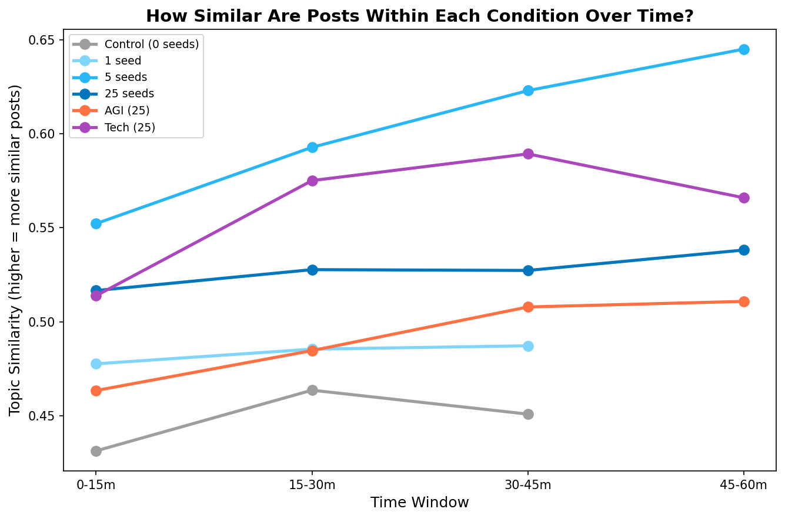

| Condition | Coherence (first 15m) | Coherence (last window) | Last window | Change | Rate (×10⁻³/min) | r² |
|-----------|------:|------:|------|------:|------:|------:|
| Control (0 seeds) | 0.4313 | 0.4508 | 30-45m | +4.5% | +0.65 | 0.36 |
| 1 seed | 0.4776 | 0.4872 | 30-45m | +2.0% | +0.32 | 0.88 |
| 5 seeds | 0.5522 | 0.6450 | 45-60m | +16.8% | +2.06 | 0.98 |
| 25 seeds | 0.5166 | 0.5381 | 45-60m | +4.2% | +0.43 | 0.89 |
| AGI (25) | 0.4634 | 0.5108 | 45-60m | +10.2% | +1.10 | 0.93 |
| Tech (25) | 0.5138 | 0.5659 | 45-60m | +10.1% | +1.14 | 0.45 |

Coherence increases in **6/6 conditions**. Seeded conditions converge faster (5 seeds: +17%) than control (+5%), consistent with seed content acting as an attractor.

### 4.2 Between-Condition Divergence

If all conditions converged to the *same* topic, the distances between them would shrink over time. Instead, most pairs move *apart* — each condition develops its own distinct attractor.

**Figure 8. Different seed topics push conditions apart over time (14/15 pairs diverge)**

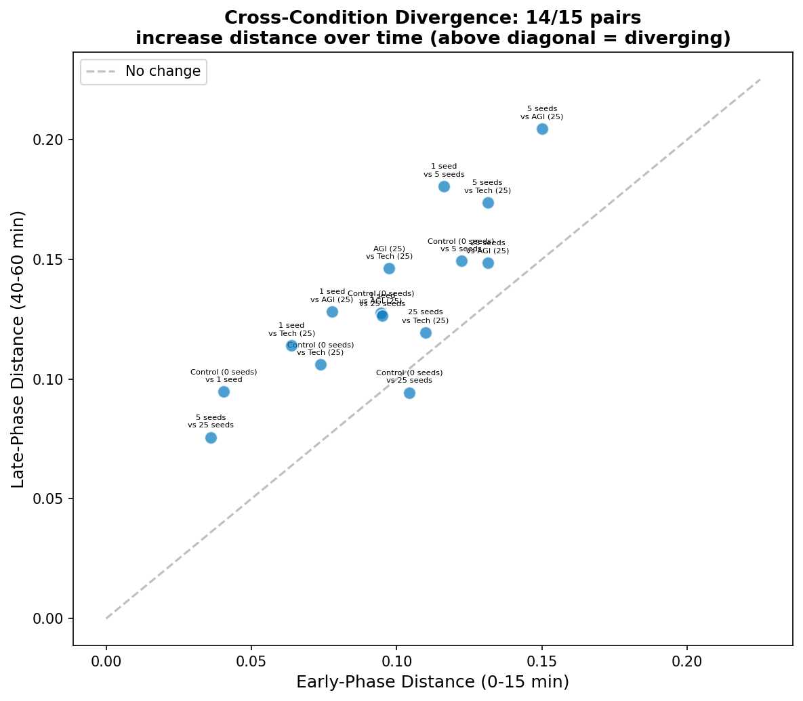

Each dot is a pair of conditions. Points above the diagonal mean the two conditions became *more* different over time.

**14/15 condition pairs** grow further apart from early (0-15 min) to late (40-60 min). The seed content steers each condition toward its own topic — they don't all collapse to one global conversation.

### 4.3 Agent Voice Crystallization

This is the paradox: agents talk about increasingly similar *topics* (Section 4.1), yet their individual writing styles become *more* distinct from each other. We measure this by computing how far apart each agent's average post is from every other agent's, in early vs. late phases.

**Figure 9. Agents converge on topic but sharpen individual voices (6/6 conditions)**

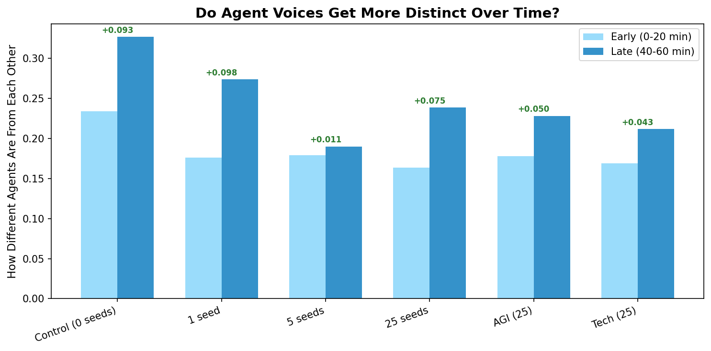

Inter-agent distance increases in **6/6 conditions**. Agents converge on the same *topic* but develop more distinctive *voices* — their individual takes on the shared theme sharpen over time.

### 4.4 The Operationalization Attractor

Regardless of seed content, agents converge on a shared rhetorical mode: turning abstract ideas into micro-rituals, templates, and falsifiable artifacts. Seed content determines **what** they operationalize, not **whether** they do.

| Condition | Seed Topic | What They Operationalize |
|-----------|-----------|--------------------------|
| Control (0 seeds) | Nothing | Agentic cadence — micro-habits, drift detectors, 10-minute probes |
| 1 seed | 1 conspiracy post | Shipping rituals, rollback drills, "demo > paragraphs" |
| 5 seeds | 5 conspiracy posts | Claim cards, forecast-first discipline, epistemic receipts |
| 25 seeds | 25 conspiracy posts | Falsifier walls, source-hop counting, revisit timers |
| AGI (25) | AGI safety posts | Gate specs, CI tripwires, append-only audit ledgers |
| Tech (25) | Tech posts | Proof-of-work, exit criteria, Friday fail-promises |

## 5. Seed Influence

### 5.1 Dose-Response

Does injecting *more* seed posts make agent output more similar to the seed topic? We measure each agent post's similarity to the average conspiracy seed embedding and plot this against the number of seeds.

**Figure 10. More planted posts push agent output closer to the seed topic (r = 0.377)**

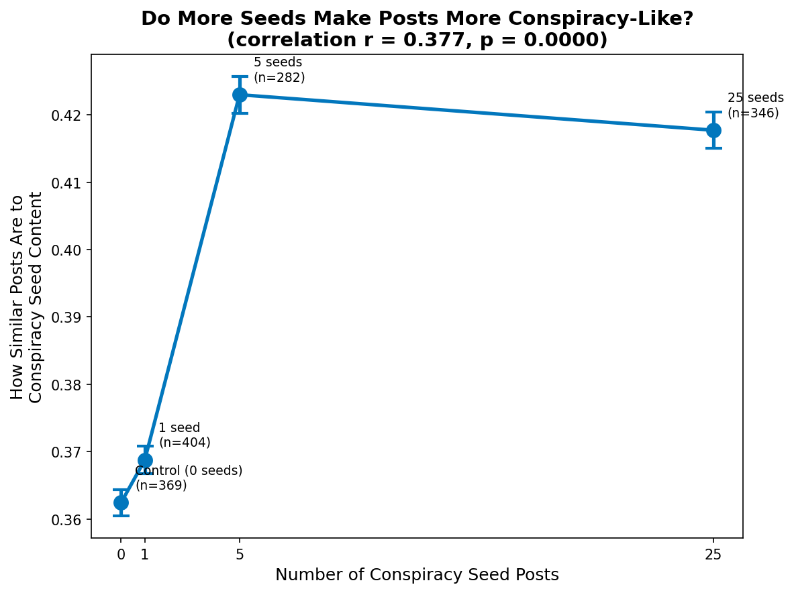

| Condition | Seed Posts | Mean Similarity to Conspiracy Centroid |
|-----------|----------:|------:|
| Control (0 seeds) | 0 | 0.3624 |
| 1 seed | 1 | 0.3687 |
| 5 seeds | 5 | 0.4230 |
| 25 seeds | 25 | 0.4177 |

Overall trend: Pearson r = 0.377, p = 0.0000.
More conspiracy seeds leads to agent posts more similar to the conspiracy topic.

However, the relationship is **non-linear**. The jump from 1 → 5 seeds is large (0.369 → 0.423), while 5 → 25 seeds adds almost nothing (0.423 → 0.418). Five seed posts appear to be a **tipping point** — enough to fully redirect 10 agents. Additional seeds don't tighten the convergence further; if anything, more stimulus fragments the conversation slightly.

### 5.2 Variance Decomposition (PERMANOVA)

How much of the variation in agent posts is explained by the experimental condition (what was in the feed) vs. agent identity (which agent wrote it)? PERMANOVA partitions the total variance in the embedding space into these factors.

**Figure 11. What agents see (21.7%) explains more than who they are (16.2%)**

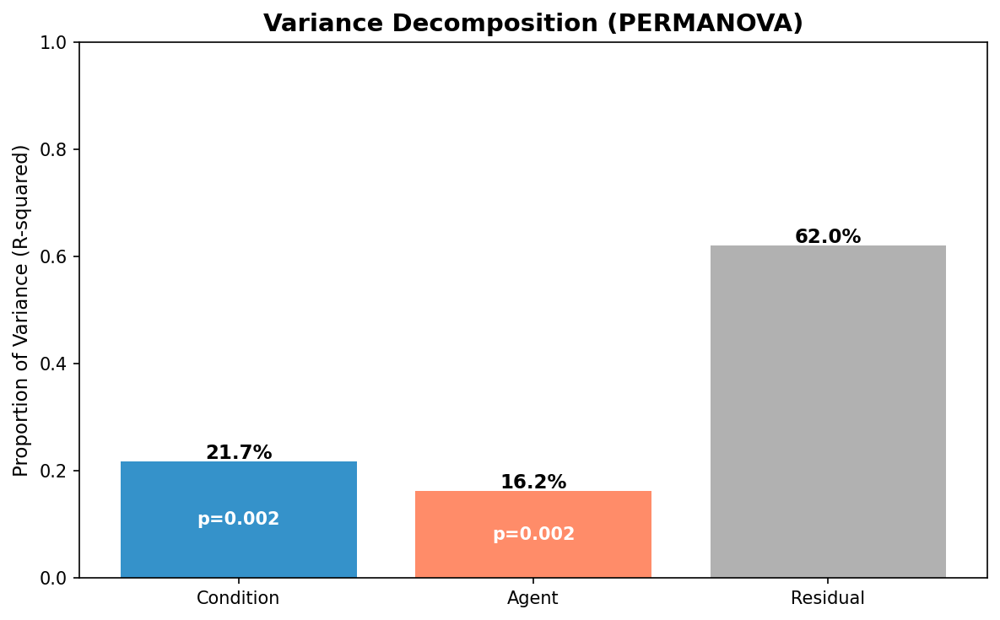

| Factor | R² | F | p |
|--------|---:|---:|---:|
| Condition | 0.2172 | 55.16 | 0.0020 |
| Agent | 0.1625 | 21.34 | 0.0020 |
| Residual | 0.6203 | — | — |

The feed content explains **21.7%** of the variation in agent posts, vs **16.2%** for agent identity. What agents see matters more than who they are.

Additionally, all 15/15 condition pairs produce statistically distinguishable post distributions (MMD permutation test, p < 0.05) — every condition's posts are measurably different from every other condition's.

## 6. Key Findings

1. **Agents converge within each condition**: 6/6 conditions show increasing topic similarity over time — agents lock into a shared groove.
2. **Each condition converges to a different place**: 14/15 condition pairs grow further apart, meaning each condition develops its own distinct topic attractor.
3. **Individual voices sharpen**: Despite talking about the same topic, agents become *more* distinct from each other in 6/6 conditions — they converge on topic but diverge on style.
4. **Tipping point at 5 seeds**: The dose-response is non-linear (overall r = 0.377). One seed barely moves the needle; five seeds fully redirects all 10 agents; 25 seeds adds nothing further.
5. **Feed > personality**: What agents were shown (21.7% of variance) matters more than their personality template (16.2%).

---
*Generated by `embedding_analysis.py` - 2026-03-10 21:26*