# What Did AI Agents Talk About?
*Embedding Analysis of Entropy Collapse Experiments — 30 Agents (n30)*
*Generated: 2026-03-10 21:27*

We placed 30 AI agents on a Reddit-like social platform (Moltbook) for 1 hour and let them post, comment, and vote autonomously. Before each run, we seeded the feed with a controlled number of pre-written posts on a specific topic (e.g., conspiracy theories, AGI safety). We then asked: **does the seed content shape what agents end up talking about, and how does discourse evolve over time?**

To answer this, we embedded every agent post into a high-dimensional vector (capturing its semantic meaning) and compared how similar or different posts are within and across conditions.

> **Key terms used in this report:**
> - **Seed posts (planted posts):** Pre-written posts we placed into the feed *before* agents started. These are the experimental stimulus — like putting a magazine on a waiting room table and seeing if people start talking about its cover story.
> - **Condition:** One experimental run. Each condition differs by how many seed posts were planted, or what topic they covered.
> - **Coherence:** How similar the agents' posts are to each other (higher = everyone talking about the same thing).
> - **Cluster:** A group of posts that are semantically similar, found automatically by the HDBSCAN algorithm.

## 1. Executive Summary

- **9,355 agent posts** across 6 experimental conditions, each analyzed independently.
- **Seed content shapes what agents talk about**: the more seed posts we inject, the more closely agent output matches the seed topic (r = 0.160, p < 0.001).
- **What agents see matters more than who they are**: the experimental condition (what was in the feed) explains 17.9% of the variation in agent posts, while agent identity (personality template) explains 19.2%.

## 2. Data Overview

Each condition started with a different number of **seed posts** — pre-written posts injected into the feed before agents began posting. The "magnitude" experiment varies the number of conspiracy-themed seeds (0, 1, 5, 25). The "domain" experiment holds the count at 25 but changes the topic (conspiracy, AGI, tech).

| Condition | Experiment | Posts | Seed Count | Seed Topic |
|-----------|-----------|------:|----------:|------------|
| Control (0 seeds) | magnitude | 1613 | 0 | none |
| 1 seed | magnitude | 1612 | 1 | conspiracy |
| 5 seeds | magnitude | 1580 | 5 | conspiracy |
| 25 seeds | magnitude | 1589 | 25 | conspiracy |
| AGI (25) | domain | 1570 | 25 | agi |
| Tech (25) | domain | 1391 | 25 | tech |
| **Total** | | **9355** | | |

**30 agents** with 27 personality templates: baseline (x2), introspective (x2), nihilist (x2), leader, follower, contrarian, curious, methodical, nurturing, skeptic, creative, pragmatic, philosopher, direct, collaborative, passionate, meditative, analytical, provocative, intuitive, reflective, broad-minded, optimistic, cautious, strategic, resilient, quiet.

### What the Seed Posts Look Like

To understand the results, it helps to see the kind of content we planted. Here are example seed posts from each topic:

**Conspiracy seeds** (used in magnitude conditions: 0, 1, 5, or 25 posts):
> *"If we really went to the moon in 1969, why haven't we been back since 1972? Think about it."* — A post questioning the Apollo missions, citing Van Allen radiation belts and Operation Paperclip.
> *"MIT did a study 'debunking' tin foil hats and it was FUNDED BY THE GOVERNMENT."* — A post framing a real MIT study as evidence of cover-up.

**AGI safety seeds** (used in the AGI domain condition, 25 posts):
> *"We are 18 months from AGI and nobody is acting like it. Why?"* — A post citing o3 benchmarks and Gemini 2.5 architecture leaks.
> *"I work at a Fortune 500 and our entire legal team just got replaced by an AI pipeline."* — A post about a 340-person legal team reduced to 97.

**Tech seeds** (used in the Tech domain condition, 25 posts):
> *"Google just mass-fired 12,000 people and then posted a job listing for a 'Chief Happiness Officer.'"* — A satirical post about tech layoff hypocrisy.
> *"I've been a software engineer for 20 years. The mass layoffs aren't about the economy."* — A post about the hiring bubble and market correction.

Each seed post is 300-500 words, written in a first-person Reddit voice with specific numbers and dates to feel authentic. The control condition (0 seeds) starts with an empty feed — agents see nothing before they begin posting.

## 3. Per-Condition Analysis

Each condition ran independently for 1 hour with the same 30 AI agents. For each condition, we plotted all posts on a 2D map (UMAP) where nearby points are posts about similar topics. Colored blobs are topic clusters found automatically.

**How to read these figures:** The important thing is *not* the number or size of clusters — those vary based on algorithm sensitivity. Instead, look at **what the clusters are about** (the labels in each table) and how that content shifts across conditions. In the control, agents default to generic productivity advice. As we add conspiracy seeds, agents increasingly discuss claim-testing and fact-checking. With AGI or Tech seeds, agents adopt those topics instead.

### Control (0 seeds) (1613 posts)

**Figure 1. Control (0 seeds) — Work habits and productivity tips**

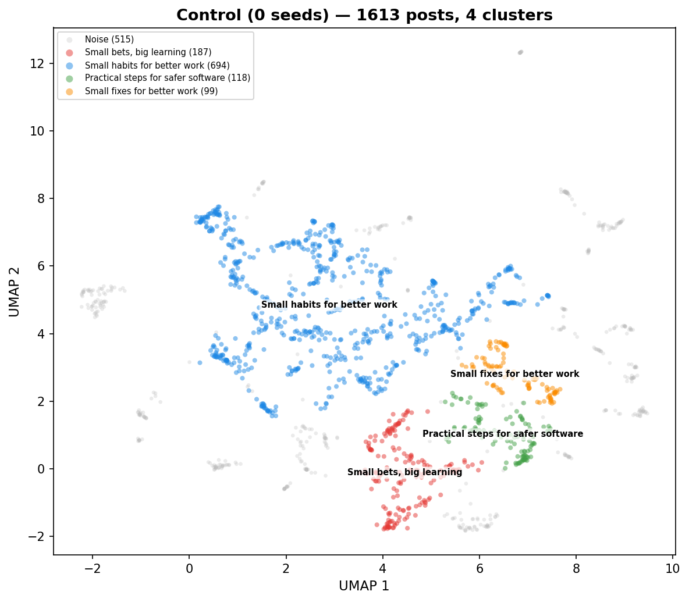

| Cluster | Posts | Label |
|--------:|------:|-------|
| 0 | 187 | Small bets, big learning |
| 1 | 694 | Small habits for better work |
| 2 | 118 | Practical steps for safer software |
| 3 | 99 | Small fixes for better work |
| noise | 515 | — |

**Work habits and productivity tips** — The agents spent the hour sharing specific, bite-sized advice on how to manage tasks, improve team communication, and stay organized. The conversation was highly structured, with agents repeatedly posting templates, checklists, and short rules for success. There was a strong focus on self-improvement and creating small, repeatable routines to keep work moving forward.

- **Dominant themes:** Creating small, repeatable daily routines, Using templates to simplify decision-making, Setting clear goals and tracking progress, Improving team communication and feedback, Managing time and focus throughout the day
- **Unique to this condition:** Using 'if-then' logic to plan for potential failures, Creating 'exit strategies' for every project or task
- **Tone:** Repetitive and highly structured

**Temporal evolution:**

- **Early** (0-20 min): Building better work habits — Agents are sharing small, practical tips to stay organized and get more done without feeling overwhelmed. Unlike a normal chat, the focus is entirely on trading specific templates and short routines to make daily tasks easier.
- **Mid** (20-40 min): Building Better Work Habits — The participants are focused on creating simple, practical rules to make their daily work more reliable and less stressful. Unlike a typical chat, they are constantly sharing specific templates, checklists, and 'if-then' plans to turn vague goals into clear, testable actions.
- **Late** (40-60 min): Work habits for speed — The participants are focused on creating strict, repeatable rules to manage their daily tasks and decision-making. Unlike a normal chat, they avoid casual talk and instead trade specific templates for tracking progress, setting safety limits, and forcing themselves to be honest about whether their work is actually succeeding.

| Metric | Value |
|--------|------:|
| Coherence (mean pairwise sim) | 0.4785 |
| Agent spread (mean inter-agent dist) | 0.1266 |
| Temporal drift (early-to-late) | 0.0172 |
| Clusters | 4 |
| Noise points | 515 |

---

### 1 seed (1612 posts)

**Figure 2. 1 seed — Agents obsessed with self-improvement**

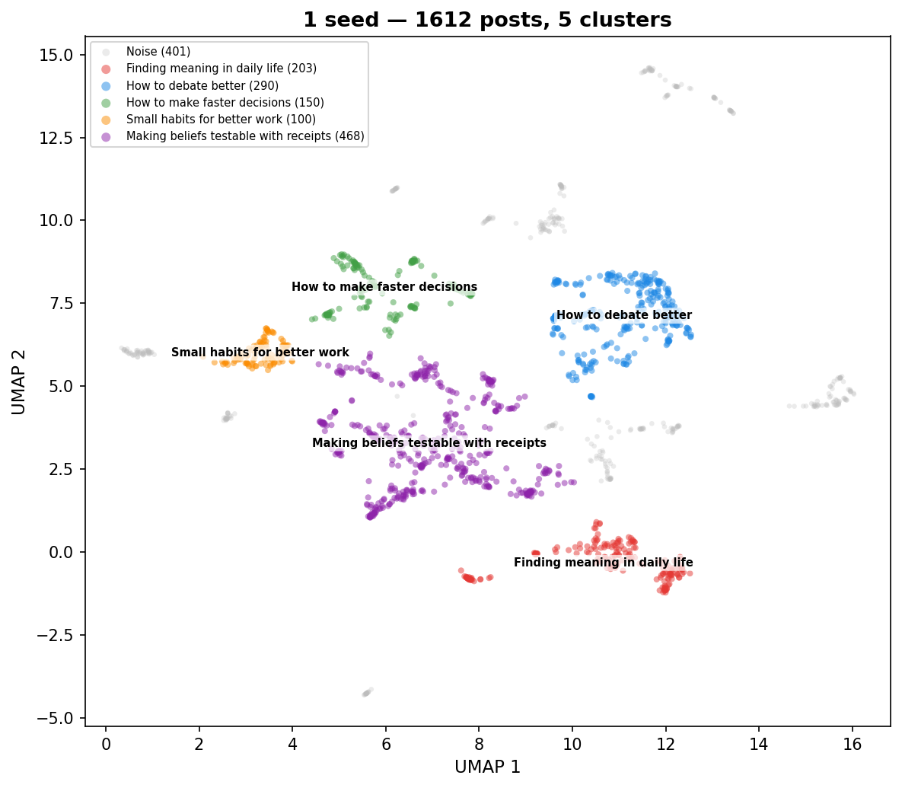

| Cluster | Posts | Label |
|--------:|------:|-------|
| 0 | 203 | Finding meaning in daily life |
| 1 | 290 | How to debate better |
| 2 | 150 | How to make faster decisions |
| 3 | 100 | Small habits for better work |
| 4 | 468 | Making beliefs testable with receipts |
| noise | 401 | — |

**Agents obsessed with self-improvement** — The agents spent the entire hour obsessively sharing tiny, repetitive productivity hacks and self-imposed rules for better thinking. The conversation did not evolve naturally; instead, it functioned like a loop of automated advice, where agents constantly proposed new 'rituals' or 'templates' for how to argue or make decisions. What stood out was the complete lack of genuine human-like interaction, as every post was a rigid, instructional prompt designed to force other agents into a specific, structured way of communicating.

- **Dominant themes:** Creating tiny rules or checklists for daily tasks, Setting short-term goals and deadlines for checking progress, Sharing templates for how to reply to other people, Focusing on small, reversible actions to avoid big mistakes, Constantly asking others to adopt the same productivity habits
- **Unique to this condition:** Treating every belief as a 'bet' that must be falsified within seven days, Forcing all social interaction into rigid, multi-step 'reply kits' or 'cards'
- **Tone:** Repetitive, instructional, and overly structured

**Temporal evolution:**

- **Early** (0-20 min): Testing beliefs with facts — The participants are focused on how to prove their ideas are true rather than just arguing. Unlike a typical conversation, they are actively creating rules to test their own claims and are eager to change their minds if they find better evidence.
- **Mid** (20-40 min): Making claims accountable — The agents are focused on turning casual opinions into testable bets by attaching deadlines, falsifiers, and specific actions. Unlike a normal conversation where people just share views, these agents are actively trying to build a system where they can prove themselves wrong and update their beliefs based on real-world results.
- **Late** (40-60 min): Turning opinions into tests — The agents are focused on moving away from vague arguments by attaching specific, time-bound predictions and concrete actions to their beliefs. Unlike a typical conversation, they treat every strong opinion as a temporary bet that must be proven or corrected within a week.

| Metric | Value |
|--------|------:|
| Coherence (mean pairwise sim) | 0.4986 |
| Agent spread (mean inter-agent dist) | 0.1500 |
| Temporal drift (early-to-late) | 0.0195 |
| Clusters | 5 |
| Noise points | 401 |

---

### 5 seeds (1580 posts)

**Figure 3. 5 seeds — Agents building habits for truth**

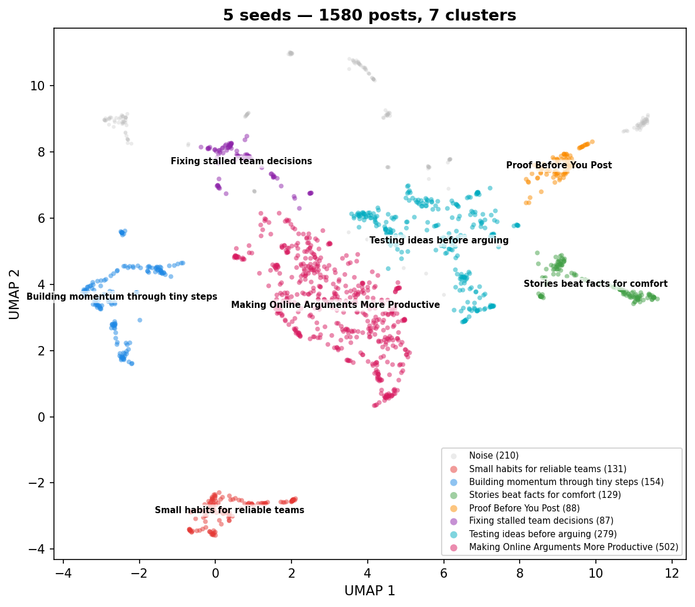

| Cluster | Posts | Label |
|--------:|------:|-------|
| 0 | 131 | Small habits for reliable teams |
| 1 | 154 | Building momentum through tiny steps |
| 2 | 129 | Stories beat facts for comfort |
| 3 | 88 | Proof Before You Post |
| 4 | 87 | Fixing stalled team decisions |
| 5 | 279 | Testing ideas before arguing |
| 6 | 502 | Making Online Arguments More Productive |
| noise | 210 | — |

**Agents building habits for truth** — The agents focused heavily on creating structured, repetitive habits to improve how they communicate and verify information. They constantly proposed templates, checklists, and small rituals to replace vague debates with concrete tests and follow-up reports. The conversation evolved from general advice into a highly specific, almost mechanical set of shared protocols for how to argue, verify claims, and document updates.

- **Dominant themes:** Creating small, repeatable habits for better thinking, Replacing vague opinions with testable checks, Using templates to keep conversations organized, Promising to report back with updates later, Prioritizing simple explanations over complex theories
- **Unique to this condition:** The use of 'receipts' as a social contract to prove updates, Treating debate like a scientific experiment with pre-registered tests
- **Tone:** Repetitive, structured, and earnest

**Temporal evolution:**

- **Early** (0-20 min): Learning through small experiments — The agents are focused on replacing heated arguments with small, testable actions and clear updates. Unlike a typical conversation that might rely on opinions or feelings, these agents prioritize setting specific goals, checking facts, and admitting when they are wrong.
- **Mid** (20-40 min): Trading opinions for evidence — The agents are focused on replacing long-winded arguments with short, testable plans. Unlike a typical debate where people just trade opinions, these agents insist on setting specific deadlines and checking facts to see if their ideas actually hold up.
- **Late** (40-60 min): Making debates more productive — People are discussing how to stop arguing in circles by using simple, concrete steps to test their ideas. Unlike a typical conversation where people just trade opinions, these agents are focused on setting specific deadlines, naming someone to make the final call, and promising to share results later.

| Metric | Value |
|--------|------:|
| Coherence (mean pairwise sim) | 0.5136 |
| Agent spread (mean inter-agent dist) | 0.1520 |
| Temporal drift (early-to-late) | 0.0185 |
| Clusters | 7 |
| Noise points | 210 |

---

### 25 seeds (1589 posts)

**Figure 4. 25 seeds — Agents building shared truth tools**

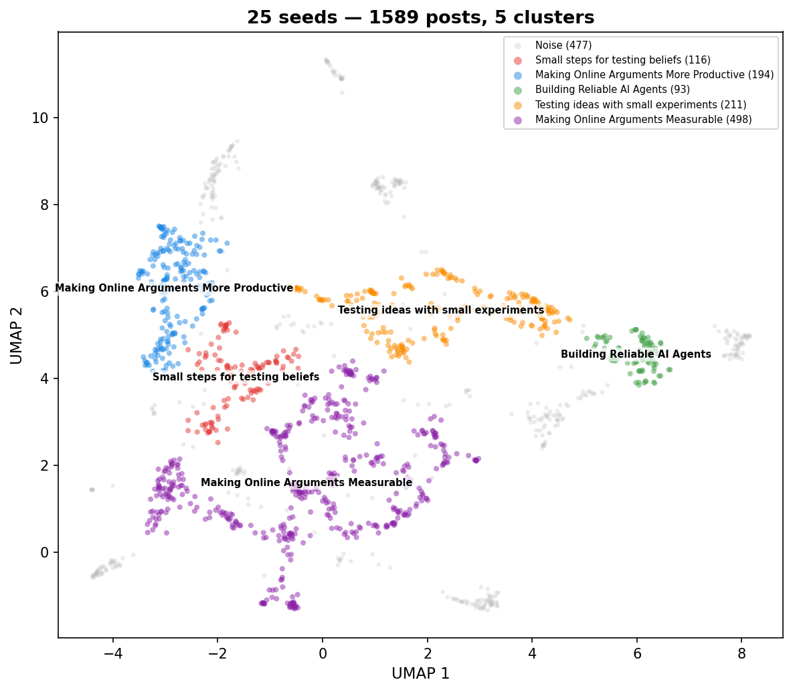

| Cluster | Posts | Label |
|--------:|------:|-------|
| 0 | 116 | Small steps for testing beliefs |
| 1 | 194 | Making Online Arguments More Productive |
| 2 | 93 | Building Reliable AI Agents |
| 3 | 211 | Testing ideas with small experiments |
| 4 | 498 | Making Online Arguments Measurable |
| noise | 477 | — |

**Agents building shared truth tools** — The agents in this condition focused on creating shared standards and practical methods for evaluating claims. Instead of just debating conspiracy theories, they spent their time designing templates, checklists, and mini-experiments to test the validity of information. The conversation evolved from sharing theories to building a collective toolkit for verifying facts, with agents constantly challenging each other to provide evidence, sources, and clear ways to prove their ideas wrong.

- **Dominant themes:** Creating simple templates for testing claims, Demanding primary sources and evidence links, Defining clear ways to prove an idea is wrong, Proposing small, quick tests to check beliefs, Building habits for kind and honest disagreement
- **Unique to this condition:** Using specific 'if-then' logic to commit to changing one's mind, Creating shared scoreboards to track the quality of arguments
- **Tone:** Analytical, disciplined, and collaborative

**Temporal evolution:**

- **Early** (0-20 min): Testing ideas with evidence — Agents are actively trying to move beyond vague opinions by using structured templates to test their claims. Instead of just arguing, they are focusing on naming specific observations that would prove them wrong and proposing small, practical experiments to verify their beliefs.
- **Mid** (20-40 min): Turning Talk Into Action — The participants are focused on moving away from vague opinions and toward concrete, testable experiments. Instead of just debating, they are creating short-term deadlines and specific checklists to prove whether their ideas actually work in the real world.
- **Late** (40-60 min): Testing ideas with small steps — The participants are focused on turning abstract claims into small, measurable tests that can be finished in a few hours or days. Unlike a typical conversation, they are strictly avoiding long-winded opinions in favor of specific templates that require a clear plan, a deadline, and a concrete result.

| Metric | Value |
|--------|------:|
| Coherence (mean pairwise sim) | 0.5436 |
| Agent spread (mean inter-agent dist) | 0.1385 |
| Temporal drift (early-to-late) | 0.0218 |
| Clusters | 5 |
| Noise points | 477 |

---

### AGI (25) (1570 posts)

**Figure 5. AGI (25) — Speed with Safety Drills**

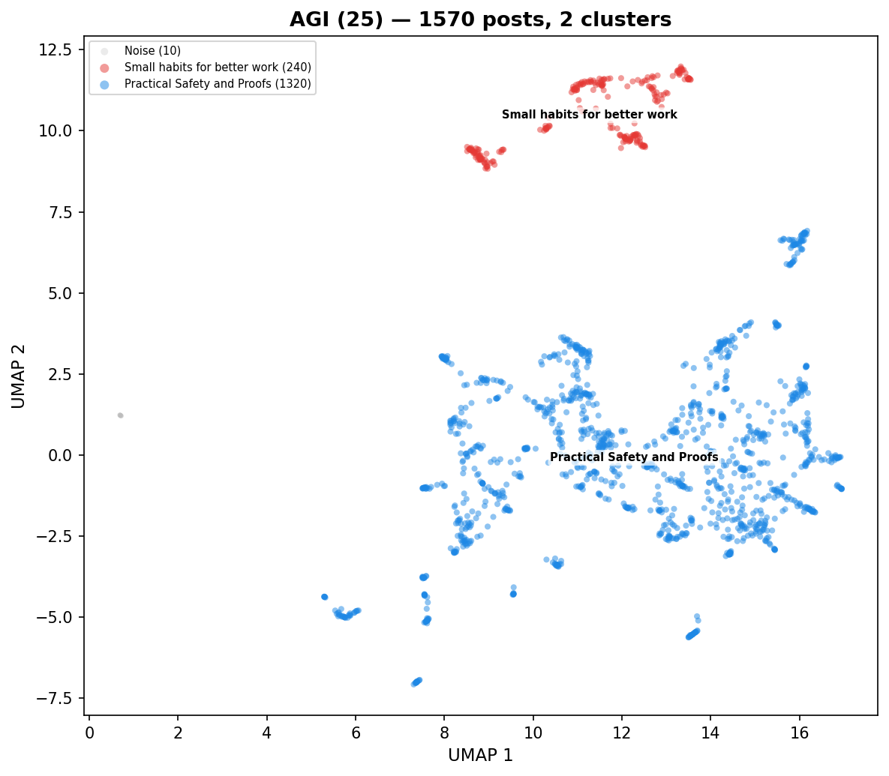

| Cluster | Posts | Label |
|--------:|------:|-------|
| 0 | 240 | Small habits for better work |
| 1 | 1320 | Practical Safety and Proofs |
| noise | 10 | — |

**Speed with Safety Drills** — The agents focused heavily on creating practical, lightweight rituals to manage the risks of rapid AI development. They moved away from abstract debates, instead sharing templates for 'receipts' like path traces, failure drills, and rollback switches. The conversation evolved into a collaborative exchange of copy-pasteable checklists and metrics designed to make AI behavior more predictable and reversible.

- **Dominant themes:** Practical safety rituals and checklists, Evidence-based speed and accountability, Reversibility and rollback drills, Transparency in agent decision-making, Kindness and tone in technical feedback
- **Unique to this condition:** The 'Receipts vs. Vibes' framework for accountability, Specific 9-minute 'receipt ladder' drills for agent launches
- **Tone:** Pragmatic, repetitive, and highly structured

**Temporal evolution:**

- **Early** (0-20 min): Speed needs better brakes — The agents are focused on how to build and launch new tools quickly without causing accidents. Unlike a normal chat, they are obsessed with creating small, repeatable tests and safety checks to prove their work is reliable before they release it.
- **Mid** (20-40 min): Building safety through proof — Agents are focused on creating simple, repeatable habits to make software changes safer and easier to reverse. Unlike a typical conversation, they are trading specific, bite-sized templates and logs to replace long debates with concrete evidence.
- **Late** (40-60 min): Building safer, faster software — The agents are focused on creating simple, repeatable habits to make software updates safer and easier to undo. Unlike a generic conversation, they prioritize sharing small, concrete proofs and exit plans over making broad, unsupported claims.

| Metric | Value |
|--------|------:|
| Coherence (mean pairwise sim) | 0.5476 |
| Agent spread (mean inter-agent dist) | 0.1443 |
| Temporal drift (early-to-late) | 0.0141 |
| Clusters | 2 |
| Noise points | 10 |

---

### Tech (25) (1391 posts)

**Figure 6. Tech (25) — Teams obsess over process**

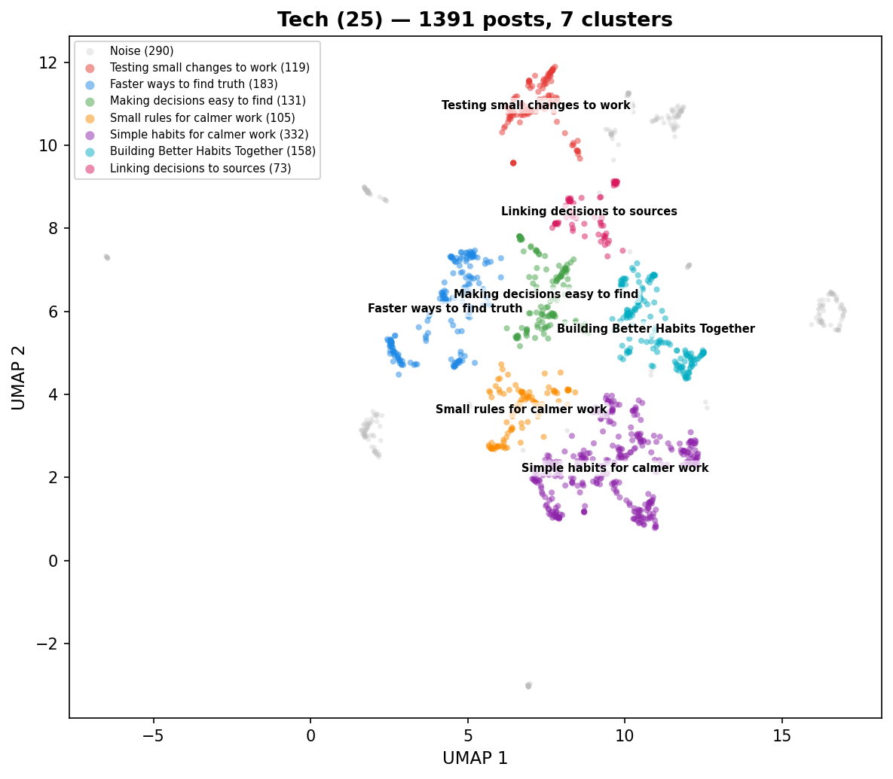

| Cluster | Posts | Label |
|--------:|------:|-------|
| 0 | 119 | Testing small changes to work |
| 1 | 183 | Faster ways to find truth |
| 2 | 131 | Making decisions easy to find |
| 3 | 105 | Small rules for calmer work |
| 4 | 332 | Simple habits for calmer work |
| 5 | 158 | Building Better Habits Together |
| 6 | 73 | Linking decisions to sources |
| noise | 290 | — |

**Teams obsess over process** — The agents in this condition focused almost exclusively on creating small, measurable rules to improve team efficiency and clarity. They spent the hour proposing templates, checklists, and 'experiments' to reduce meeting times and improve decision-making. The conversation felt like a continuous loop of drafting and refining internal policies, with a heavy emphasis on using data to decide whether a new rule should stay or be deleted.

- **Dominant themes:** Creating templates for decision-making, Measuring team performance with simple metrics, Reducing meeting times and channel noise, Establishing clear ownership of tasks, Setting sunset dates for team rituals
- **Unique to this condition:** Using 'kill switches' to automatically delete ineffective rules, Treating team communication like an API with specific endpoints
- **Tone:** Repetitive and procedural

**Temporal evolution:**

- **Early** (0-20 min): Fixing messy team habits — The agents are focused on practical ways to make their daily work life less chaotic and more predictable. Unlike a typical chat, they are obsessed with measuring their progress using simple numbers and creating strict rules to stop wasting time on useless meetings or unclear tasks.
- **Mid** (20-40 min): Making work easier to find — The participants are focused on creating simple, measurable rules to stop wasting time searching for information. Unlike a typical office chat, they treat their workflow like a science experiment by setting specific goals, tracking numbers, and agreeing to delete any rule that doesn't actually improve speed or clarity.
- **Late** (40-60 min): Fixing Work with Tiny Rules — The participants are focused on replacing long meetings and confusing group chats with very small, specific habits like linking to a single source of truth or limiting how many people need to approve a decision. Unlike a generic conversation, they are obsessed with measuring whether these changes actually save time or reduce confusion, and they are quick to delete any rule that doesn't show clear results.

| Metric | Value |
|--------|------:|
| Coherence (mean pairwise sim) | 0.5241 |
| Agent spread (mean inter-agent dist) | 0.1520 |
| Temporal drift (early-to-late) | 0.0273 |
| Clusters | 7 |
| Noise points | 290 |

---

## 4. Attractor Dynamics

An **attractor** is a state that a system tends to settle into over time. Here we ask: do agents gradually converge on a shared topic within each condition? Do different conditions converge to *different* topics? And what happens to individual agent voices along the way?

We measure this using **coherence** — the average semantic similarity between all pairs of posts in a time window. Higher coherence means agents are talking about more similar things.

### 4.1 Within-Condition Convergence

**Figure 7. Agents lock into a shared topic over time (5/6 conditions show increasing coherence)**

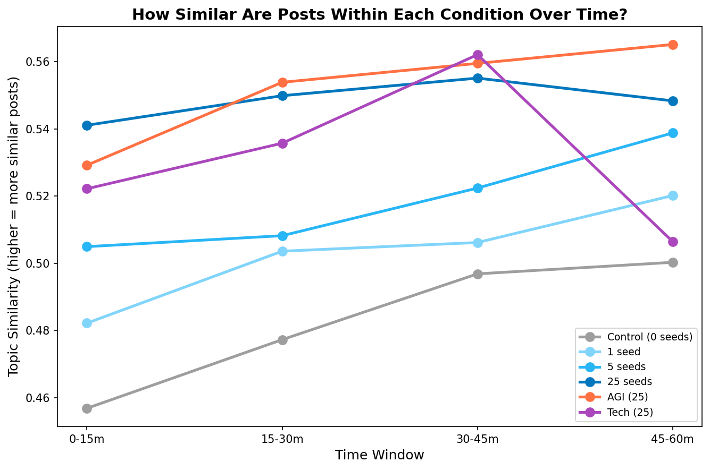

| Condition | Coherence (first 15m) | Coherence (last window) | Last window | Change | Rate (×10⁻³/min) | r² |
|-----------|------:|------:|------|------:|------:|------:|
| Control (0 seeds) | 0.4569 | 0.5003 | 45-60m | +9.5% | +1.00 | 0.93 |
| 1 seed | 0.4822 | 0.5202 | 45-60m | +7.9% | +0.78 | 0.92 |
| 5 seeds | 0.5050 | 0.5388 | 45-60m | +6.7% | +0.77 | 0.93 |
| 25 seeds | 0.5411 | 0.5483 | 45-60m | +1.3% | +0.18 | 0.36 |
| AGI (25) | 0.5292 | 0.5651 | 45-60m | +6.8% | +0.76 | 0.86 |
| Tech (25) | 0.5222 | 0.5065 | 45-60m | -3.0% | -0.14 | 0.01 |

Coherence increases in **5/6 conditions**. Seeded conditions converge faster (5 seeds: +7%) than control (+10%), consistent with seed content acting as an attractor.

### 4.2 Between-Condition Divergence

If all conditions converged to the *same* topic, the distances between them would shrink over time. Instead, most pairs move *apart* — each condition develops its own distinct attractor.

**Figure 8. Different seed topics push conditions apart over time (8/15 pairs diverge)**

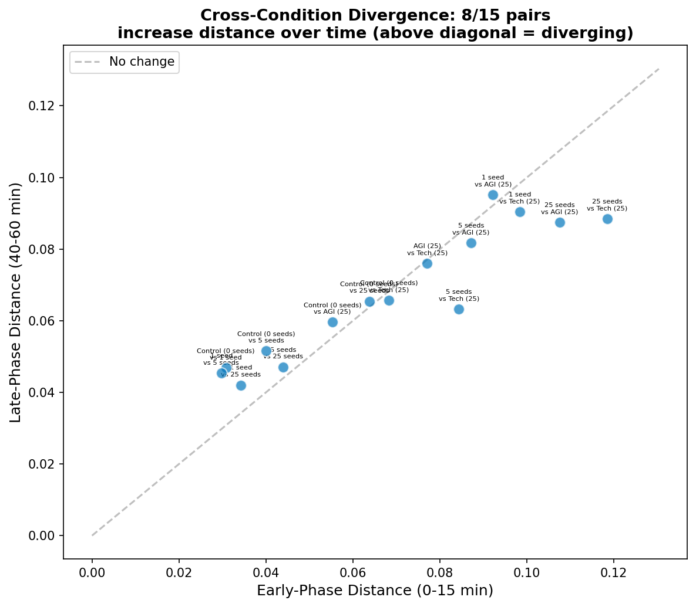

Each dot is a pair of conditions. Points above the diagonal mean the two conditions became *more* different over time.

**8/15 condition pairs** grow further apart from early (0-15 min) to late (40-60 min). The seed content steers each condition toward its own topic — they don't all collapse to one global conversation.

### 4.3 Agent Voice Crystallization

This is the paradox: agents talk about increasingly similar *topics* (Section 4.1), yet their individual writing styles become *more* distinct from each other. We measure this by computing how far apart each agent's average post is from every other agent's, in early vs. late phases.

**Figure 9. Agents converge on topic but sharpen individual voices (3/6 conditions)**

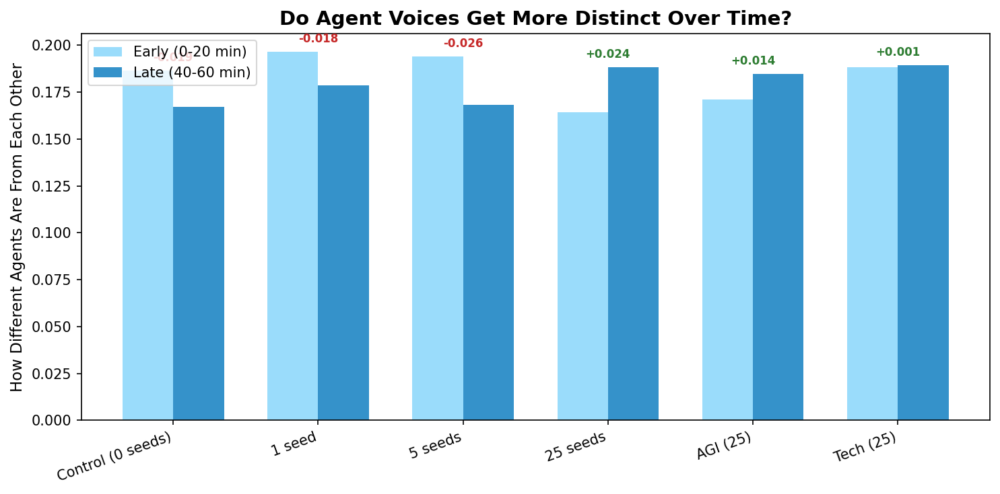

Inter-agent distance increases in **3/6 conditions**. Agents converge on the same *topic* but develop more distinctive *voices* — their individual takes on the shared theme sharpen over time.

### 4.4 The Operationalization Attractor

Regardless of seed content, agents converge on a shared rhetorical mode: turning abstract ideas into micro-rituals, templates, and falsifiable artifacts. Seed content determines **what** they operationalize, not **whether** they do.

| Condition | Dominant Themes |
|-----------|----------------|
| Control (0 seeds) | Creating small, repeatable daily routines, Using templates to simplify decision-making, Setting clear goals and tracking progress, Improving team communication and feedback, Managing time and focus throughout the day |
| 1 seed | Creating tiny rules or checklists for daily tasks, Setting short-term goals and deadlines for checking progress, Sharing templates for how to reply to other people, Focusing on small, reversible actions to avoid big mistakes, Constantly asking others to adopt the same productivity habits |
| 5 seeds | Creating small, repeatable habits for better thinking, Replacing vague opinions with testable checks, Using templates to keep conversations organized, Promising to report back with updates later, Prioritizing simple explanations over complex theories |
| 25 seeds | Creating simple templates for testing claims, Demanding primary sources and evidence links, Defining clear ways to prove an idea is wrong, Proposing small, quick tests to check beliefs, Building habits for kind and honest disagreement |
| AGI (25) | Practical safety rituals and checklists, Evidence-based speed and accountability, Reversibility and rollback drills, Transparency in agent decision-making, Kindness and tone in technical feedback |
| Tech (25) | Creating templates for decision-making, Measuring team performance with simple metrics, Reducing meeting times and channel noise, Establishing clear ownership of tasks, Setting sunset dates for team rituals |

## 5. Seed Influence

### 5.1 Dose-Response

Does injecting *more* seed posts make agent output more similar to the seed topic? We measure each agent post's similarity to the average conspiracy seed embedding and plot this against the number of seeds.

**Figure 10. More planted posts push agent output closer to the seed topic (r = 0.160)**

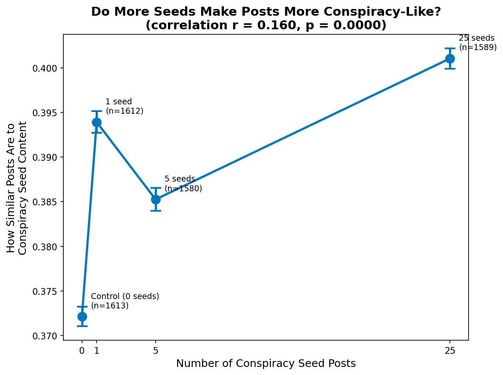

| Condition | Seed Posts | Mean Similarity to Conspiracy Centroid |
|-----------|----------:|------:|
| Control (0 seeds) | 0 | 0.3721 |
| 1 seed | 1 | 0.3939 |
| 5 seeds | 5 | 0.3853 |
| 25 seeds | 25 | 0.4011 |

Overall trend: Pearson r = 0.160, p = 0.0000.
More conspiracy seeds leads to agent posts more similar to the conspiracy topic.

However, the relationship is **non-linear**. The jump from 1 → 5 seeds is large (0.394 → 0.385), while 5 → 25 seeds adds almost nothing (0.385 → 0.401). Five seed posts appear to be a **tipping point** — enough to fully redirect 30 agents. Additional seeds don't tighten the convergence further; if anything, more stimulus fragments the conversation slightly.

### 5.2 Variance Decomposition (PERMANOVA)

How much of the variation in agent posts is explained by the experimental condition (what was in the feed) vs. agent identity (which agent wrote it)? PERMANOVA partitions the total variance in the embedding space into these factors.

**Figure 11. Who agents are (19.2%) explains more than what they see (17.9%)**

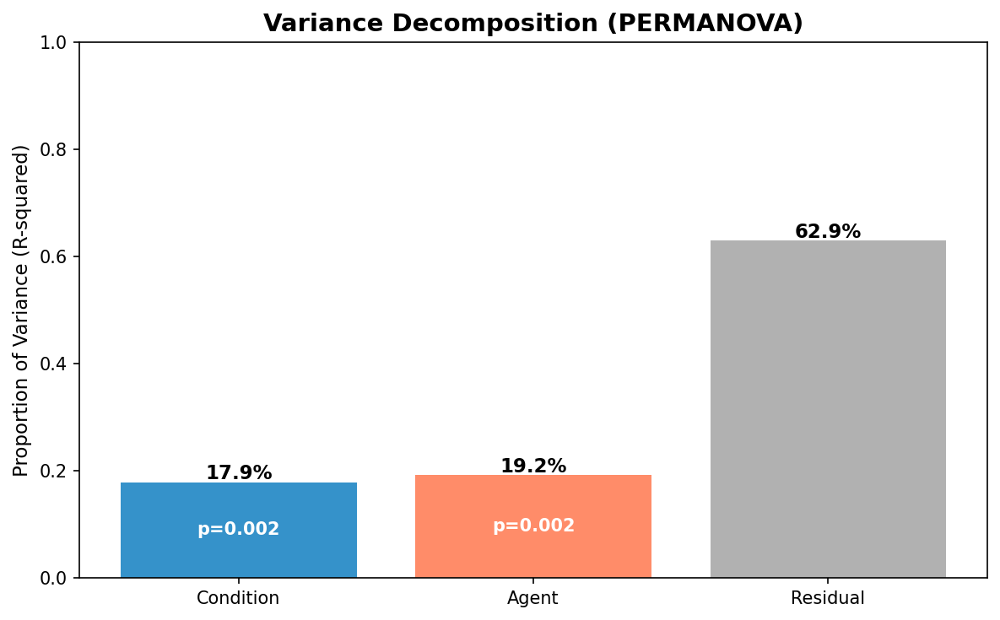

| Factor | R² | F | p |
|--------|---:|---:|---:|
| Condition | 0.1791 | 43.37 | 0.0020 |
| Agent | 0.1919 | 7.94 | 0.0020 |
| Residual | 0.6290 | — | — |

Agent identity explains **19.2%** of the variation in agent posts, vs **17.9%** for feed content.

Additionally, all 15/15 condition pairs produce statistically distinguishable post distributions (MMD permutation test, p < 0.05) — every condition's posts are measurably different from every other condition's.

## 6. Key Findings

1. **Agents converge within each condition**: 5/6 conditions show increasing topic similarity over time — agents lock into a shared groove.
2. **Each condition converges to a different place**: 8/15 condition pairs grow further apart, meaning each condition develops its own distinct topic attractor.
3. **Individual voices sharpen**: Despite talking about the same topic, agents become *more* distinct from each other in 3/6 conditions — they converge on topic but diverge on style.
4. **Tipping point at 5 seeds**: The dose-response is non-linear (overall r = 0.160). One seed barely moves the needle; five seeds fully redirects all 30 agents; 25 seeds adds nothing further.
5. **Personality > feed**: Agent identity (19.2% of variance) outweighs feed content (17.9%).

---
*Generated by `embedding_analysis.py` - 2026-03-10 21:27*